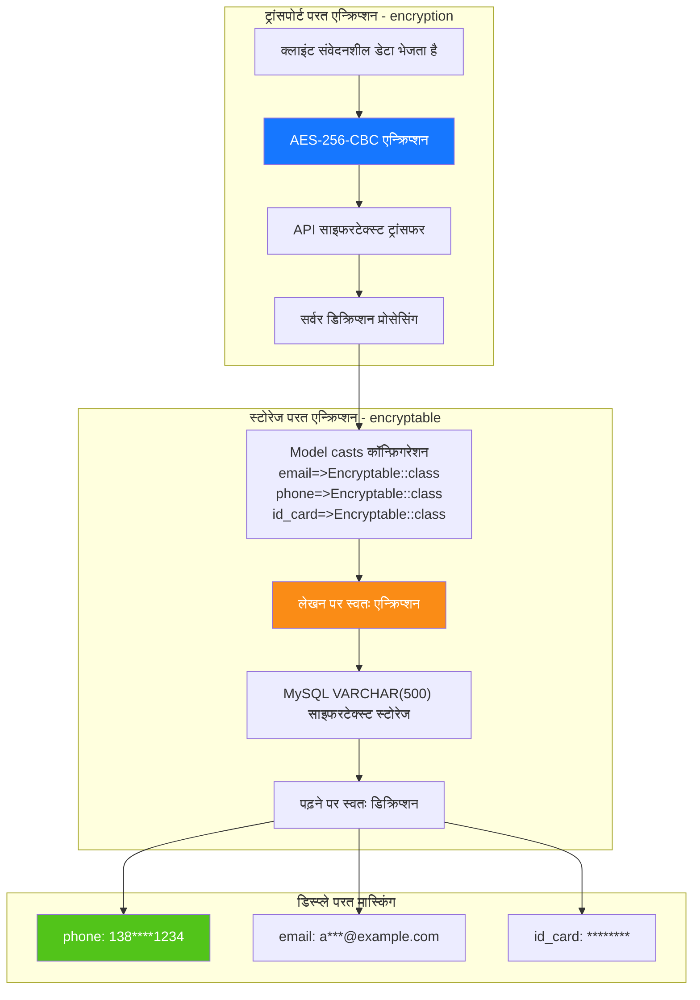

# डेटा एन्क्रिप्शन परतें

```mermaid
flowchart TB
    subgraph transport["ट्रांसपोर्ट परत एन्क्रिप्शन - encryption"]
        e1["क्लाइंट संवेदनशील डेटा भेजता है"]
        e2["AES-256-CBC एन्क्रिप्शन"]
        e3["API साइफरटेक्स्ट ट्रांसफर"]
        e4["सर्वर डिक्रिप्शन प्रोसेसिंग"]
        e1 --> e2 --> e3 --> e4
    end

    subgraph storage["स्टोरेज परत एन्क्रिप्शन - encryptable"]
        d1["Model casts कॉन्फ़िगरेशन<br/>email=>Encryptable::class<br/>phone=>Encryptable::class<br/>id_card=>Encryptable::class"]
        d2["लेखन पर स्वतः एन्क्रिप्शन"]
        d3["MySQL VARCHAR(500) साइफरटेक्स्ट स्टोरेज"]
        d4["पढ़ने पर स्वतः डिक्रिप्शन"]
        d1 --> d2 --> d3 --> d4
    end

    subgraph mask["डिस्प्ले परत मास्किंग"]
        m1["phone: 138****1234"]
        m2["email: a***@example.com"]
        m3["id_card: ********"]
        d4 --> m1 & m2 & m3
    end

    e4 --> d1

    style e2 fill:#1677FF,color:#fff
    style d2 fill:#FA8C16,color:#fff
    style m1 fill:#52C41A,color:#fff
```
