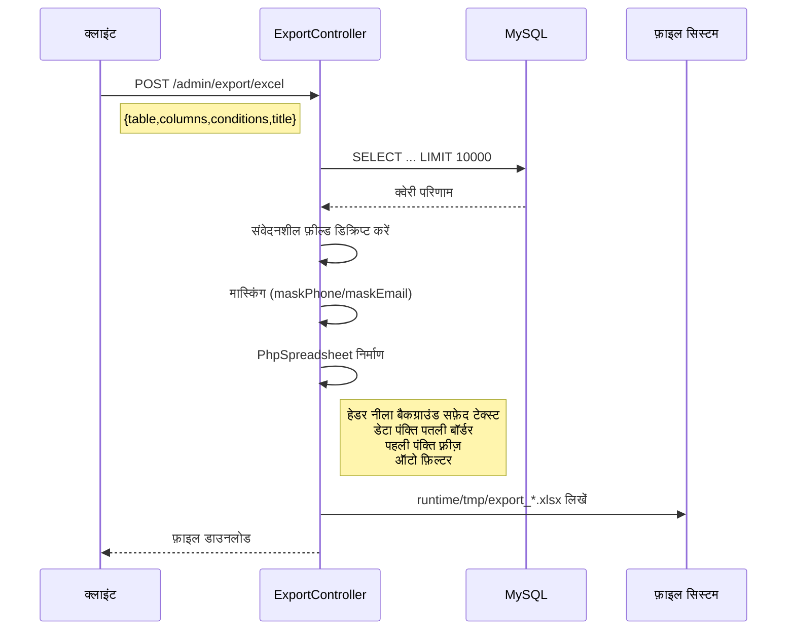
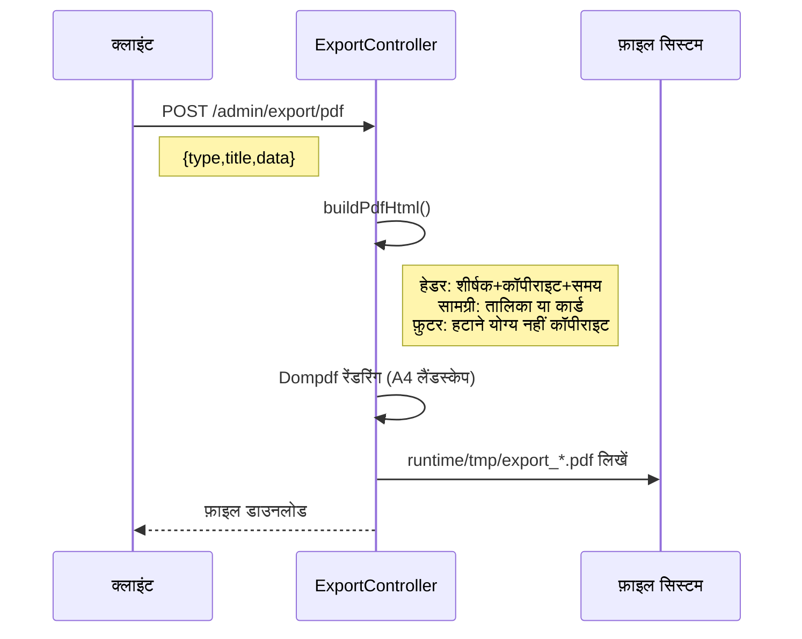

# निर्यात व्यावसायिक प्रवाह

## Excel निर्यात

```mermaid
sequenceDiagram
    participant C as क्लाइंट
    participant CTL as ExportController
    participant DB as MySQL
    participant FS as फ़ाइल सिस्टम

    C->>CTL: POST /admin/export/excel
    Note right of C: {table,columns,conditions,title}
    CTL->>DB: SELECT ... LIMIT 10000
    DB-->>CTL: क्वेरी परिणाम
    CTL->>CTL: संवेदनशील फ़ील्ड डिक्रिप्ट करें
    CTL->>CTL: मास्किंग (maskPhone/maskEmail)
    CTL->>CTL: PhpSpreadsheet निर्माण
    Note right of CTL: हेडर नीला बैकग्राउंड सफ़ेद टेक्स्ट<br/>डेटा पंक्ति पतली बॉर्डर<br/>पहली पंक्ति फ़्रीज़<br/>ऑटो फ़िल्टर
    CTL->>FS: runtime/tmp/export_*.xlsx लिखें
    CTL-->>C: फ़ाइल डाउनलोड
```

## PDF निर्यात

```mermaid
sequenceDiagram
    participant C as क्लाइंट
    participant CTL as ExportController
    participant FS as फ़ाइल सिस्टम

    C->>CTL: POST /admin/export/pdf
    Note right of C: {type,title,data}
    CTL->>CTL: buildPdfHtml()
    Note right of CTL: हेडर: शीर्षक+कॉपीराइट+समय<br/>सामग्री: तालिका या कार्ड<br/>फ़ुटर: हटाने योग्य नहीं कॉपीराइट
    CTL->>CTL: Dompdf रेंडरिंग (A4 लैंडस्केप)
    CTL->>FS: runtime/tmp/export_*.pdf लिखें
    CTL-->>C: फ़ाइल डाउनलोड
```
