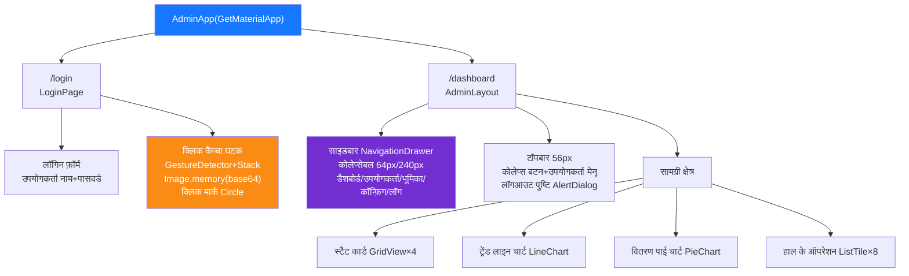
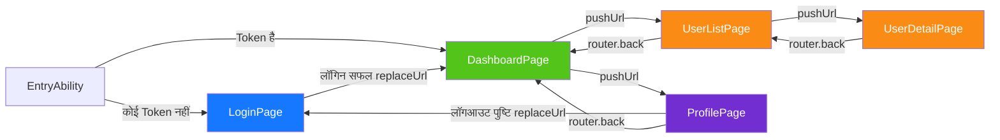

# फ्रंटएंड घटक आर्किटेक्चर

## Flutter Web घटक ट्री

```mermaid
flowchart TD
    app["AdminApp(GetMaterialApp)"]

    app --> login["/login<br/>LoginPage"]
    app --> dashboard["/dashboard<br/>AdminLayout"]

    login --> form["लॉगिन फ़ॉर्म<br/>उपयोगकर्ता नाम+पासवर्ड"]
    login --> captcha["क्लिक कैप्चा घटक<br/>GestureDetector+Stack<br/>Image.memory(base64)<br/>क्लिक मार्क Circle"]

    dashboard --> sidebar["साइडबार NavigationDrawer<br/>कोलेप्सेबल 64px/240px<br/>डैशबोर्ड/उपयोगकर्ता/भूमिका/कॉन्फ़िग/लॉग"]
    dashboard --> header["टॉपबार 56px<br/>कोलेप्स बटन+उपयोगकर्ता मेनू<br/>लॉगआउट पुष्टि AlertDialog"]
    dashboard --> content["सामग्री क्षेत्र"]

    content --> stats["स्टैट कार्ड GridView×4"]
    content --> chart["ट्रेंड लाइन चार्ट LineChart"]
    content --> pie["वितरण पाई चार्ट PieChart"]
    content --> logs["हाल के ऑपरेशन ListTile×8"]

    style app fill:#1677FF,color:#fff
    style captcha fill:#FA8C16,color:#fff
    style sidebar fill:#722ED1,color:#fff
```

## HarmonyOS पेज रूटिंग

```mermaid
flowchart LR
    entry["EntryAbility"]
    entry -->|"कोई Token नहीं"| loginH["LoginPage"]
    entry -->|"Token है"| dashH["DashboardPage"]

    loginH -->|"लॉगिन सफल replaceUrl"| dashH

    dashH -->|"pushUrl"| userList["UserListPage"]
    dashH -->|"pushUrl"| profile["ProfilePage"]

    userList -->|"pushUrl"| userDetail["UserDetailPage"]
    userList -->|"router.back"| dashH
    userDetail -->|"router.back"| userList

    profile -->|"लॉगआउट पुष्टि replaceUrl"| loginH
    profile -->|"router.back"| dashH

    style loginH fill:#1677FF,color:#fff
    style dashH fill:#52C41A,color:#fff
    style userList fill:#FA8C16,color:#fff
    style userDetail fill:#FA8C16,color:#fff
    style profile fill:#722ED1,color:#fff
```
