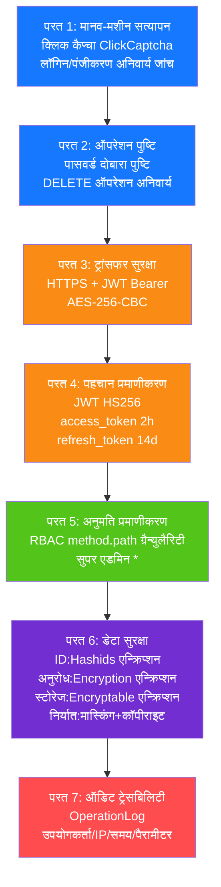

# सुरक्षा गहन रक्षा

```mermaid
flowchart TB
    l1["परत 1: मानव-मशीन सत्यापन<br/>क्लिक कैप्चा ClickCaptcha<br/>लॉगिन/पंजीकरण अनिवार्य जांच"]
    l2["परत 2: ऑपरेशन पुष्टि<br/>पासवर्ड दोबारा पुष्टि<br/>DELETE ऑपरेशन अनिवार्य"]
    l3["परत 3: ट्रांसफर सुरक्षा<br/>HTTPS + JWT Bearer<br/>AES-256-CBC"]
    l4["परत 4: पहचान प्रमाणीकरण<br/>JWT HS256<br/>access_token 2h<br/>refresh_token 14d"]
    l5["परत 5: अनुमति प्रमाणीकरण<br/>RBAC method.path ग्रैन्युलैरिटी<br/>सुपर एडमिन *"]
    l6["परत 6: डेटा सुरक्षा<br/>ID:Hashids एन्क्रिप्शन<br/>अनुरोध:Encryption एन्क्रिप्शन<br/>स्टोरेज:Encryptable एन्क्रिप्शन<br/>निर्यात:मास्किंग+कॉपीराइट"]
    l7["परत 7: ऑडिट ट्रेसबिलिटी<br/>OperationLog<br/>उपयोगकर्ता/IP/समय/पैरामीटर"]

    l1 --> l2 --> l3 --> l4 --> l5 --> l6 --> l7

    style l1 fill:#1677FF,color:#fff
    style l2 fill:#1677FF,color:#fff
    style l3 fill:#FA8C16,color:#fff
    style l4 fill:#FA8C16,color:#fff
    style l5 fill:#52C41A,color:#fff
    style l6 fill:#722ED1,color:#fff
    style l7 fill:#FF4D4F,color:#fff
```
