# Diagram Arsitektur dan Diagram Alur Bisnis

> Copyright (c) 2026 erik <erik@erik.xyz> — https://erik.xyz

> Diagram Mermaid berikut dapat dirender otomatis di GitHub / GitLab / VS Code. Untuk lingkungan lain, gunakan [Mermaid Live Editor](https://mermaid.live/).

---

## 1. Arsitektur Topologi Sistem

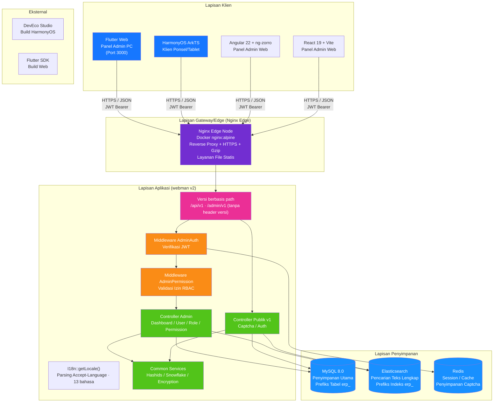

---

## 2. Arsitektur Berlapis Backend

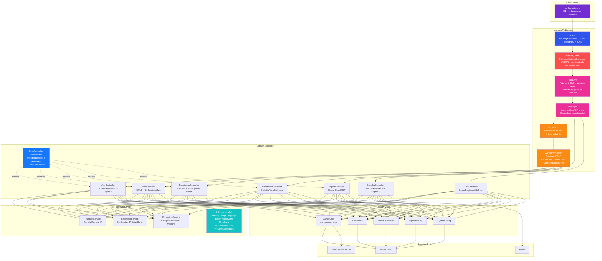

### Perluasan Lapisan Bisnis ERP

Seiring evolusi sistem dari panel admin murni menjadi sistem ERP lengkap, lapisan controller dan service menambahkan modul bisnis berikut:

| Lapisan | Direktori | Keterangan |
|------|------|------|
| Controller Bisnis | `app/controller/{product,purchase,sales,inventory,finance,crm,workflow,notification,project,hr,manufacturing,report,oms,wms,tms,quality,eam,dms,open,platform,print,retail,bi}/` | 139 buah (23 domain bisnis, plus Install / Index di tingkat atas), dibagi per modul, menangani permintaan bisnis |
| Service Bisnis | `app/service/{finance,inventory,notification,crm,hr,manufacturing,oms,wms,tms,quality,…}/` | 63 kelas service / 64 berkas / 20 subdirektori modul; mencakup stok masuk-keluar + kalkulasi biaya, piutang-hutang keuangan + penyelesaian, pengiriman notifikasi |

### Internasionalisasi (13 bahasa)

Resolusi bahasa ada di `getLocale()` pada `app/common/I18n.php` (dipanggil oleh `I18n::trans()`, **bukan middleware**): mengambil label pertama header permintaan `Accept-Language` lalu memetakan sub-label bahasa utama (`zh*` → `zh_CN`). Pembagian kamus frontend-backend:

| Ujung | Lokasi kamus | Skala | Generator |
|----|----------|------|--------|
| Backend | `resource/translations/<locale>/{common,modules,validation}.php` | 13 direktori bahasa; `zh_CN` 565 entri, 11 bahasa lainnya masing-masing 544 entri, `en` 30 entri (cakupan entri daun, label field `attributes` pada `validation.php` dihitung, kunci grupnya tidak) | `scripts/gen-be-locales.mjs` |
| Angular | sumber `apps/angular/src/app/core/zh-en/part1..4.ts` → produk `core/zh-<code>.ts` | kamus sumber 1456 entri | `scripts/gen-fe-locales.mjs --app angular` |
| React | sumber `apps/react/src/lib/i18n/zhEn.ts` → produk `lib/i18n/zh<Code>.ts` | kamus sumber 1451 entri | `scripts/gen-fe-locales.mjs --app react` |

- Daftar bahasa: `zh_CN` `en` `ja` `ko` `de` `fr` `es` `pt` `ru` `ar` `hi` `bn` `id`.
- Backend 「Inggris adalah key」: `en` pada common/modules dibiarkan kosong; kunci `validation.php` adalah nama aturan framework, hanya nilainya diterjemahkan.
- Kamus 11 bahasa baru di frontend masing-masing dimuat dinamis dengan `import()` menjadi chunk mandiri; entri yang hilang kembali ke teks asli 中文.
- Mengganti bahasa berarti mengganti `Accept-Language`, backend mengembalikan teks sesuai bahasa (`app/common/I18n.php` + `config/translation.php`).

---

## 3. Siklus Hidup Permintaan

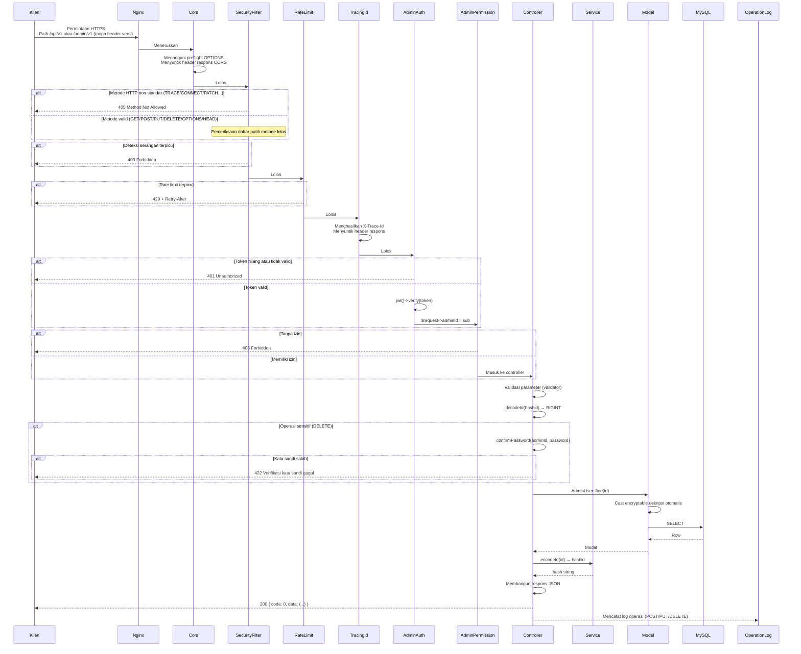

---

## 4. Alur Autentikasi dan Captcha

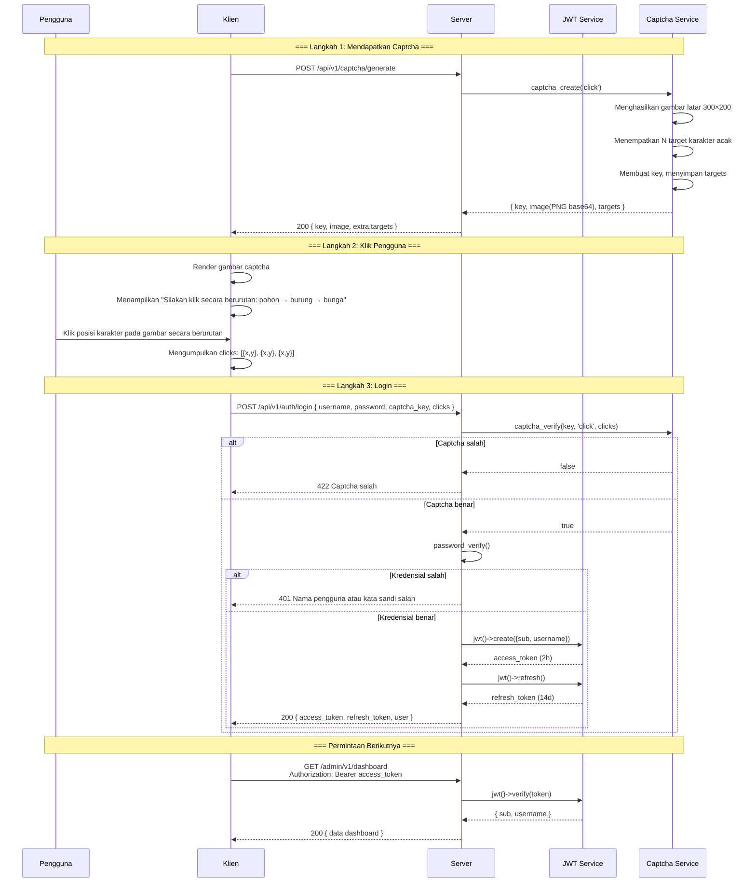

---

## 5. Model Izin RBAC

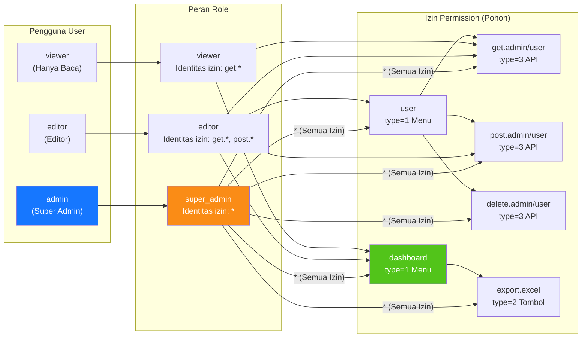

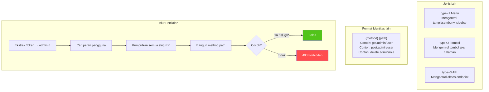

---

## 6. Siklus Hidup Lengkap ID

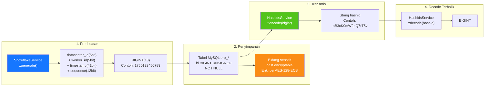

---

## 7. Lapisan Enkripsi Data

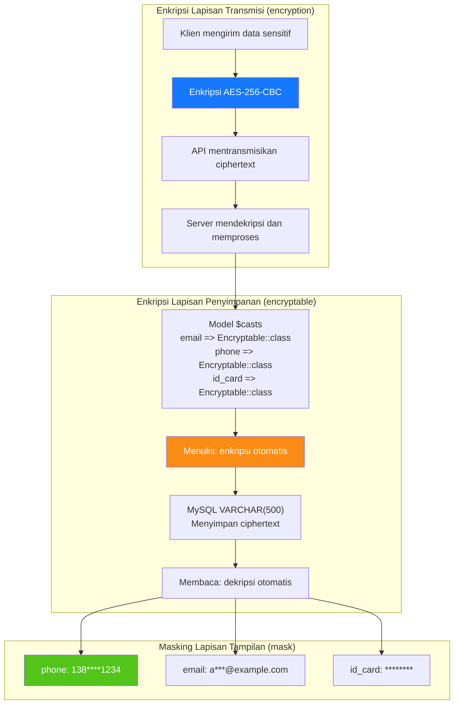

---

## 8. Relasi ER Basis Data

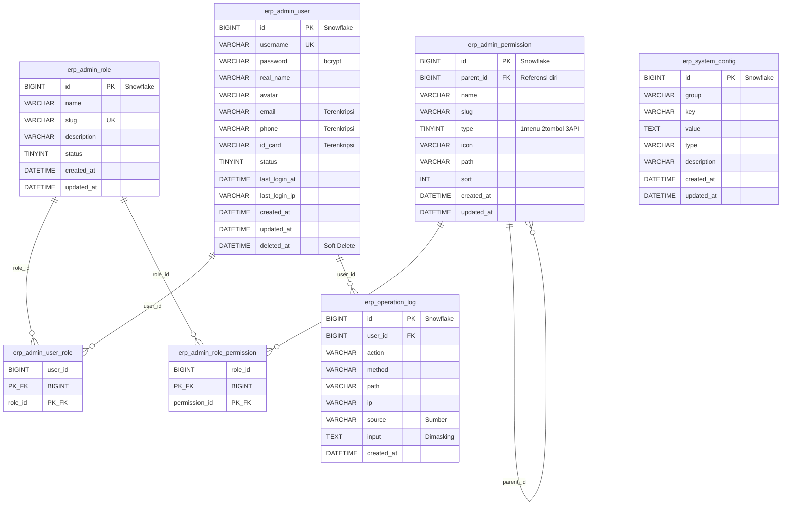

---

## 9. Alur Bisnis Ekspor

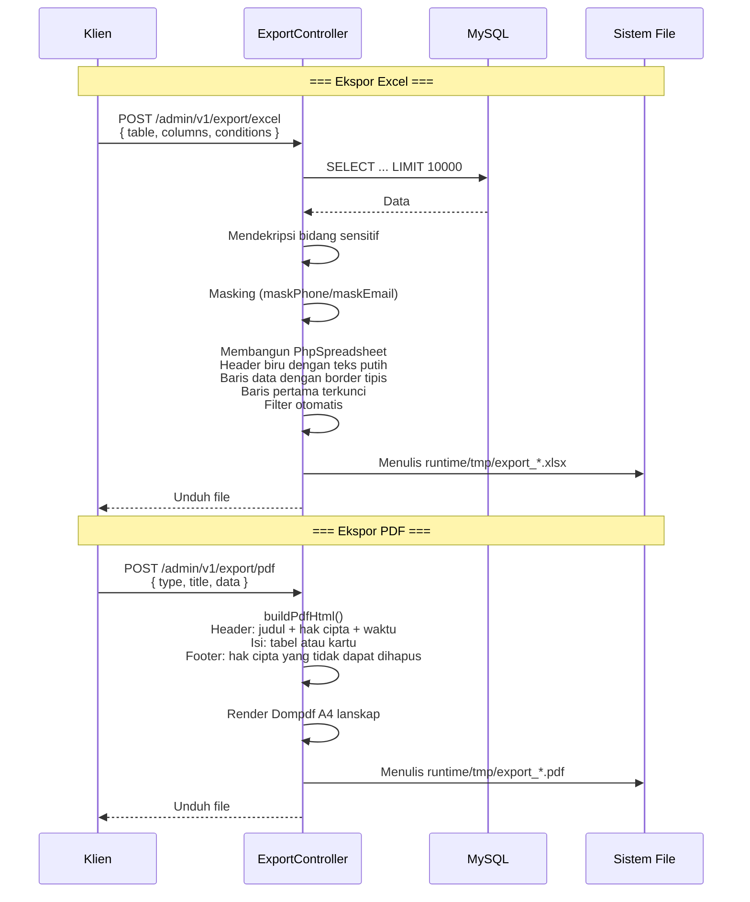

---

## 10. Pohon Komponen Flutter Web

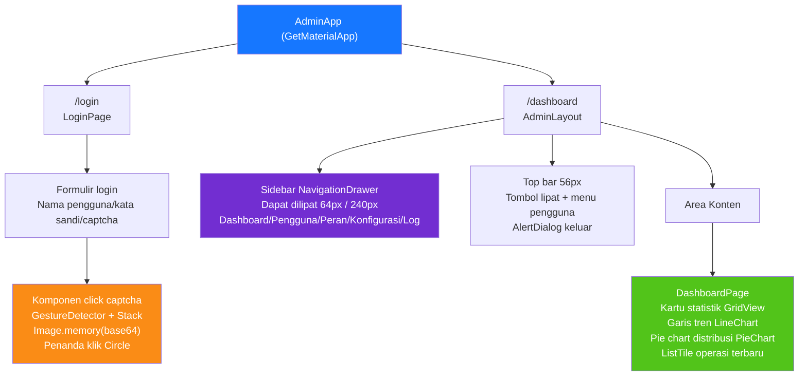

---

## 11. Routing Halaman HarmonyOS

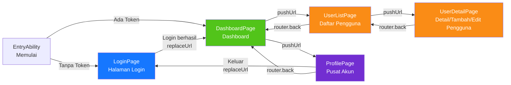

---

## 12. Panorama Pertahanan Berlapis

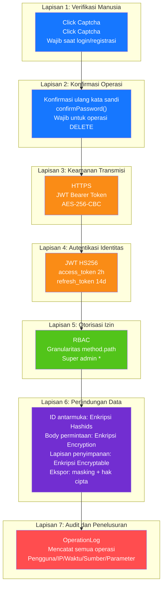

---

## 13. Topologi Deployment

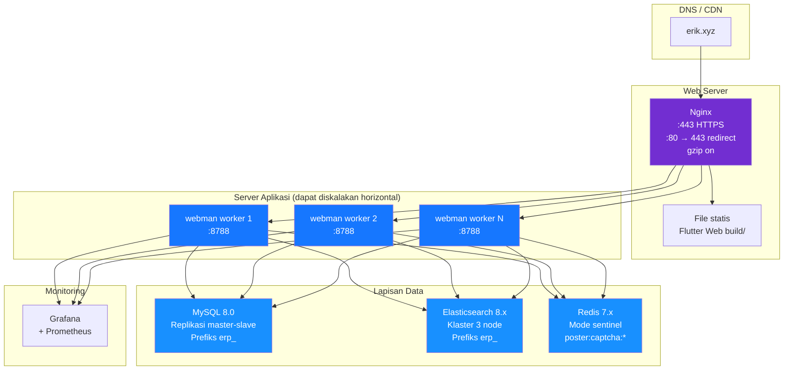

---

## 14. Arsitektur Keseluruhan Sistem ERP

```mermaid
graph TB
    subgraph Client["Lapisan Klien"]
        FW["Flutter Web<br/>Panel Admin PC"]
        FA["Flutter App<br/>iOS/Android/macOS/Windows/Linux"]
        HW["HarmonyOS<br/>App Native HarmonyOS"]
        NG["Angular 22 + ng-zorro<br/>Panel Admin Web"]
        RC["React 19 + Vite<br/>Panel Admin Web"]
    end

    subgraph Gateway["Lapisan API Gateway"]
        MW["Rantai middleware<br/>Cors→SecurityFilter→RateLimit→TracingId<br/>Grup rute: AdminAuth→AdminPermission→OperationLog"]
    end

    subgraph Business["Lapisan Modul Bisnis"]
        direction LR
        Admin["Manajemen Sistem<br/>Pengguna/Peran/Izin/Konfigurasi/Log"]
        Product["Manajemen Produk<br/>Produk/Kategori/Merek/Gudang/Pemasok/Pelanggan"]
        Purchase["Manajemen Pembelian<br/>Permintaan→Pesanan→Penerimaan→Retur→Settlement"]
        Sales["Manajemen Penjualan<br/>Penawaran→Pesanan→Pengiriman→Retur→Settlement"]
        Inventory["Manajemen Inventaris<br/>Masuk/keluar stok/Batch/Stock opname/Transfer/Peringatan"]
        Finance["Manajemen Keuangan<br/>Akun/Voucher/Piutang-Hutang/Buku Besar/Jurnal Detail/Laporan/Reimbursement"]
        CRM["CRM<br/>Pelanggan/Kontak/Tindak lanjut/Funnel/Gudang umum/Penawaran/Kontrak"]
        Workflow["Alur Kerja Persetujuan<br/>Definisi alur kerja/Submit/Setujui/Tolak/Tarik"]
        Notification["Notifikasi Pesan<br/>Daftar notifikasi/Dibaca/Perhitungan belum dibaca"]
        Project["Manajemen Proyek<br/>Proyek/Tugas/Catatan jam kerja"]
        HR["Sumber Daya Manusia<br/>Departemen/Karyawan/Jabatan/Absensi/Cuti/Gaji"]
        Manufacturing["Manufaktur<br/>BOM/Pesanan produksi/Rute produksi/Workstation/MRP"]
        Report["Laporan Kustom<br/>Template laporan/Dataset/Bidang/Filter/Jadwal"]
    end

    subgraph Service["Lapisan Layanan Bisnis"]
        IS["InventoryService<br/>Masuk/keluar stok + biaya rata-rata bergerak"]
        FS["FinanceService<br/>Pembuatan piutang/hutang otomatis + penghapusan"]
        NS["NotificationService<br/>Pengiriman notifikasi terpadu"]
    end

    subgraph Data["Lapisan Data"]
        MySQL["MySQL 8.0<br/>227 tabel bisnis"]
        Redis["Redis 7<br/>Cache/Rate limit/Session"]
        ES["Elasticsearch 8<br/>Pencarian teks lengkap"]
    end

    Client --> Gateway
    Gateway --> Business
    Business --> Service
    Service --> Data
    Business --> Data
```

---

## 15. Alur Data Lintas Modul

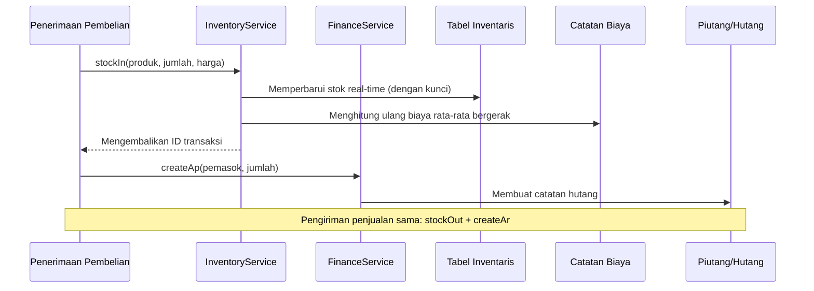

---

## 16. Alur Data Kalkulasi Biaya Inventaris

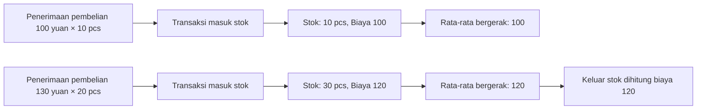

---

## 17. Alur Data Alur Kerja Persetujuan

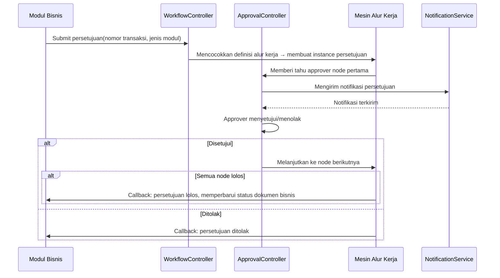

---

## 18. Alur Data Notifikasi Pesan

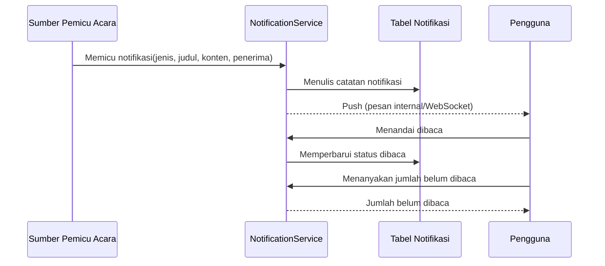

---

## 19. Alur Data MRP (Material Requirements Planning)

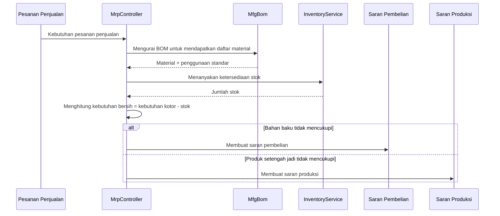

---

## 20. Tabel Pemetaan Controller-Service-Model Modul ERP

> Keterangan lapisan service: kolom `Service Inti` menandai layanan bisnis yang telah diturunkan ke modul tersebut; modul yang ditandai **⚠ Controller langsung query model, technical debt diketahui**,
> controller masih memanggil langsung metode query/tulis model (`XxxModel::find/where/save` dll.), belum diekstrak ke lapisan service, merupakan technical debt yang diketahui,
> akan dikonvergensikan bertahap sesuai pola ekstraksi ringan lapisan service P2-F2 (`app/service/AbstractCrudService` kelas dasar CRUD umum + Service modul).

| Modul | Controllers (Direktori) | Service Inti | Model Utama | Jumlah Tabel |
|------|-------------------|-------------|-----------|------|
| Manajemen Sistem | admin/controller/ (16) | - ⚠Controller langsung query model, technical debt diketahui | AdminUser, AdminRole, AdminPermission | 7 |
| Manajemen Produk | controller/product/ (8) | ProductService | Product, Category, Brand, Warehouse, Supplier, Customer | 12 |
| Manajemen Pembelian | controller/purchase/ (8) | InventoryService, FinanceService ⚠CRUD masih langsung query, technical debt diketahui | PurchaseOrder, PurchaseReceive | 14 |
| Manajemen Penjualan | controller/sales/ (5) | InventoryService, FinanceService ⚠CRUD masih langsung query, technical debt diketahui | SalesOrder, SalesDelivery | 9 |
| Manajemen Inventaris | controller/inventory/ (6) | InventoryService ⚠CRUD masih langsung query, technical debt diketahui | Inventory, InventoryFlow, CostRecord | 11 |
| Manajemen Keuangan | controller/finance/ (28) | FinanceService ⚠CRUD masih langsung query, technical debt diketahui | FinanceArAp, FinanceVoucher, FinanceReceipt, FinancePayment, FinanceGeneralLedger, FinanceBalanceSheet, FinanceAsset, FinanceBudget, FinanceCostCenter | 38 |
| CRM | controller/crm/ (10) | CrmService | CrmOpportunity, CrmFollowRecord, CrmContract, CrmPoolRule, CrmQuotation, CrmCampaign, CrmTicket, CrmAnalyticsReport | 16 |
| Alur Kerja Persetujuan | controller/workflow/ (3) | - ⚠Controller langsung query model, technical debt diketahui | ApprovalWorkflow, ApprovalInstance, ApprovalNode, ApprovalRecord | 4 |
| Notifikasi Pesan | controller/notification/ (2) | NotificationService ⚠CRUD masih langsung query, technical debt diketahui | Notification, NotificationSetting, NotificationTemplate | 4 |
| Manajemen Proyek | controller/project/ (4) | - ⚠Controller langsung query model, technical debt diketahui | Project, ProjectTask, ProjectTimesheet, ProjectMember, ProjectGantt | 6 |
| Sumber Daya Manusia | controller/hr/ (9) | HrService | HrDepartment, HrEmployee, HrPosition, HrAttendance, HrLeave, HrSalary | 21 |
| Manufaktur | controller/manufacturing/ (13) | ManufacturingService | MfgBom, MfgProductionOrder, MfgRouting, MfgWorkstation, MfgMrpPlan | 21 |
| Laporan Kustom | controller/report/ (2) | - ⚠Controller langsung query model, technical debt diketahui | ReportTemplate, ReportDataset, ReportField, ReportFilter, ReportSchedule | 5 |
| Manajemen Peralatan EAM | controller/eam/ (5) | - ⚠Controller langsung query model, technical debt diketahui | EamEquipment, EamMaintenancePlan, EamRepairOrder, EamSparePart, EamInspectionTask, EamInspectionResult | 6 |
| Manajemen Dokumen DMS | controller/dms/ (2) | - ⚠Controller langsung query model, technical debt diketahui | DmsCategory, DmsDocument, DmsDocumentVersion | 3 |
| Dashboard BI | controller/bi/ (3) | - ⚠Controller langsung query model, technical debt diketahui | BiDashboard, BiWidget | 2 |

> Tabel ini adalah pemetaan modul awal (Manajemen Sistem + 15 domain bisnis); 8 domain yang ditambahkan kemudian —— oms / wms / tms / quality / open / platform / print / retail —— tidak dicantumkan,
> daftar lengkapnya lihat pohon struktur proyek di `docs/CLAUDE.md` (`app/controller/` total 23 direktori modul / 139 controller, termasuk Install dan Index di tingkat atas).
>
> Cakupan `Jumlah Tabel` (terukur 2026-09-15): mengambil 227 tabel dari `database/install.sql`, dipetakan berdasarkan prefiks nama tabel ke satu modul saja —— Manajemen Sistem `admin_*`+`system_config`+`operation_log`;
> Manajemen Produk `product*`/`category`/`brand`/`warehouse`/`location`/`supplier`/`customer*`; Manajemen Pembelian `purchase_*`+`supplier_assessment`; Manajemen Inventaris `inventory*`/`transfer*`/`check_*`/`cost_record`;
> modul lain memakai prefiks tabel bernama sama (`sales_*`→Penjualan, `finance_*`→Keuangan, `crm_*`→CRM, `approval_*`→Persetujuan, `notification*`→Notifikasi, `project*`→Proyek, `hr_*`→SDM, `mfg_*`→Produksi, `report_*`→Laporan, `eam_*`→EAM, `dms_*`→DMS, `bi_*`→BI).
> Satu tabel hanya masuk satu kolom; domain baru dan tabel bersama yang ditambahkan kemudian berjumlah 48 tabel (`oms_`/`wms_`/`tms_`/`quality_`/`openapi_`/`webhook_`/`member_`/`print_template`/`company`/`tenant`/`channel`/`custom_field_definition`/`tax_*`) tidak dihitung pada baris mana pun tabel ini.
> Hitung ulang: ``grep -o 'CREATE TABLE IF NOT EXISTS `erp_[a-z_]*`' database/install.sql | sed 's/.*`erp_\([a-z_]*\)`/\1/' | cut -d_ -f1 | sort | uniq -c | sort -rn``

### 20.1 Catatan Ekstraksi Ringan Lapisan Service P2-F2 (crm/hr/manufacturing/product telah selesai diekstrak)

| Modul | Jumlah pemanggilan langsung controller sebelum ekstraksi | Setelah ekstraksi | Service Baru | Isi Ekstraksi |
|------|----------------------|--------|--------------|----------|
| CRM | 57 | 0 | `app/service/crm/CrmService.php` | CRUD umum + transisi status kontrak, penawaran jadi kontrak, klaim/rilis gudang umum, penugasan/penyelesaian/balasan tiket, pembersihan kaskade detail, pembangunan data laporan analisis |
| Sumber Daya Manusia | 38 | 0 | `app/service/hr/HrService.php` | CRUD umum + penentuan keterlambatan/pulang cepat, persetujuan cuti (menghasilkan absensi cuti otomatis), keunikan gaji/perhitungan gaji bersih/pembayaran/pembuatan massal |
| Manufaktur | 33 | 0 | `app/service/manufacturing/ManufacturingService.php` | CRUD umum + transisi mulai/selesai work order, salinan versi BOM/eksklusivitas efektif, pembuatan detail MRP |
| Manajemen Produk | 29 | 0 | `app/service/product/ProductService.php` | CRUD umum + pembuatan transaksi produk (SKU/harga), pembaruan mempertahankan nilai asli per bidang, pemuatan relasi detail |

Pola ekstraksi: `app/service/AbstractCrudService.php` menyediakan CRUD umum `list/all/find/create/update/delete/deleteWhere`
dan helper logika murni `normalizePageParams/canTransition`; Service modul mewarisinya dan mengendapkan bisnis spesifik modul.
Controller menginjeksi service melalui `Container::get(XxxService::class)` (fallback class_exists), menjaga struktur rute/parameter/return sepenuhnya tidak berubah;
kodek/hashid, konfirmasi ulang kata sandi, pembungkusan respons dan concern HTTP lainnya tetap berada di controller.
Service baru telah didaftarkan di `config/dependence.php` (file tersebut merupakan dead config, tidak dimuat oleh addDefinitions, kontainer dependensi runtime
dipakai dengan fallback class_exists, sehingga semua Service mempertahankan konstruktor tanpa parameter).

Modul yang belum diekstrak (Manajemen Proyek 18 kali, Laporan Kustom 18 kali, Pembelian 24 kali, Penjualan 24 kali, Manajemen Sistem 42 kali, dll.) telah ditandai di tabel
"Controller langsung query model, technical debt diketahui", akan diekstrak bertahap dengan pola yang sama pada iterasi berikutnya.

> ⚠ Pengujian ulang (2026-09-15): nilai pada bagian ini adalah hasil pengukuran **pada titik ekstraksi** (1051d83 / 2026-08-16) —— dengan cakupan yang sama pada commit tersebut, keempat modul tepat
> CRM 57→0, SDM 36→0 (bagian ini menandai 38), Produksi 33→0, Produk 29→0; modul yang belum diekstrak saat itu adalah Proyek 18 / Laporan 18 / Pembelian 25 / Penjualan 25 / Manajemen Sistem 44 (penandaan 18/18/24/24/42, selisih 1~2 berasal dari perbedaan cakupan penghitungan).
> Setelah ekstraksi, halaman baru yang ditambahkan belum terhubung ke Service, query langsung sudah mengalir kembali: CRM 6 tempat (pengisian nama relasi `pluck`), Produksi 39 tempat (CostEntry/MaterialIssue/WorkReport/Subkontrak penerimaan-pengiriman dan 6 controller periode berikutnya),
> Manajemen Produk 2 tempat (LocationController lokasi), SDM masih 0; modul yang belum diekstrak kini Proyek 24 / Laporan 20 / Pembelian 58 / Penjualan 35 / Manajemen Sistem 67.
> Cakupan pengujian ulang dan perintahnya (`Model::class` tidak dihitung): ``grep -rhoE '\b[A-Z][A-Za-z]*::(find|where|whereIn|query|first|all|count|paginate|insert|update|delete|save|create|pluck|exists)\(' app/controller/<modul>/ | grep -vE '\b(Service|Container|Validator|Cache|Log)::' | wc -l``

---

## Modul Ekstensi OMS/WMS/TMS (2026-08)

### OMS (Order Management System) — 8 tabel
- **Ekstensi Pesanan** (`erp_oms_order`): Agregasi multi-kanal/status pemenuhan/status pembayaran/prioritas
- **Alamat Pesanan** (`erp_oms_order_address`): Alamat pengiriman/penagihan (format multinegara)
- **Catatan Pemenuhan** (`erp_oms_fulfillment`+`_item`): Pelacakan jumlah dialokasikan/dipetik/dikemas/dikirim
- **RMA** (`erp_oms_rma`+`_item`): Siklus hidup lengkap retur/tukar
- **Pre-reservasi Stok** (`erp_oms_inventory_reservation`): ATP = fisik - reserved
- **Kanal** (`erp_channel`): direct/marketplace/edi/pos

### WMS (Warehouse Management System) — 12 tabel
- **Zona dan Lokasi Gudang** (`erp_wms_zone`, `erp_wms_location`): zone→aisle→rack→level→bin
- **Inbound** (`erp_wms_asn`+`_item`, `erp_wms_receiving`, `erp_wms_putaway_task`+`_item`)
- **Outbound** (`erp_wms_wave`+`wave_order`, `erp_wms_pick_task`+`_item`, `erp_wms_pack_task`)

### TMS (Transport Management System) — 7 tabel
- **Operator Pengiriman** (`erp_tms_carrier`+`carrier_service`, `erp_tms_freight_rate`)
- **Waybill** (`erp_tms_shipment`+`_package`, `erp_tms_tracking_event`)
- **Invoice** (`erp_tms_freight_invoice`)

### Alur Data
```
OMS: Channel Order → Inventory Reservation (ATP) → Create Fulfillment → WMS
WMS: Wave → Pick → Pack → TMS Shipment
TMS: Rate Shop → Ship → Confirm (stockOut + AR) → Tracking → Delivery
WMS Inbound: ASN → Receive → Putaway (stockIn + AP)
RMA: Request → Approve → Return → Receive (stockIn) → Refund
```

---

## 21. Roadmap Ekosistem (2026-08)

> Spesifikasi desain terperinci: `superpowers/specs/2026-08-04-erp-ecosystem-roadmap-design.md`

### 21.1 Penilaian Baseline (saat roadmap dimulai)

> P0~P3 semuanya telah selesai, skor komprehensif saat ini 89/100 (lihat CLAUDE.md); tabel di bawah adalah snapshot baseline sebelum roadmap dimulai.

| Dimensi | Skor | Kesenjangan Kunci |
|------|------|----------|
| API Backend | 85/100 | Banyak modul merupakan kerangka CRUD, kekurangan mesin kalkulasi bisnis |
| Keamanan | 95/100 | Pertahanan berlapis 7 lapis (panorama L0–L12), siap produksi |
| UI Frontend | 20/100 | **Kelemahan terbesar**: Flutter 12 halaman mencakup ~20% modul, panel admin Web belum ada |
| Ekosistem Operasional | 70/100 | Kekurangan rollback migrasi, backup otomatis, observabilitas |
| Kedalaman Bisnis | 55/100 | Algoritma inti keuangan/HR/manufaktur belum diimplementasikan |
| **Komprehensif** | **65/100** | |

### 21.2 Roadmap Empat Fase Berurutan

```
P0(3-4 minggu) → P1(4-6 minggu) → P2(1-2 minggu) → P3(2-3 minggu) = Total sekitar 13 minggu
```

| Fase | Nama | Deliverable Inti |
|------|------|----------|
| **P0** | Ekosistem Frontend | Panel admin Flutter Web semua modul (14 modul 40+ halaman), pustaka komponen umum, penyelarasan HarmonyOS |
| **P1** | Kedalaman Bisnis | Mesin pembukuan berpasangan keuangan, mesin kalkulasi gaji, mesin MRP, modul manajemen kualitas, notifikasi real-time (WebSocket) |
| **P2** | Keandalan Operasional | Rollback migrasi database, penguatan backup otomatis, tracing OpenTelemetry, driver antrean RabbitMQ |
| **P3** | Peningkatan Pengalaman | Dashboard BI drag-and-drop, manajemen peralatan (EAM), isolasi multi-tenant, manajemen dokumen (DMS) |

### 21.3 Evolusi Rantai Middleware

```
Saat ini:   Cors → SecurityFilter → RateLimit → TracingId → {Grup rute}
Setelah P1:  Cors → SecurityFilter → RateLimit → WebSocketUpgrade → {Grup rute}
Setelah P2:  Cors → SecurityFilter → RateLimit → TracingId → WebSocketUpgrade → {Grup rute}
Setelah P3:  Cors → SecurityFilter → RateLimit → TracingId → TenantScope → WebSocketUpgrade → {Grup rute}
```

### 21.4 Arsitektur Target P0 — Panel Admin Flutter Web

| Lapisan | Konten Baru |
|------|----------|
| Lapisan Layout | Layout tiga kolom PC `AdminLayout` (sidebar dapat dilipat + top bar + area konten) |
| Lapisan Komponen | `DataTableWrapper`, `FormDialog`, `ConfirmDialog`, `StatCard`, `BreadcrumbNav`, `FileUploader` |
| Lapisan Halaman | Diperluas dari 12 halaman yang ada menjadi cakupan penuh 14 modul 40+ halaman |
| Lapisan Service | Menggunakan kembali `ApiService`, `AuthService`, `CaptchaService`, `ExportService` yang ada |

### 21.5 Arsitektur Target P1 — Mesin Kalkulasi Bisnis

| Mesin | Kelas Service | Aturan Kunci |
|------|--------|----------|
| Pembukuan berpasangan | `DoubleEntryService`, `PeriodCloseService`, `AccountBalanceService` | Validasi wajib keseimbangan debit/kredit, pemindahan laba rugi akhir periode, konversi nilai tukar multivaluta |
| Kalkulasi gaji | `SalaryEngineService`, `SocialInsuranceService`, `HousingFundService`, `TaxCalculatorService` | Batas atas/bawah basis jaminan sosial, rasio dana perumahan, tarif pajak penghasilan progresif, pembayaran via bank |
| MRP | `MrpEngineService`, `BomExplosionService`, `NetRequirementService` | Ekspansi BOM per lapisan + susut, low level code (LLC), stok pengaman, aturan batch |
| Kualitas | `QmsInspectionService` | Alur tiga dokumen IQC bahan masuk/IPQC proses/OQC pengiriman |
| Notifikasi | `WebSocketService`, `ChannelRouter` | Multi-kanal internal/email/WeCom/DingTalk |

### 21.6 Ringkasan Perubahan Model Data

| Fase | Jumlah Tabel Baru | Modul Terkait |
|------|----------|----------|
| P0 | 0 | Murni frontend, tanpa perubahan tabel |
| P1 | 14 | Keuangan(2) + HR(3) + Manufaktur(2) + Kualitas(5) + Notifikasi(2) |
| P3 | 7 | BI(2) + EAM(3) + DMS(2) |

---

## 22. Multi-Tenant (kapabilitas dicadangkan, tidak diaktifkan)

> Pernyataan hak cipta sama dengan header file: Copyright (c) 2026 erik <erik@erik.xyz> — https://erik.xyz

### 22.1 Posisi dan Keputusan

Multi-tenant diposisikan sebagai **kapabilitas cadangan** di proyek ini, periode ini **tidak dihubungkan, tidak diaktifkan** (degradasi terdokumentasi). Sesuai dengan perencanaan:
Penagihan SaaS, aktivasi mandiri tenant, dan "skema komersialisasi multi-tenant lengkap" lainnya tidak termasuk dalam ruang lingkup pembangunan proyek ini; periode ini hanya mempertahankan
kerangka kode minimal (middleware + model Trait) dan memberikan langkah aktivasi, untuk diaktifkan sesuai kebutuhan di masa mendatang.
Catatan: "Isolasi multi-tenant" di roadmap §21.2 P3 disesuaikan menjadi "kapabilitas cadangan (degradasi terdokumentasi)", mempertahankan kerangka, tidak dihubungkan.

Dasar keputusan (tinjauan 2026-08):
- Deployment yang ada hampir semuanya single-tenant, menghubungkan akan membawa kompleksitas isolasi dan risiko regresi yang tidak perlu;
- Kerangka saat ini memiliki cacat teknis (lihat 22.4), "terhubung berarti terisolasi" tidak berlaku, perlu menyelesaikan perbaikan desain terlebih dahulu;
- Isolasi memerlukan penambahan kolom per tabel pada 227 tabel bisnis dan pengaktifan per model, biayanya jauh melebihi "koneksi minimal".

### 22.2 Fakta Saat Ini (verifikasi kode dan konfigurasi)

| Item | Kondisi Saat Ini |
|----|------|
| `app/middleware/TenantScope.php` | Ada, tidak didaftarkan; membaca kode tenant dari header `X-Tenant-Code` lalu mencari `erp_tenant` dan menyuntikkan konteks, langsung meloloskan jika header tidak ada |
| `app/model/concerns/TenantScope.php` | Ada; dipakai 4 model keuangan (`FinanceLedger` / `FinanceBalanceSheet` / `FinanceCashFlow` / `FinanceProfit`, keluarga perusahaan `tenantScopeByCompany()` mengembalikan true), memfilter berdasarkan `company_id`; karena middleware tidak terdaftar, konteks permintaan tidak akan disuntikkan, sehingga global scope saat ini tidak berlaku |
| `config/middleware.php` | Rantai global: Cors → SecurityFilter → RateLimit → TracingId, tanpa TenantScope |
| `config/route.php` grup /admin/v1 | AdminAuth → AdminPermission → OperationLog, tanpa TenantScope |
| Payload JWT | Hanya `sub` / `username` / `token_type`, **tanpa klaim tenant_id** (`app/api/v1/controller/AuthController.php`) |
| Database | **Seluruh database tanpa kolom tenant_id** (install.sql juga tidak) |
| Model | 4 model keuangan memakai trait `TenantScope` (keluarga perusahaan, memfilter `company_id`) —— isolasi percontohan; saat konteks tenant tidak disuntikkan, tidak ada filter yang diterapkan |

### 22.3 Langkah Aktivasi (referensi cadangan, tidak dieksekusi periode ini)

1. Daftarkan middleware: pada grup /admin/v1 di `config/route.php`, tambahkan
   `app\middleware\TenantScope::class` pada `middleware()` (ditempatkan setelah AdminAuth, memastikan telah terautentikasi).
2. Peminta membawa `X-Tenant-Code` (string kode tenant) pada header permintaan.
3. Tambahkan kolom `tenant_id` (BIGINT + indeks) pada tabel bisnis yang perlu diisolasi dan isi ulang data yang ada;
   tabel kamus/sistem (seperti `erp_admin_user`, `erp_role`, `erp_permission`) tidak diisolasi.
4. Gunakan `use app\model\concerns\TenantScope;` pada kelas model yang perlu diisolasi, otomatis memfilter sesuai tenant saat ini.
5. (Opsional) Jika ingin mengambil tenant dari JWT daripada header permintaan: perluas payload penandatanganan login dengan klaim `tenant_id`,
   dan baca dari `$payload['tenant_id']` di middleware.

### 22.4 Keterbatasan Teknis yang Diketahui (harus diselesaikan sebelum aktivasi)

- **Batas kepercayaan (harus diselesaikan sebelum pendaftaran)**: sumber konteks tenant adalah header permintaan `X-Tenant-Code`,
   yaitu input yang dapat dipalsukan; jika middleware diaktifkan sebelum `erp_admin_user` diikatkan ke perusahaan/tenant
   (penentuan kepemilikan admin), akan timbul celah bidang data lintas kewenangan (setiap admin terautentikasi dapat
   mengklaim tenant mana pun dan membaca datanya).
- **Rantai transmisi statis putus (teruji PHP 8.3) sudah digantikan oleh versi perbaikan P2-4 B5**: trait `TenantScope`
   kini melalui injeksi konteks permintaan (`request()->tenantId` / `companyId`), jalur ini tanpa status statis,
   sehingga interferensi lintas permintaan dalam proses menetap hilang; fasad statis bernama trait telah ditandai
   `@deprecated`, hanya untuk cadangan pengujian/CLI.
- **Kesenjangan data plane**: seluruh database tidak memiliki kolom tenant_id, perlu migrasi per tabel; tabel kamus yang dibagikan lintas tenant perlu mekanisme pengecualian desain.

### 22.5 Kriteria Penerimaan

Penerimaan periode ini = dokumen dan kode konsisten: `config/middleware.php` dan `config/route.php` tidak mengandung
registrasi TenantScope; komentar middleware menandai "sudah diimplementasikan, default tidak didaftarkan" dan memberikan titik pendaftaran serta batas kepercayaan,
komentar trait menandai jalur injeksi konteks permintaan dan garis regresi (tanpa konteks tenant tidak ikut memfilter);
deskripsi bagian ini berkorespondensi satu per satu dengan kondisi kode saat ini.
