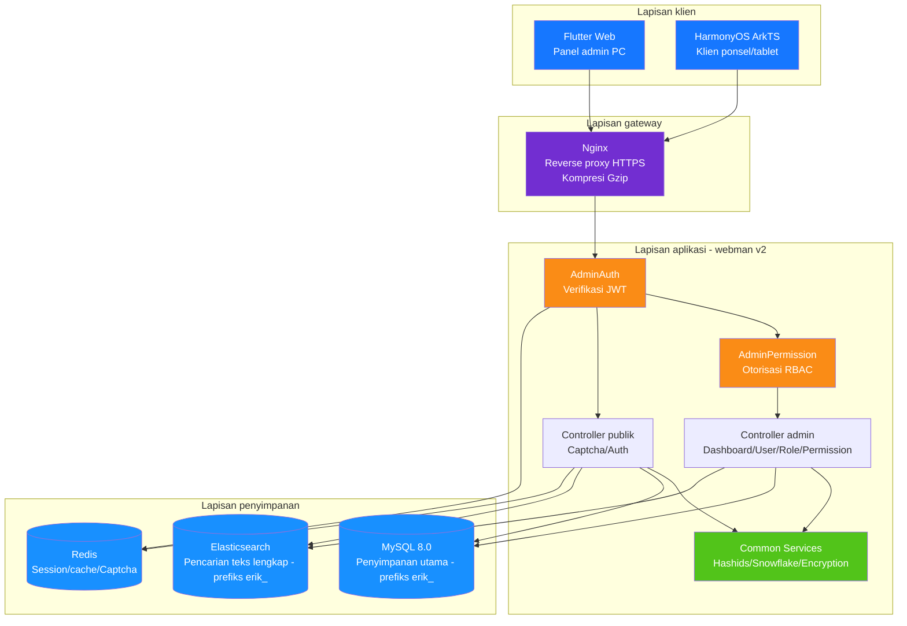

# Arsitektur Topologi Sistem

```mermaid
flowchart TB
    subgraph clients["Lapisan klien"]
        flutter["Flutter Web<br/>Panel admin PC"]
        harmony["HarmonyOS ArkTS<br/>Klien ponsel/tablet"]
    end

    subgraph gateway["Lapisan gateway"]
        nginx["Nginx<br/>Reverse proxy HTTPS<br/>Kompresi Gzip"]
    end

    subgraph app["Lapisan aplikasi - webman v2"]
        auth["AdminAuth<br/>Verifikasi JWT"]
        perm["AdminPermission<br/>Otorisasi RBAC"]
        admin["Controller admin<br/>Dashboard/User/Role/Permission"]
        public["Controller publik<br/>Captcha/Auth"]
        common["Common Services<br/>Hashids/Snowflake/Encryption"]
    end

    subgraph storage["Lapisan penyimpanan"]
        mysql[("MySQL 8.0<br/>Penyimpanan utama - prefiks erik_")]
        es[("Elasticsearch<br/>Pencarian teks lengkap - prefiks erik_")]
        redis[("Redis<br/>Session/cache/Captcha")]
    end

    flutter --> nginx
    harmony --> nginx
    nginx --> auth
    auth --> perm
    perm --> admin
    auth --> public
    admin --> common
    public --> common
    admin --> mysql
    public --> mysql
    admin --> es
    public --> es
    auth --> redis
    public --> redis

    style flutter fill:#1677FF,color:#fff
    style harmony fill:#1677FF,color:#fff
    style nginx fill:#722ED1,color:#fff
    style auth fill:#FA8C16,color:#fff
    style perm fill:#FA8C16,color:#fff
    style common fill:#52C41A,color:#fff
    style mysql fill:#1890FF,color:#fff
    style es fill:#1890FF,color:#fff
    style redis fill:#1890FF,color:#fff
```
