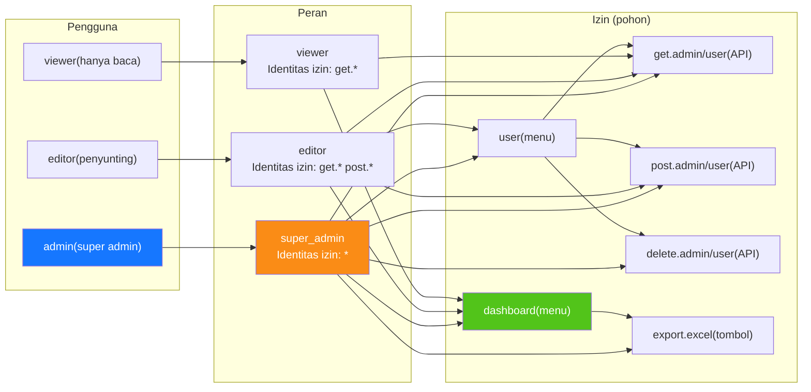
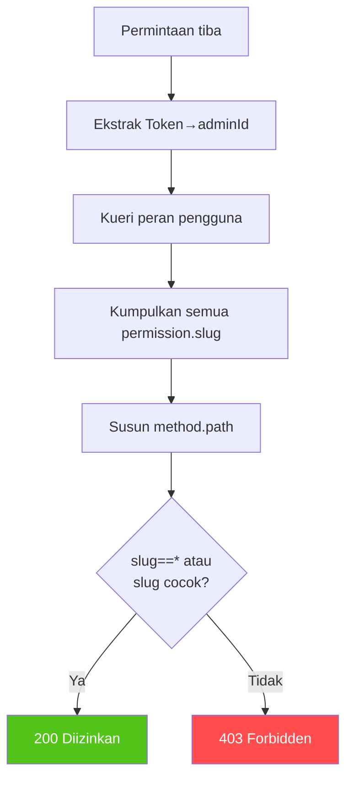
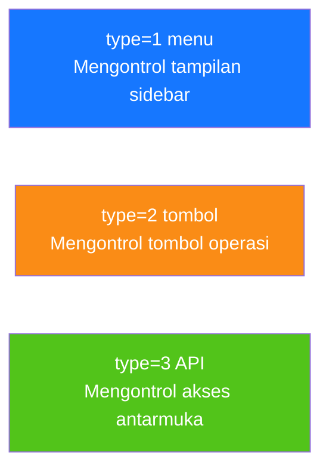

# Model Izin RBAC

## Relasi Pengguna-Peran-Izin

```mermaid
flowchart LR
    subgraph users["Pengguna"]
        u1["admin(super admin)"]
        u2["editor(penyunting)"]
        u3["viewer(hanya baca)"]
    end

    subgraph roles["Peran"]
        r1["super_admin<br/>Identitas izin: *"]
        r2["editor<br/>Identitas izin: get.* post.*"]
        r3["viewer<br/>Identitas izin: get.*"]
    end

    subgraph permissions["Izin (pohon)"]
        p1["dashboard(menu)"]
        p2["user(menu)"]
        p3["get.admin/user(API)"]
        p4["post.admin/user(API)"]
        p5["delete.admin/user(API)"]
        p6["export.excel(tombol)"]
    end

    u1 --> r1
    u2 --> r2
    u3 --> r3
    r1 --> p1 & p2 & p3 & p4 & p5 & p6
    r2 --> p1 & p2 & p3 & p4
    r3 --> p1 & p3
    p2 --> p3 & p4 & p5
    p1 --> p6

    style u1 fill:#1677FF,color:#fff
    style r1 fill:#FA8C16,color:#fff
    style p1 fill:#52C41A,color:#fff
```

## Alur Penentuan Izin

```mermaid
flowchart TD
    start["Permintaan tiba"] --> extract["Ekstrak Token→adminId"]
    extract --> findRoles["Kueri peran pengguna"]
    findRoles --> collectSlug["Kumpulkan semua permission.slug"]
    collectSlug --> buildKey["Susun method.path"]
    buildKey --> check{"slug==* atau<br/>slug cocok?"}
    check -->|"Ya"| allow["200 Diizinkan"]
    check -->|"Tidak"| deny["403 Forbidden"]

    style allow fill:#52C41A,color:#fff
    style deny fill:#FF4D4F,color:#fff
```

## Jenis Izin

```mermaid
flowchart LR
    t1["type=1 menu<br/>Mengontrol tampilan sidebar"]
    t2["type=2 tombol<br/>Mengontrol tombol operasi"]
    t3["type=3 API<br/>Mengontrol akses antarmuka"]

    style t1 fill:#1677FF,color:#fff
    style t2 fill:#FA8C16,color:#fff
    style t3 fill:#52C41A,color:#fff
```
