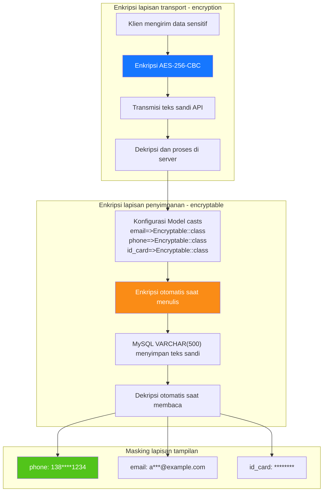

# Lapisan Enkripsi Data

```mermaid
flowchart TB
    subgraph transport["Enkripsi lapisan transport - encryption"]
        e1["Klien mengirim data sensitif"]
        e2["Enkripsi AES-256-CBC"]
        e3["Transmisi teks sandi API"]
        e4["Dekripsi dan proses di server"]
        e1 --> e2 --> e3 --> e4
    end

    subgraph storage["Enkripsi lapisan penyimpanan - encryptable"]
        d1["Konfigurasi Model casts<br/>email=>Encryptable::class<br/>phone=>Encryptable::class<br/>id_card=>Encryptable::class"]
        d2["Enkripsi otomatis saat menulis"]
        d3["MySQL VARCHAR(500) menyimpan teks sandi"]
        d4["Dekripsi otomatis saat membaca"]
        d1 --> d2 --> d3 --> d4
    end

    subgraph mask["Masking lapisan tampilan"]
        m1["phone: 138****1234"]
        m2["email: a***@example.com"]
        m3["id_card: ********"]
        d4 --> m1 & m2 & m3
    end

    e4 --> d1

    style e2 fill:#1677FF,color:#fff
    style d2 fill:#FA8C16,color:#fff
    style m1 fill:#52C41A,color:#fff
```
