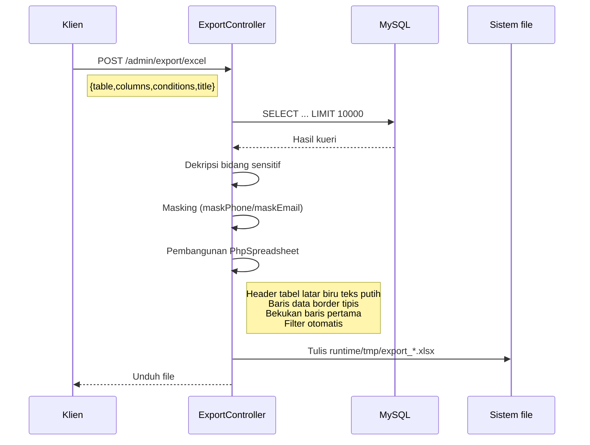
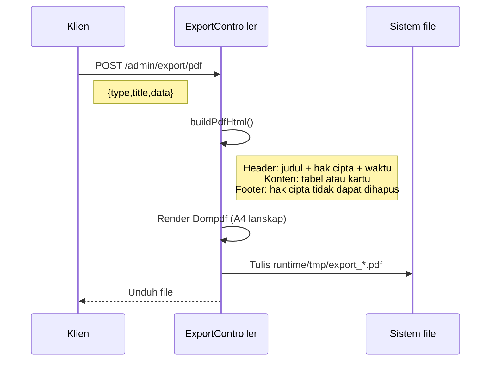

# Alur Bisnis Ekspor

## Ekspor Excel

```mermaid
sequenceDiagram
    participant C as Klien
    participant CTL as ExportController
    participant DB as MySQL
    participant FS as Sistem file

    C->>CTL: POST /admin/export/excel
    Note right of C: {table,columns,conditions,title}
    CTL->>DB: SELECT ... LIMIT 10000
    DB-->>CTL: Hasil kueri
    CTL->>CTL: Dekripsi bidang sensitif
    CTL->>CTL: Masking (maskPhone/maskEmail)
    CTL->>CTL: Pembangunan PhpSpreadsheet
    Note right of CTL: Header tabel latar biru teks putih<br/>Baris data border tipis<br/>Bekukan baris pertama<br/>Filter otomatis
    CTL->>FS: Tulis runtime/tmp/export_*.xlsx
    CTL-->>C: Unduh file
```

## Ekspor PDF

```mermaid
sequenceDiagram
    participant C as Klien
    participant CTL as ExportController
    participant FS as Sistem file

    C->>CTL: POST /admin/export/pdf
    Note right of C: {type,title,data}
    CTL->>CTL: buildPdfHtml()
    Note right of CTL: Header: judul + hak cipta + waktu<br/>Konten: tabel atau kartu<br/>Footer: hak cipta tidak dapat dihapus
    CTL->>CTL: Render Dompdf (A4 lanskap)
    CTL->>FS: Tulis runtime/tmp/export_*.pdf
    CTL-->>C: Unduh file
```
