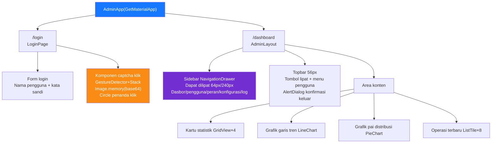
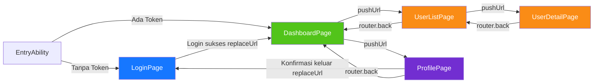

# Arsitektur Komponen Frontend

## Pohon Komponen Flutter Web

```mermaid
flowchart TD
    app["AdminApp(GetMaterialApp)"]

    app --> login["/login<br/>LoginPage"]
    app --> dashboard["/dashboard<br/>AdminLayout"]

    login --> form["Form login<br/>Nama pengguna + kata sandi"]
    login --> captcha["Komponen captcha klik<br/>GestureDetector+Stack<br/>Image.memory(base64)<br/>Circle penanda klik"]

    dashboard --> sidebar["Sidebar NavigationDrawer<br/>Dapat dilipat 64px/240px<br/>Dasbor/pengguna/peran/konfigurasi/log"]
    dashboard --> header["Topbar 56px<br/>Tombol lipat + menu pengguna<br/>AlertDialog konfirmasi keluar"]
    dashboard --> content["Area konten"]

    content --> stats["Kartu statistik GridView×4"]
    content --> chart["Grafik garis tren LineChart"]
    content --> pie["Grafik pai distribusi PieChart"]
    content --> logs["Operasi terbaru ListTile×8"]

    style app fill:#1677FF,color:#fff
    style captcha fill:#FA8C16,color:#fff
    style sidebar fill:#722ED1,color:#fff
```

## Rute Halaman HarmonyOS

```mermaid
flowchart LR
    entry["EntryAbility"]
    entry -->|"Tanpa Token"| loginH["LoginPage"]
    entry -->|"Ada Token"| dashH["DashboardPage"]

    loginH -->|"Login sukses replaceUrl"| dashH

    dashH -->|"pushUrl"| userList["UserListPage"]
    dashH -->|"pushUrl"| profile["ProfilePage"]

    userList -->|"pushUrl"| userDetail["UserDetailPage"]
    userList -->|"router.back"| dashH
    userDetail -->|"router.back"| userList

    profile -->|"Konfirmasi keluar replaceUrl"| loginH
    profile -->|"router.back"| dashH

    style loginH fill:#1677FF,color:#fff
    style dashH fill:#52C41A,color:#fff
    style userList fill:#FA8C16,color:#fff
    style userDetail fill:#FA8C16,color:#fff
    style profile fill:#722ED1,color:#fff
```
