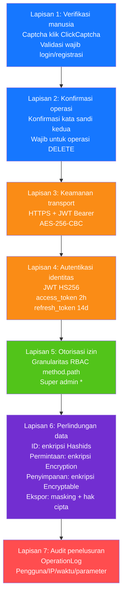

# Pertahanan Berlapis Keamanan

```mermaid
flowchart TB
    l1["Lapisan 1: Verifikasi manusia<br/>Captcha klik ClickCaptcha<br/>Validasi wajib login/registrasi"]
    l2["Lapisan 2: Konfirmasi operasi<br/>Konfirmasi kata sandi kedua<br/>Wajib untuk operasi DELETE"]
    l3["Lapisan 3: Keamanan transport<br/>HTTPS + JWT Bearer<br/>AES-256-CBC"]
    l4["Lapisan 4: Autentikasi identitas<br/>JWT HS256<br/>access_token 2h<br/>refresh_token 14d"]
    l5["Lapisan 5: Otorisasi izin<br/>Granularitas RBAC method.path<br/>Super admin *"]
    l6["Lapisan 6: Perlindungan data<br/>ID: enkripsi Hashids<br/>Permintaan: enkripsi Encryption<br/>Penyimpanan: enkripsi Encryptable<br/>Ekspor: masking + hak cipta"]
    l7["Lapisan 7: Audit penelusuran<br/>OperationLog<br/>Pengguna/IP/waktu/parameter"]

    l1 --> l2 --> l3 --> l4 --> l5 --> l6 --> l7

    style l1 fill:#1677FF,color:#fff
    style l2 fill:#1677FF,color:#fff
    style l3 fill:#FA8C16,color:#fff
    style l4 fill:#FA8C16,color:#fff
    style l5 fill:#52C41A,color:#fff
    style l6 fill:#722ED1,color:#fff
    style l7 fill:#FF4D4F,color:#fff
```
