# アーキテクチャ設計図と業務ロジック図

> Copyright (c) 2026 erik <erik@erik.xyz> — https://erik.xyz

> 以下の Mermaid 図表は GitHub / GitLab / VS Code で自動レンダリングされます。その他の環境では [Mermaid Live Editor](https://mermaid.live/) で確認してください。

---

## 1. システムトポロジアーキテクチャ

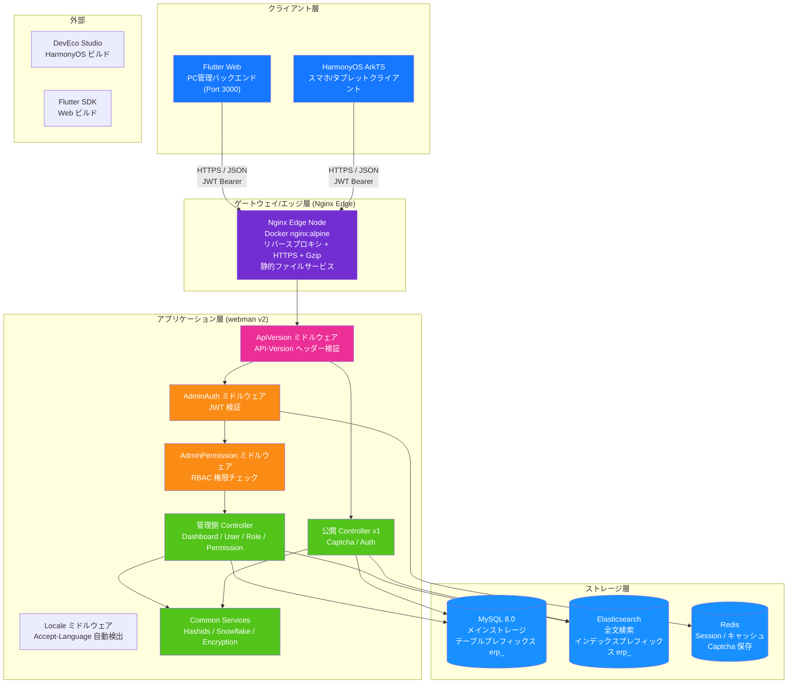

---

## 2. バックエンド階層アーキテクチャ

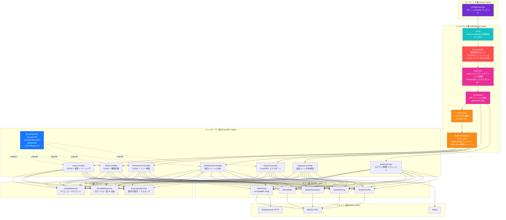

### ERP 業務層の拡張

システムが純粋な管理バックエンドから完全な ERP システムへと進化するにつれ、コントローラー層とサービス層に以下の業務モジュールが追加されました：

| 階層 | ディレクトリ | 説明 |
|------|------|------|
| 業務コントローラー | `app/controller/{product,purchase,sales,inventory,finance,crm,workflow,notification,project,hr,manufacturing,report}/` | 70 個、モジュールごとに分類され業務リクエストを処理 |
| 業務サービス | `app/service/{inventory,finance,notification}/` | 在庫入出庫+コスト計算、財務の売掛/買掛+消込、通知送信 |

---

## 3. リクエストライフサイクル

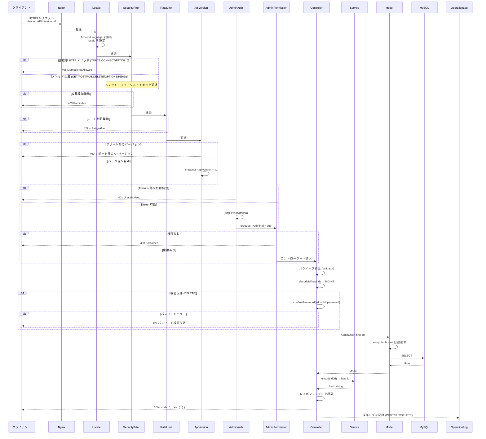

---

## 4. 認証と認証コードのフロー

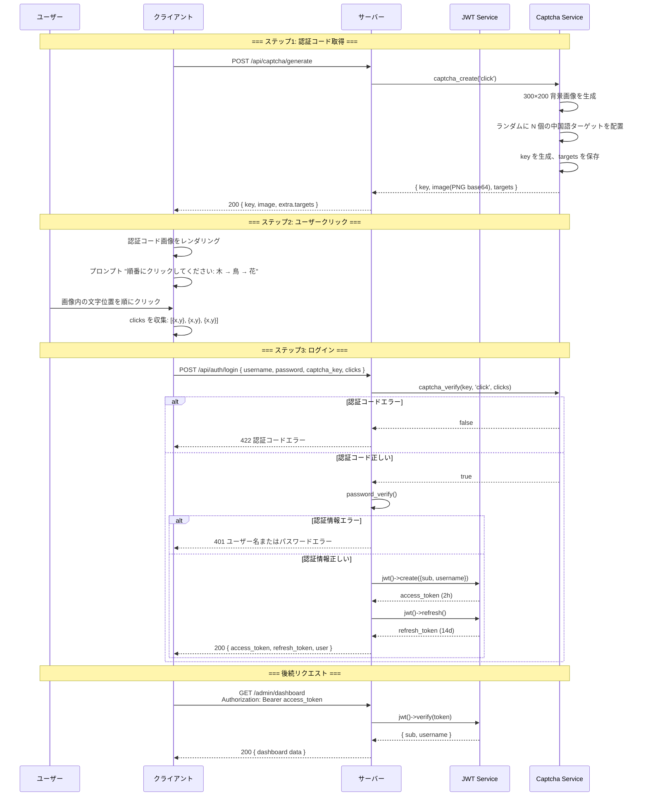

---

## 5. RBAC 権限モデル

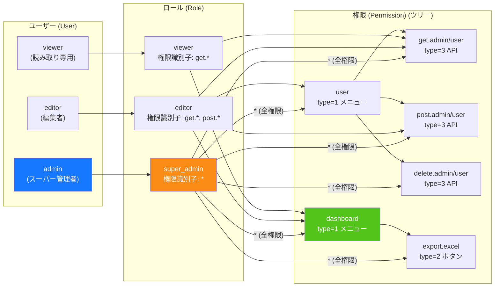

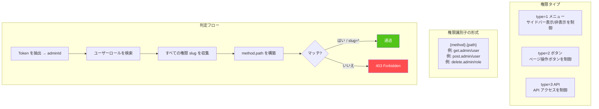

---

## 6. ID の全ライフサイクル

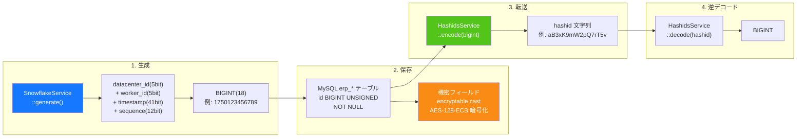

---

## 7. データ暗号化の階層

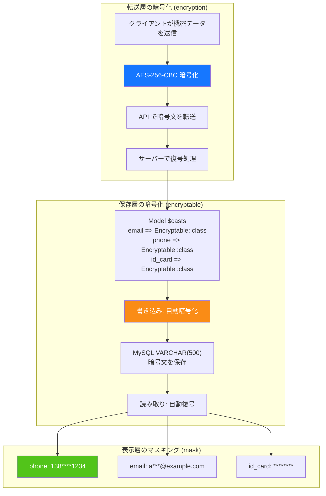

---

## 8. データベース ER 関係

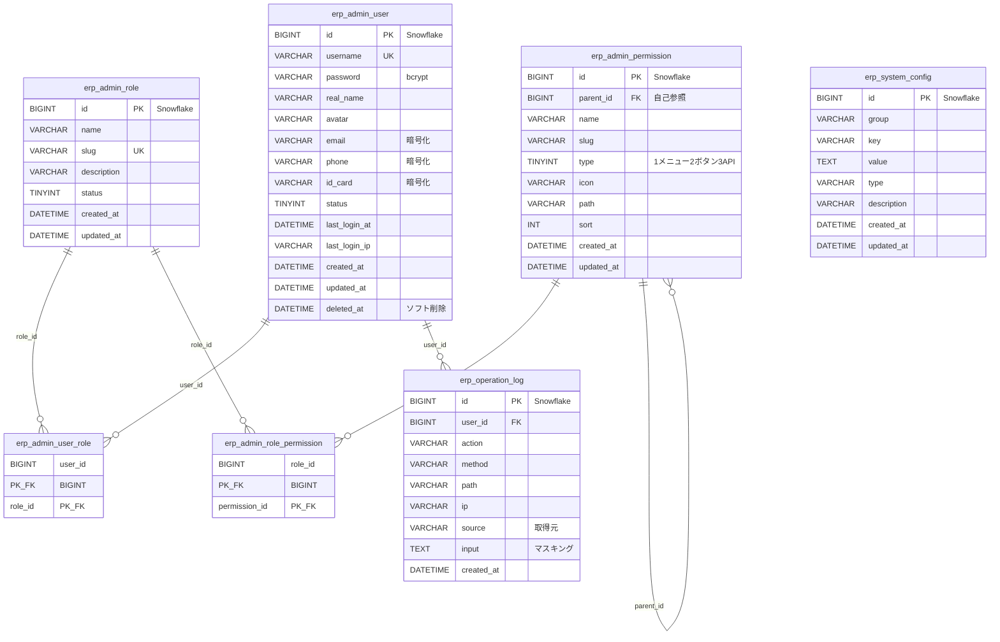

---

## 9. エクスポート業務フロー

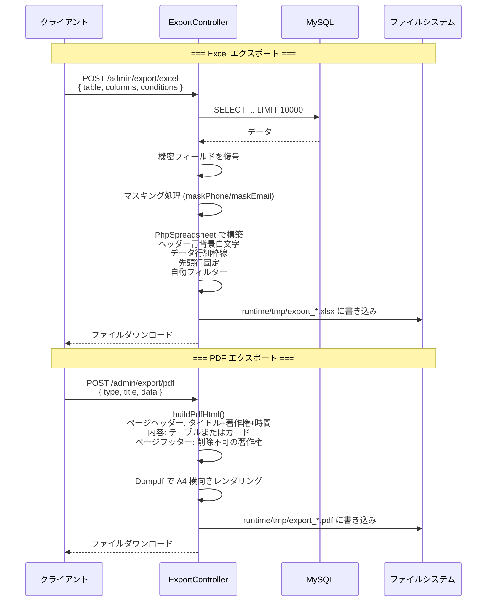

---

## 10. Flutter Web コンポーネントツリー

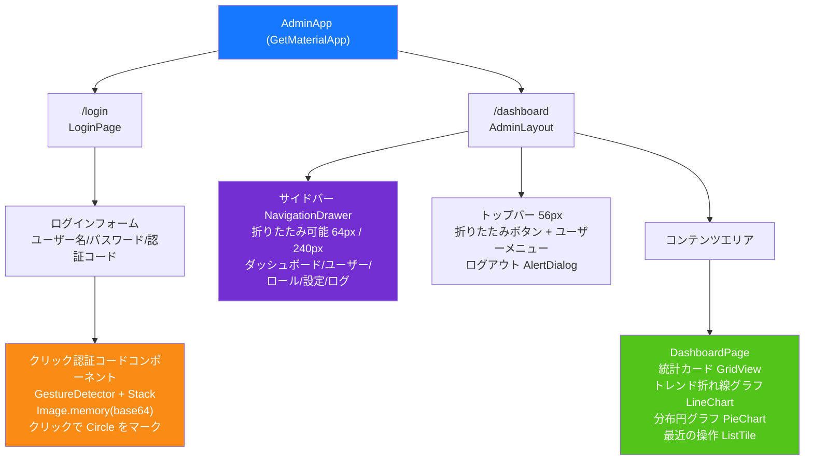

---

## 11. HarmonyOS ページルーティング

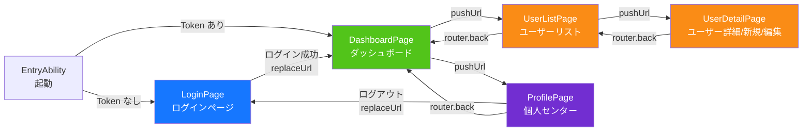

---

## 12. セキュリティ多層防御の全体像

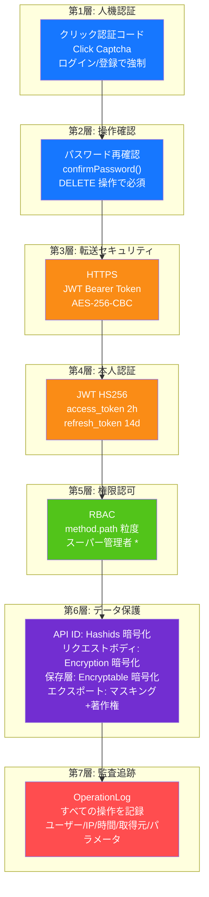

---

## 13. デプロイメントトポロジ

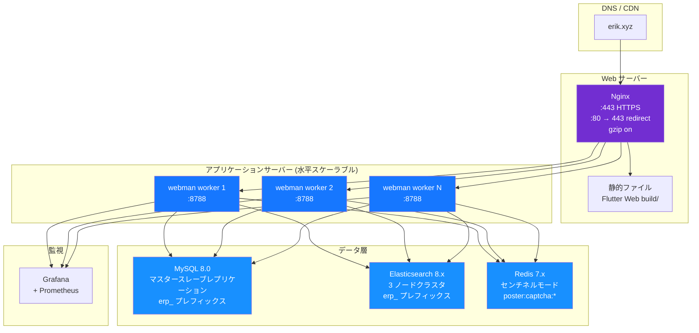

---

## 14. ERP システム全体アーキテクチャ

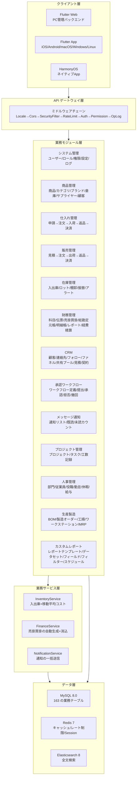

---

## 15. モジュール間データフロー

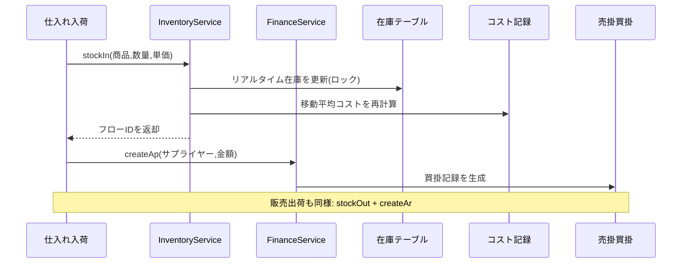

---

## 16. 在庫コスト計算データフロー

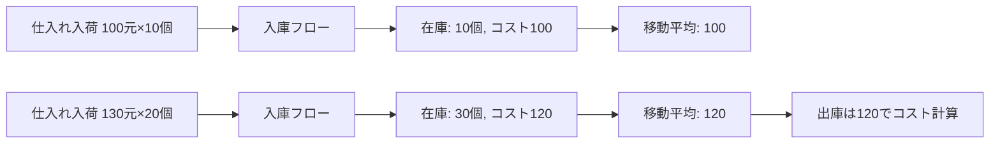

---

## 17. 承認ワークフローデータフロー

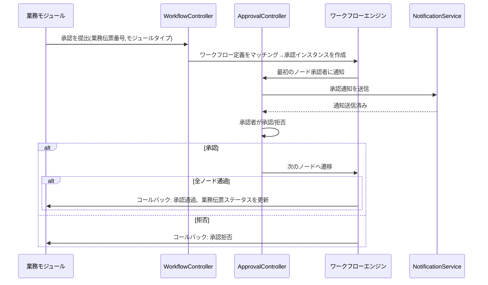

---

## 18. メッセージ通知データフロー

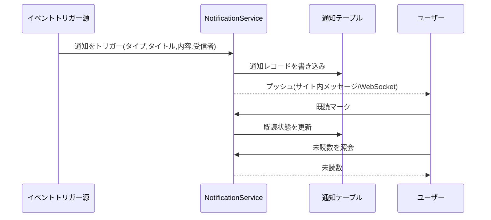

---

## 19. MRP 部品所要計画データフロー

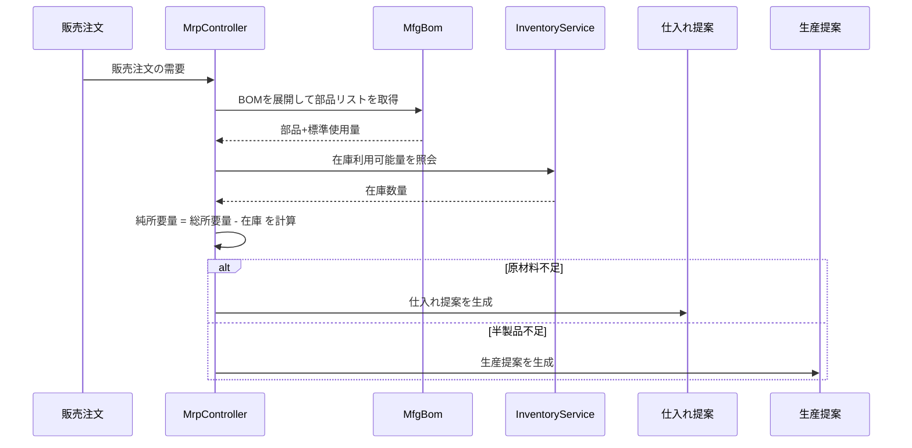

---

## 20. ERP モジュール コントローラー-サービス-モデル対応表

> サービス層の説明：`核心Service` 列は、そのモジュールに実装済みの業務サービスを示します；**⚠ コントローラーがモデルを直接参照、既知の技術負債** と記載されたモジュールは、コントローラーが引き続きモデルの照会/書き込みメソッド（`XxxModel::find/where/save` など）を直接呼び出しており、サービス層をまだ抽出しておらず、既知の技術負債に該当します。今後は P2-F2 サービス層軽量抽出パターン（`app/service/AbstractCrudService` 汎用 CRUD 基底クラス + モジュール Service）に沿って段階的に収束させます。

| モジュール | Controllers (ディレクトリ) | コアService | 主要Model | テーブル数 |
|------|-------------------|-------------|-----------|------|
| システム管理 | admin/controller/ (14個) | - ⚠コントローラーがモデルを直接参照、既知の技術負債 | AdminUser, AdminRole, AdminPermission | 7 |
| 商品管理 | controller/product/ (7個) | ProductService | Product, Category, Brand, Warehouse, Supplier, Customer | 11 |
| 仕入れ管理 | controller/purchase/ (5個) | InventoryService, FinanceService ⚠CRUDは依然として直接参照、既知の技術負債 | PurchaseOrder, PurchaseReceive | 9 |
| 販売管理 | controller/sales/ (5個) | InventoryService, FinanceService ⚠CRUDは依然として直接参照、既知の技術負債 | SalesOrder, SalesDelivery | 9 |
| 在庫管理 | controller/inventory/ (5個) | InventoryService ⚠CRUDは依然として直接参照、既知の技術負債 | Inventory, InventoryFlow, CostRecord | 11 |
| 財務管理 | controller/finance/ (20個) | FinanceService ⚠CRUDは依然として直接参照、既知の技術負債 | FinanceArAp, FinanceVoucher, FinanceReceipt, FinancePayment, FinanceGeneralLedger, FinanceBalanceSheet, FinanceAsset, FinanceBudget, FinanceCostCenter | 26 |
| CRM | controller/crm/ (10個) | CrmService | CrmOpportunity, CrmFollowRecord, CrmContract, CrmPoolRule, CrmQuotation, CrmCampaign, CrmTicket, CrmAnalyticsReport | 16 |
| 承認ワークフロー | controller/workflow/ (2個) | - ⚠コントローラーがモデルを直接参照、既知の技術負債 | ApprovalWorkflow, ApprovalInstance, ApprovalNode, ApprovalRecord | 4 |
| メッセージ通知 | controller/notification/ (1個) | NotificationService ⚠CRUDは依然として直接参照、既知の技術負債 | Notification, NotificationSetting, NotificationTemplate | 3 |
| プロジェクト管理 | controller/project/ (3個) | - ⚠コントローラーがモデルを直接参照、既知の技術負債 | Project, ProjectTask, ProjectTimesheet, ProjectMember, ProjectGantt | 5 |
| 人事管理 | controller/hr/ (5個) | HrService | HrDepartment, HrEmployee, HrPosition, HrAttendance, HrLeave, HrSalary | 8 |
| 生産製造 | controller/manufacturing/ (5個) | ManufacturingService | MfgBom, MfgProductionOrder, MfgRouting, MfgWorkstation, MfgMrpPlan | 8 |
| カスタムレポート | controller/report/ (2個) | - ⚠コントローラーがモデルを直接参照、既知の技術負債 | ReportTemplate, ReportDataset, ReportField, ReportFilter, ReportSchedule | 5 |
| EAM 設備管理 | controller/eam/ (4個) | - ⚠コントローラーがモデルを直接参照、既知の技術負債 | EamEquipment, EamMaintenancePlan, EamRepairOrder, EamSparePart | 4 |
| DMS 文書管理 | controller/dms/ (2個) | - ⚠コントローラーがモデルを直接参照、既知の技術負債 | DmsCategory, DmsDocument, DmsDocumentVersion | 3 |
| BI ダッシュボード | controller/bi/ (3個) | - ⚠コントローラーがモデルを直接参照、既知の技術負債 | BiDashboard, BiWidget | 2 |

### 20.1 P2-F2 サービス層軽量抽出記録（crm/hr/manufacturing/product は抽出済み）

| モジュール | 抽出前のコントローラー直接参照呼び出し数 | 抽出後 | 追加 Service | 抽出内容 |
|------|----------------------|--------|--------------|----------|
| CRM | 57 | 0 | `app/service/crm/CrmService.php` | 汎用 CRUD + 契約ステータス遷移、見積から契約への変換、共有プールの取得/解放、工単の割り当て/解決/返信、明細のカスケード削除、分析レポートデータ構築 |
| 人事管理 | 38 | 0 | `app/service/hr/HrService.php` | 汎用 CRUD + 出勤打刻の遅刻/早退判定、休暇承認（休暇勤怠を自動生成）、給与の一意性/実支給計算/支給/一括生成 |
| 生産製造 | 33 | 0 | `app/service/manufacturing/ManufacturingService.php` | 汎用 CRUD + 工単の開始/完了遷移、BOM バージョン複製/有効化の排他、MRP 明細生成 |
| 商品管理 | 29 | 0 | `app/service/product/ProductService.php` | 汎用 CRUD + 商品トランザクション作成（SKU/価格）、フィールド単位の原値保持更新、詳細の関連ロード |

抽出パターン：`app/service/AbstractCrudService.php` が `list/all/find/create/update/delete/deleteWhere` の汎用 CRUD と `normalizePageParams/canTransition` の純ロジックヘルパーを提供；モジュール Service はこれを継承し、モジュール固有の業務を集約します。コントローラーは `Container::get(XxxService::class)`（class_exists フォールバック）でサービスを注入し、ルート/パラメータ/戻り値構造は完全に不変のまま維持；hashid エンコード/デコード、パスワード再確認、レスポンスラッピングなどの HTTP 関心事は引き続きコントローラーに残します。新 Service は `config/dependence.php` に登録済みです（このファイルは dead config で、addDefinitions ではロードされず、実行時にコンテナの class_exists フォールバックでインスタンス化されるため、すべての Service は引数なしコンストラクタを維持）。

未抽出モジュール（プロジェクト管理 18 回、カスタムレポート 18 回、仕入れ 24 回、販売 24 回、システム管理 42 回など）は表中に「コントローラーがモデルを直接参照、既知の技術負債」と記載済みで、今後のイテレーションで同じパターンに沿って抽出します。

---

## OMS/WMS/TMS 拡張モジュール (2026-08)

### OMS (Order Management System) — 8 tables
- **注文拡張** (`erp_oms_order`)：マルチチャネル集約/履行ステータス/支払いステータス/優先度
- **注文住所** (`erp_oms_order_address`)：受取/請求先住所(多国対応フォーマット)
- **履行記録** (`erp_oms_fulfillment`+`_item`)：割当/ピッキング済み/梱包済み/出荷済み数量の追跡
- **RMA** (`erp_oms_rma`+`_item`)：返品交換の全ライフサイクル
- **在庫予約** (`erp_oms_inventory_reservation`)：ATP = physical - reserved
- **チャネル** (`erp_channel`)：direct/marketplace/edi/pos

### WMS (Warehouse Management System) — 12 tables
- **エリア・ロケーション** (`erp_wms_zone`, `erp_wms_location`)：zone→aisle→rack→level→bin
- **入庫** (`erp_wms_asn`+`_item`, `erp_wms_receiving`, `erp_wms_putaway_task`+`_item`)
- **出庫** (`erp_wms_wave`+`wave_order`, `erp_wms_pick_task`+`_item`, `erp_wms_pack_task`)

### TMS (Transport Management System) — 7 tables
- **運送会社** (`erp_tms_carrier`+`carrier_service`, `erp_tms_freight_rate`)
- **運送伝票** (`erp_tms_shipment`+`_package`, `erp_tms_tracking_event`)
- **請求書** (`erp_tms_freight_invoice`)

### Data Flow
```
OMS: Channel Order → Inventory Reservation (ATP) → Create Fulfillment → WMS
WMS: Wave → Pick → Pack → TMS Shipment
TMS: Rate Shop → Ship → Confirm (stockOut + AR) → Tracking → Delivery
WMS Inbound: ASN → Receive → Putaway (stockIn + AP)
RMA: Request → Approve → Return → Receive (stockIn) → Refund
```

---

## 21. エコシステムロードマップ (2026-08)

> 詳細設計仕様: `superpowers/specs/2026-08-04-erp-ecosystem-roadmap-design.md`

### 21.1 ベースライン評価（ロードマップ開始時）

> P0〜P3 はすべて納品済みで、現在の総合スコアは 89/100（CLAUDE.md 参照）；下表はロードマップ開始前のベースラインスナップショットです。

| 次元 | スコア | 主なギャップ |
|------|------|----------|
| バックエンド API | 85/100 | 多くのモジュールが CRUD の骨組みのみで、業務計算エンジンが不足 |
| セキュリティ防御 | 95/100 | 18 層の多層防御、本番対応済み |
| フロントエンド UI | 20/100 | **最大の弱点**: Flutter 12 ページでモジュールの約 20% のみカバー、Web 管理パネルが未整備 |
| 運用エコシステム | 70/100 | マイグレーションロールバック、自動バックアップ、可観測性が不足 |
| 業務深度 | 55/100 | 財務/人事/製造のコアアルゴリズムが未実装 |
| **総合** | **65/100** | |

### 21.2 4段階シリアルロードマップ

```
P0(3-4周) → P1(4-6周) → P2(1-2周) → P3(2-3周) = 总计约13周
```

| 段階 | 名称 | 主要納品物 |
|------|------|----------|
| **P0** | フロントエンドエコシステム | Flutter Web 全モジュール管理パネル（14 モジュール 40+ ページ）、汎用コンポーネントライブラリ、HarmonyOS 整合 |
| **P1** | 業務深度 | 財務複式簿記エンジン、給与計算エンジン、MRP エンジン、品質管理モジュール、リアルタイム通知(WebSocket) |
| **P2** | 運用信頼性 | データベースマイグレーションロールバック、自動バックアップ強化、OpenTelemetry トレーシング、RabbitMQ キュードライバー |
| **P3** | 体験向上 | BI ドラッグ可能ダッシュボード、設備管理(EAM)、マルチテナント分離、文書管理(DMS) |

### 21.3 ミドルウェアチェーン進化

```
現状:   Locale → Cors → SecurityFilter → RateLimit → TracingId → {路由组}
P1 後:  Locale → Cors → SecurityFilter → RateLimit → WebSocketUpgrade → {路由组}
P2 後:  Locale → Cors → SecurityFilter → RateLimit → TracingId → WebSocketUpgrade → {路由组}
P3 後:  Locale → Cors → SecurityFilter → RateLimit → TracingId → TenantScope → WebSocketUpgrade → {路由组}
```

### 21.4 P0 目標アーキテクチャ — Flutter Web 管理パネル

| 階層 | 追加内容 |
|------|----------|
| レイアウト層 | `AdminLayout` PC 3カラムレイアウト（折りたたみ可能なサイドバー + トップバー + コンテンツエリア） |
| コンポーネント層 | `DataTableWrapper`, `FormDialog`, `ConfirmDialog`, `StatCard`, `BreadcrumbNav`, `FileUploader` |
| ページ層 | 既存の 12 ページから 14 モジュール 40+ ページの全カバレッジへ拡張 |
| サービス層 | 既存の `ApiService`, `AuthService`, `CaptchaService`, `ExportService` を再利用 |

### 21.5 P1 目標アーキテクチャ — 業務計算エンジン

| エンジン | サービスクラス | 主要ルール |
|------|--------|----------|
| 複式簿記 | `DoubleEntryService`, `PeriodCloseService`, `AccountBalanceService` | 借方貸方バランスの強制検証、期末損益振替、多通貨レート換算 |
| 給与計算 | `SalaryEngineService`, `SocialInsuranceService`, `HousingFundService`, `TaxCalculatorService` | 社会保険基数の上下限、積立金比率、所得税累進税率、銀行振込支給 |
| MRP | `MrpEngineService`, `BomExplosionService`, `NetRequirementService` | BOM の階層展開+ロス、低層コード(LLC)、安全在庫、ロット規則 |
| 品質 | `QmsInspectionService` | IQC 入荷/IPQC 工程/OQC 出荷 の3伝票フロー |
| 通知 | `WebSocketService`, `ChannelRouter` | サイト内/メール/WeChat Work/DingTalk マルチチャネル |

### 21.6 データモデル変更サマリー

| 段階 | 追加テーブル数 | 対象モジュール |
|------|----------|----------|
| P0 | 0 | フロントエンドのみ、テーブル変更なし |
| P1 | 14 | 財務(2) + HR(3) + 製造(2) + 品質(5) + 通知(2) |
| P3 | 7 | BI(2) + EAM(3) + DMS(2) |

---

## 22. マルチテナント（予約機能、未有効化）

> 著作権表示はファイルヘッダーと同じ：Copyright (c) 2026 erik <erik@erik.xyz> — https://erik.xyz

### 22.1 位置づけと判断

マルチテナントは本プロジェクトでは**予約機能**として位置づけられ、今回の期間では**接続せず、有効化しない**（ドキュメント化されたデグレード）方針です。計画と一致し、SaaS 課金、テナントのセルフプロビジョニングなどの「マルチテナント完全商業化ソリューション」は本プロジェクトの建設範囲外；今回の期間では最小限のコード骨格（ミドルウェア + モデル Trait）のみ残し、有効化手順を提示して、今後の必要に応じた有効化に備えます。注：§21.2 ロードマップ P3 の「マルチテナント分離」はこれに合わせて「予約機能（ドキュメント化されたデグレード）」に調整され、骨格を残し、接続しません。

判断根拠（2026-08 レビュー）：
- 既存のデプロイはほぼすべてシングルテナントであり、接続すると不要な分離の複雑さとリグレッションリスクが生じる；
- 現在の骨格には技術的欠陥がある（22.4 参照）、「接続すれば即分離」は成立せず、先に設計修正を完了する必要がある；
- 分離には 163 テーブルのうち業務テーブルごとにカラム追加とモデルごとの有効化が必要で、コストが「最小限の接続」をはるかに超える。

### 22.2 現状の事実（コードと設定の確認）

| 項目 | 現状 |
|----|------|
| `app/middleware/TenantScope.php` | 存在するが未登録；`X-Tenant-Id` ヘッダーからテナントを読み取り、ヘッダー欠落時はそのまま通過 |
| `app/model/concerns/TenantScope.php` | 存在するが、使用するモデルなし；`bootTenantScope()` のグローバルスコープはテナント設定後のみフィルタリング |
| `config/middleware.php` | グローバルチェーン：Locale → Cors → SecurityFilter → RateLimit → TracingId、TenantScope なし |
| `config/route.php` /admin グループ | AdminAuth → AdminPermission → OperationLog、TenantScope なし |
| JWT ペイロード | `sub` / `username` / `token_type` のみ、**tenant_id クレームなし**（`app/api/v1/controller/AuthController.php`） |
| データベース | **全テーブルに tenant_id カラムなし**（install.sql にもなし） |
| モデル | **TenantScope trait を使用するモデルは存在しない** |

### 22.3 有効化手順（予約用の参考、今回の期間では実行しない）

1. ミドルウェアを登録：`config/route.php` の /admin グループの `middleware()` に `app\middleware\TenantScope::class` を追加（AdminAuth の後に配置し、認証済みであることを保証）。
2. リクエスト側はリクエストヘッダーに `X-Tenant-Id`（int テナントID）を付与。
3. 分離が必要な業務テーブルに `tenant_id` カラム（BIGINT + インデックス）を追加し、既存データをバックフィル；辞書/システムテーブル（例：`erp_admin_user`、`erp_role`、`erp_permission`）は分離しない。
4. 分離が必要なモデルクラスで `use app\model\concerns\TenantScope;` を記述し、現在のテナントで自動フィルタリング。
5. （任意）リクエストヘッダーではなく JWT からテナントを取得する場合：ログイン発行ペイロードを拡張して `tenant_id` クレームを追加し、ミドルウェアで `$payload['tenant_id']` から読み取る。

### 22.4 既知の技術的制限（有効化前に必ず解決）

- **静的受け渡しチェーンの断裂（PHP 8.3 実測）**：ミドルウェアが trait 名で `setCurrentTenantId()` を呼び出すと trait 自身の静的コピーに書き込まれ、その trait を使用するモデルクラスからは読み取れず、クエリはフィルタリングされません。有効化時はリクエストコンテキストベースの注入（例：`request()->tenantId`）に変更する必要があります。
- **静的グローバル状態の干渉**：Workerman は常駐プロセスのため、静的プロパティがリクエスト間で共有されます；コルーチンモード（Swoole/Swow）を有効化するとテナント間のデータ干渉が発生するため、リクエストレベルバインド（`context()` / リクエストオブジェクト）に変更する必要があります。
- **データプレーンのギャップ**：全テーブルに tenant_id カラムがないため、テーブルごとのマイグレーションが必要；テナント間で共有される辞書テーブルには免除メカニズムの設計が必要。

### 22.5 受入基準

今回の受入基準 = ドキュメントとコードの一致：`config/middleware.php` と `config/route.php` に TenantScope の登録が含まれない；ミドルウェアと Trait のコメントに「予約機能、未有効化」と明記され、有効化手順が提示されている；本節の記述がコードの現状と1件ずつ対応している。
