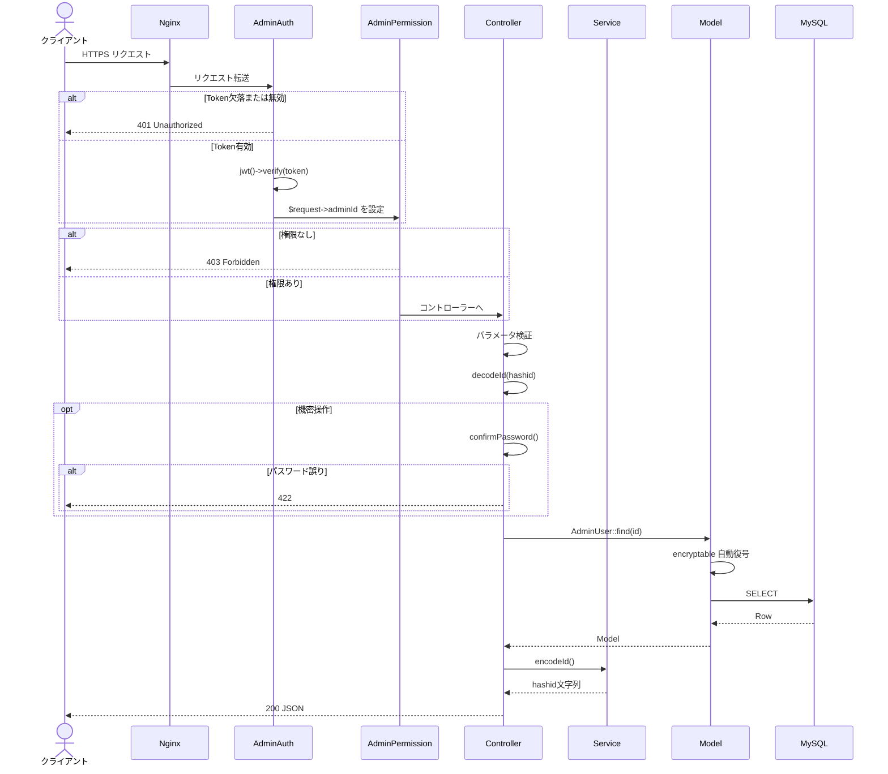

# リクエスト・ライフサイクル

```mermaid
sequenceDiagram
    actor C as クライアント
    participant N as Nginx
    participant MW1 as AdminAuth
    participant MW2 as AdminPermission
    participant CTL as Controller
    participant SVC as Service
    participant MDL as Model
    participant DB as MySQL

    C->>N: HTTPS リクエスト
    N->>MW1: リクエスト転送

    alt Token欠落または無効
        MW1-->>C: 401 Unauthorized
    else Token有効
        MW1->>MW1: jwt()->verify(token)
        MW1->>MW2: $request->adminId を設定
    end

    alt 権限なし
        MW2-->>C: 403 Forbidden
    else 権限あり
        MW2->>CTL: コントローラーへ
    end

    CTL->>CTL: パラメータ検証
    CTL->>CTL: decodeId(hashid)

    opt 機密操作
        CTL->>CTL: confirmPassword()
        alt パスワード誤り
            CTL-->>C: 422
        end
    end

    CTL->>MDL: AdminUser::find(id)
    MDL->>MDL: encryptable 自動復号
    MDL->>DB: SELECT
    DB-->>MDL: Row
    MDL-->>CTL: Model

    CTL->>SVC: encodeId()
    SVC-->>CTL: hashid文字列

    CTL-->>C: 200 JSON
```
