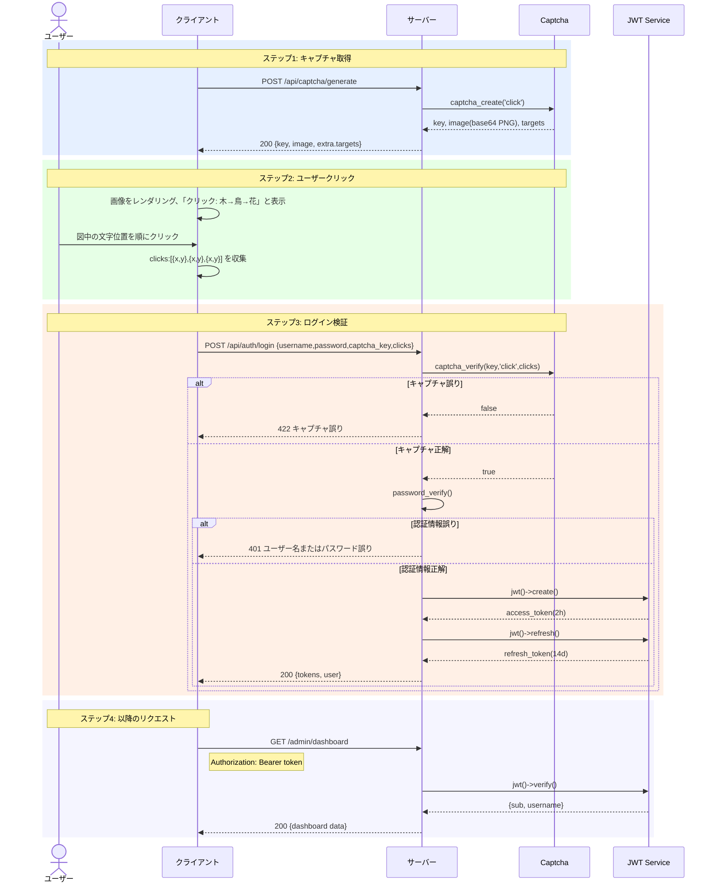

# 認証とキャプチャフロー

```mermaid
sequenceDiagram
    actor U as ユーザー
    participant CL as クライアント
    participant SV as サーバー
    participant CAP as Captcha
    participant JWT as JWT Service

    rect rgb(230, 240, 255)
    Note over U,CAP: ステップ1: キャプチャ取得
    CL->>SV: POST /api/captcha/generate
    SV->>CAP: captcha_create('click')
    CAP-->>SV: key, image(base64 PNG), targets
    SV-->>CL: 200 {key, image, extra.targets}
    end

    rect rgb(230, 255, 230)
    Note over U,CAP: ステップ2: ユーザークリック
    CL->>CL: 画像をレンダリング、「クリック: 木→鳥→花」と表示
    U->>CL: 図中の文字位置を順にクリック
    CL->>CL: clicks:[{x,y},{x,y},{x,y}] を収集
    end

    rect rgb(255, 240, 230)
    Note over U,CAP: ステップ3: ログイン検証
    CL->>SV: POST /api/auth/login {username,password,captcha_key,clicks}
    SV->>CAP: captcha_verify(key,'click',clicks)

    alt キャプチャ誤り
        CAP-->>SV: false
        SV-->>CL: 422 キャプチャ誤り
    else キャプチャ正解
        CAP-->>SV: true
        SV->>SV: password_verify()
        alt 認証情報誤り
            SV-->>CL: 401 ユーザー名またはパスワード誤り
        else 認証情報正解
            SV->>JWT: jwt()->create()
            JWT-->>SV: access_token(2h)
            SV->>JWT: jwt()->refresh()
            JWT-->>SV: refresh_token(14d)
            SV-->>CL: 200 {tokens, user}
        end
    end
    end

    rect rgb(245, 245, 255)
    Note over U,CL: ステップ4: 以降のリクエスト
    CL->>SV: GET /admin/dashboard
    Note right of CL: Authorization: Bearer token
    SV->>JWT: jwt()->verify()
    JWT-->>SV: {sub, username}
    SV-->>CL: 200 {dashboard data}
    end
```
