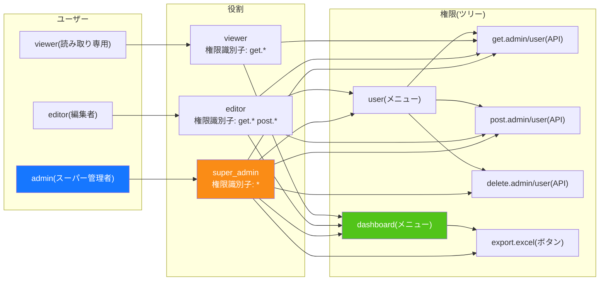
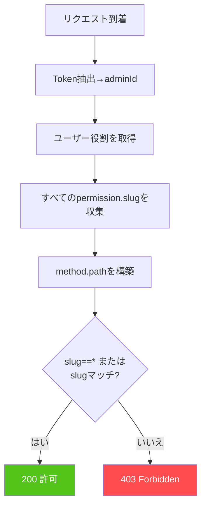
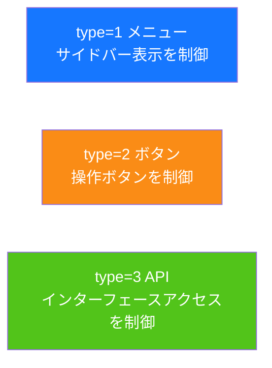

# RBAC 権限モデル

## ユーザー-役割-権限の関係

```mermaid
flowchart LR
    subgraph users["ユーザー"]
        u1["admin(スーパー管理者)"]
        u2["editor(編集者)"]
        u3["viewer(読み取り専用)"]
    end

    subgraph roles["役割"]
        r1["super_admin<br/>権限識別子: *"]
        r2["editor<br/>権限識別子: get.* post.*"]
        r3["viewer<br/>権限識別子: get.*"]
    end

    subgraph permissions["権限(ツリー)"]
        p1["dashboard(メニュー)"]
        p2["user(メニュー)"]
        p3["get.admin/user(API)"]
        p4["post.admin/user(API)"]
        p5["delete.admin/user(API)"]
        p6["export.excel(ボタン)"]
    end

    u1 --> r1
    u2 --> r2
    u3 --> r3
    r1 --> p1 & p2 & p3 & p4 & p5 & p6
    r2 --> p1 & p2 & p3 & p4
    r3 --> p1 & p3
    p2 --> p3 & p4 & p5
    p1 --> p6

    style u1 fill:#1677FF,color:#fff
    style r1 fill:#FA8C16,color:#fff
    style p1 fill:#52C41A,color:#fff
```

## 権限判定フロー

```mermaid
flowchart TD
    start["リクエスト到着"] --> extract["Token抽出→adminId"]
    extract --> findRoles["ユーザー役割を取得"]
    findRoles --> collectSlug["すべてのpermission.slugを収集"]
    collectSlug --> buildKey["method.pathを構築"]
    buildKey --> check{"slug==* または<br/>slugマッチ?"}
    check -->|"はい"| allow["200 許可"]
    check -->|"いいえ"| deny["403 Forbidden"]

    style allow fill:#52C41A,color:#fff
    style deny fill:#FF4D4F,color:#fff
```

## 権限タイプ

```mermaid
flowchart LR
    t1["type=1 メニュー<br/>サイドバー表示を制御"]
    t2["type=2 ボタン<br/>操作ボタンを制御"]
    t3["type=3 API<br/>インターフェースアクセスを制御"]

    style t1 fill:#1677FF,color:#fff
    style t2 fill:#FA8C16,color:#fff
    style t3 fill:#52C41A,color:#fff
```
