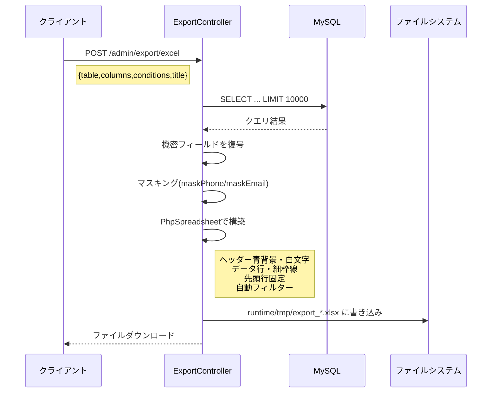
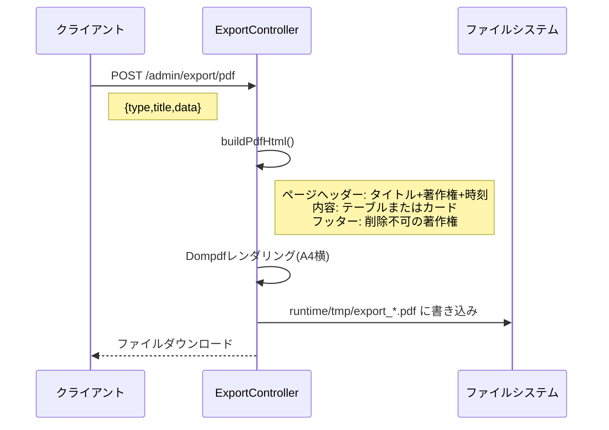

# エクスポート業務フロー

## Excel エクスポート

```mermaid
sequenceDiagram
    participant C as クライアント
    participant CTL as ExportController
    participant DB as MySQL
    participant FS as ファイルシステム

    C->>CTL: POST /admin/export/excel
    Note right of C: {table,columns,conditions,title}
    CTL->>DB: SELECT ... LIMIT 10000
    DB-->>CTL: クエリ結果
    CTL->>CTL: 機密フィールドを復号
    CTL->>CTL: マスキング(maskPhone/maskEmail)
    CTL->>CTL: PhpSpreadsheetで構築
    Note right of CTL: ヘッダー青背景・白文字<br/>データ行・細枠線<br/>先頭行固定<br/>自動フィルター
    CTL->>FS: runtime/tmp/export_*.xlsx に書き込み
    CTL-->>C: ファイルダウンロード
```

## PDF エクスポート

```mermaid
sequenceDiagram
    participant C as クライアント
    participant CTL as ExportController
    participant FS as ファイルシステム

    C->>CTL: POST /admin/export/pdf
    Note right of C: {type,title,data}
    CTL->>CTL: buildPdfHtml()
    Note right of CTL: ページヘッダー: タイトル+著作権+時刻<br/>内容: テーブルまたはカード<br/>フッター: 削除不可の著作権
    CTL->>CTL: Dompdfレンダリング(A4横)
    CTL->>FS: runtime/tmp/export_*.pdf に書き込み
    CTL-->>C: ファイルダウンロード
```
