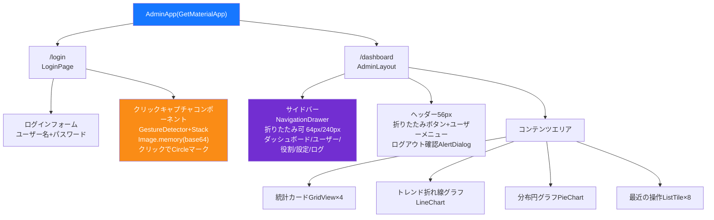
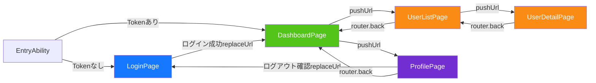

# フロントエンド・コンポーネント・アーキテクチャ

## Flutter Web コンポーネントツリー

```mermaid
flowchart TD
    app["AdminApp(GetMaterialApp)"]

    app --> login["/login<br/>LoginPage"]
    app --> dashboard["/dashboard<br/>AdminLayout"]

    login --> form["ログインフォーム<br/>ユーザー名+パスワード"]
    login --> captcha["クリックキャプチャコンポーネント<br/>GestureDetector+Stack<br/>Image.memory(base64)<br/>クリックでCircleマーク"]

    dashboard --> sidebar["サイドバーNavigationDrawer<br/>折りたたみ可 64px/240px<br/>ダッシュボード/ユーザー/役割/設定/ログ"]
    dashboard --> header["ヘッダー56px<br/>折りたたみボタン+ユーザーメニュー<br/>ログアウト確認AlertDialog"]
    dashboard --> content["コンテンツエリア"]

    content --> stats["統計カードGridView×4"]
    content --> chart["トレンド折れ線グラフLineChart"]
    content --> pie["分布円グラフPieChart"]
    content --> logs["最近の操作ListTile×8"]

    style app fill:#1677FF,color:#fff
    style captcha fill:#FA8C16,color:#fff
    style sidebar fill:#722ED1,color:#fff
```

## HarmonyOS ページルーティング

```mermaid
flowchart LR
    entry["EntryAbility"]
    entry -->|"Tokenなし"| loginH["LoginPage"]
    entry -->|"Tokenあり"| dashH["DashboardPage"]

    loginH -->|"ログイン成功replaceUrl"| dashH

    dashH -->|"pushUrl"| userList["UserListPage"]
    dashH -->|"pushUrl"| profile["ProfilePage"]

    userList -->|"pushUrl"| userDetail["UserDetailPage"]
    userList -->|"router.back"| dashH
    userDetail -->|"router.back"| userList

    profile -->|"ログアウト確認replaceUrl"| loginH
    profile -->|"router.back"| dashH

    style loginH fill:#1677FF,color:#fff
    style dashH fill:#52C41A,color:#fff
    style userList fill:#FA8C16,color:#fff
    style userDetail fill:#FA8C16,color:#fff
    style profile fill:#722ED1,color:#fff
```
