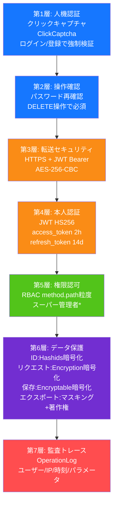

# セキュリティ多層防御

```mermaid
flowchart TB
    l1["第1層: 人機認証<br/>クリックキャプチャClickCaptcha<br/>ログイン/登録で強制検証"]
    l2["第2層: 操作確認<br/>パスワード再確認<br/>DELETE操作で必須"]
    l3["第3層: 転送セキュリティ<br/>HTTPS + JWT Bearer<br/>AES-256-CBC"]
    l4["第4層: 本人認証<br/>JWT HS256<br/>access_token 2h<br/>refresh_token 14d"]
    l5["第5層: 権限認可<br/>RBAC method.path粒度<br/>スーパー管理者*"]
    l6["第6層: データ保護<br/>ID:Hashids暗号化<br/>リクエスト:Encryption暗号化<br/>保存:Encryptable暗号化<br/>エクスポート:マスキング+著作権"]
    l7["第7層: 監査トレース<br/>OperationLog<br/>ユーザー/IP/時刻/パラメータ"]

    l1 --> l2 --> l3 --> l4 --> l5 --> l6 --> l7

    style l1 fill:#1677FF,color:#fff
    style l2 fill:#1677FF,color:#fff
    style l3 fill:#FA8C16,color:#fff
    style l4 fill:#FA8C16,color:#fff
    style l5 fill:#52C41A,color:#fff
    style l6 fill:#722ED1,color:#fff
    style l7 fill:#FF4D4F,color:#fff
```
