# 아키텍처 설계도 및 비즈니스 로직 다이어그램

> Copyright (c) 2026 erik <erik@erik.xyz> — https://erik.xyz

> 아래 Mermaid 차트는 GitHub / GitLab / VS Code에서 자동 렌더링됩니다. 그 외 환경에서는 [Mermaid Live Editor](https://mermaid.live/)로 확인하세요.

---

## 1. 시스템 토폴로지 아키텍처

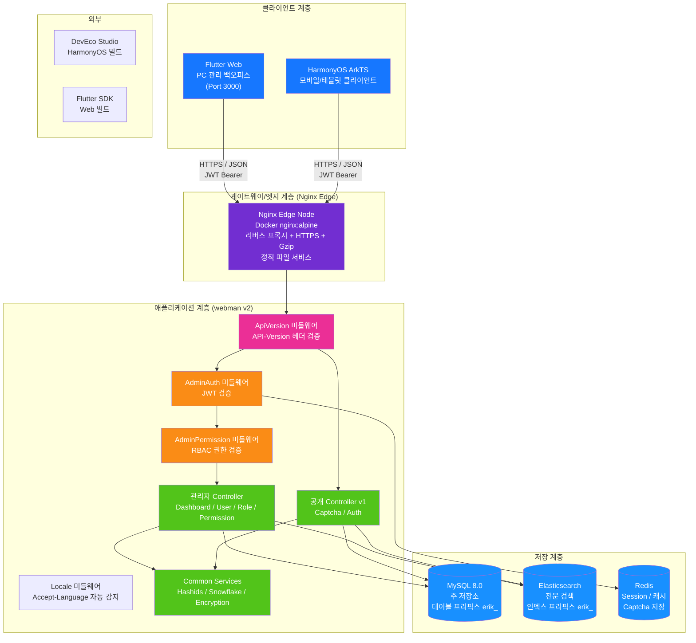

---

## 2. 백엔드 계층형 아키텍처

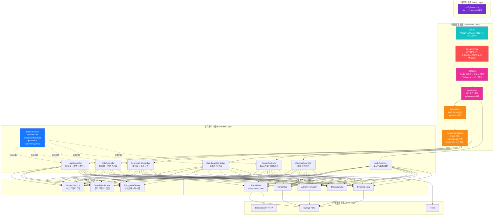

### ERP 비즈니스 계층 확장

시스템이 순수 관리 백오피스에서 완전한 ERP 시스템으로 진화함에 따라 컨트롤러 계층과 서비스 계층에 다음 비즈니스 모듈이 추가되었습니다:

| 계층 | 디렉토리 | 설명 |
|------|------|------|
| 비즈니스 컨트롤러 | `app/controller/{product,purchase,sales,inventory,finance,crm,workflow,notification,project,hr,manufacturing,report}/` | 70개, 모듈별로 구분되어 비즈니스 요청 처리 |
| 비즈니스 서비스 | `app/service/{inventory,finance,notification}/` | 재고 입출고+원가 계산, 재무 외상 매입/매출+정산, 알림 발송 |

---

## 3. 요청 수명 주기

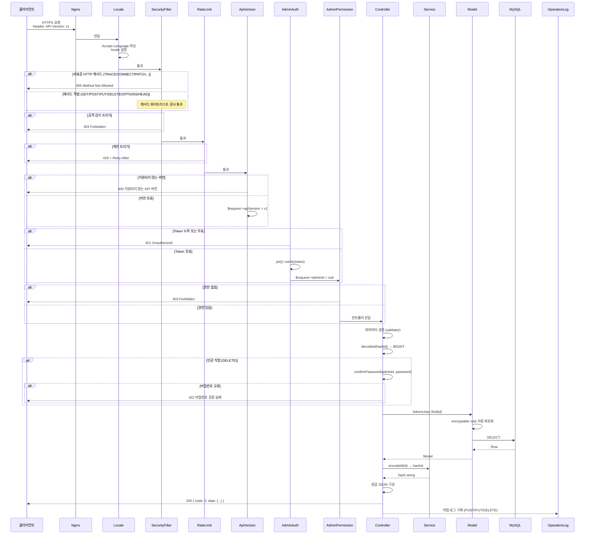

---

## 4. 인증 및 캡차 플로우

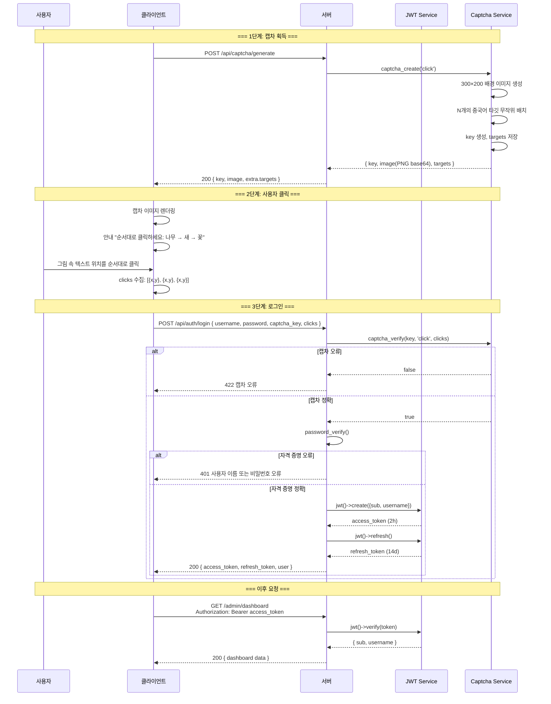

---

## 5. RBAC 권한 모델

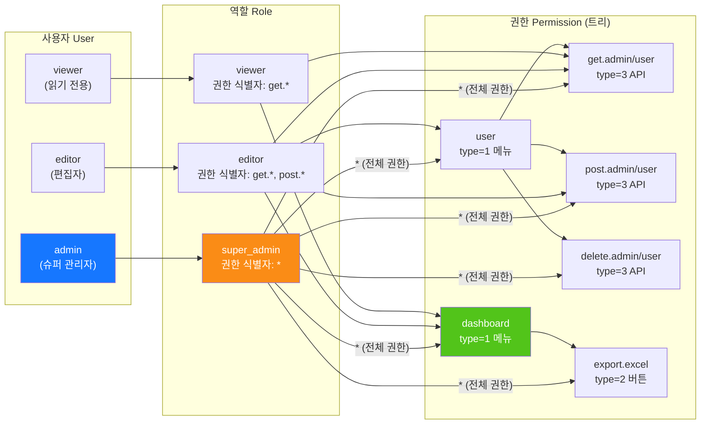

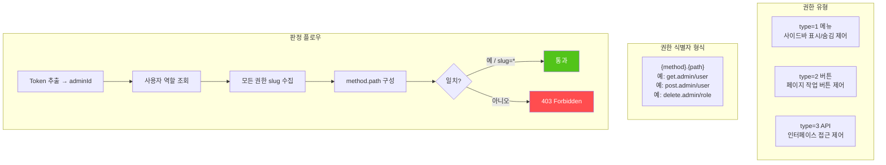

---

## 6. ID 전체 수명 주기

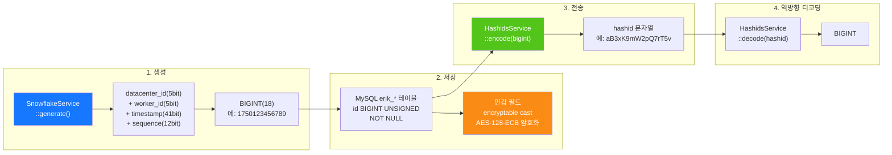

---

## 7. 데이터 암호화 계층

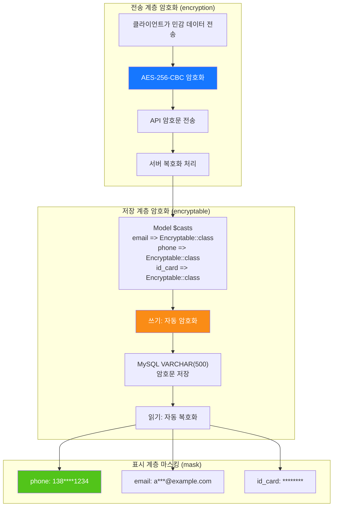

---

## 8. 데이터베이스 ER 관계

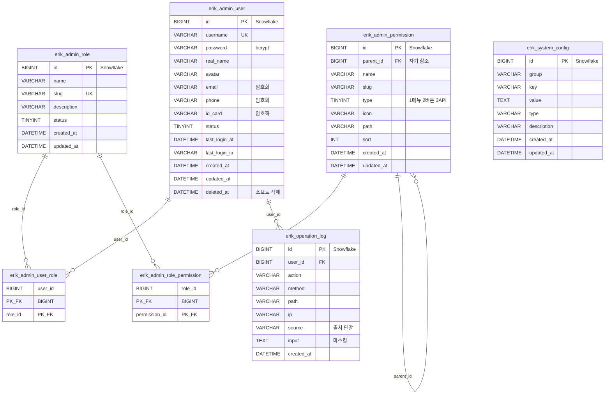

---

## 9. 내보내기 비즈니스 플로우

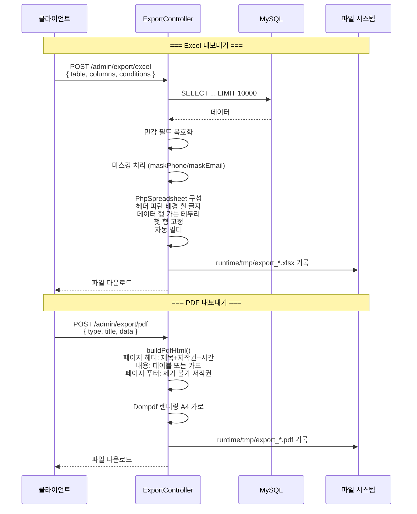

---

## 10. Flutter Web 컴포넌트 트리

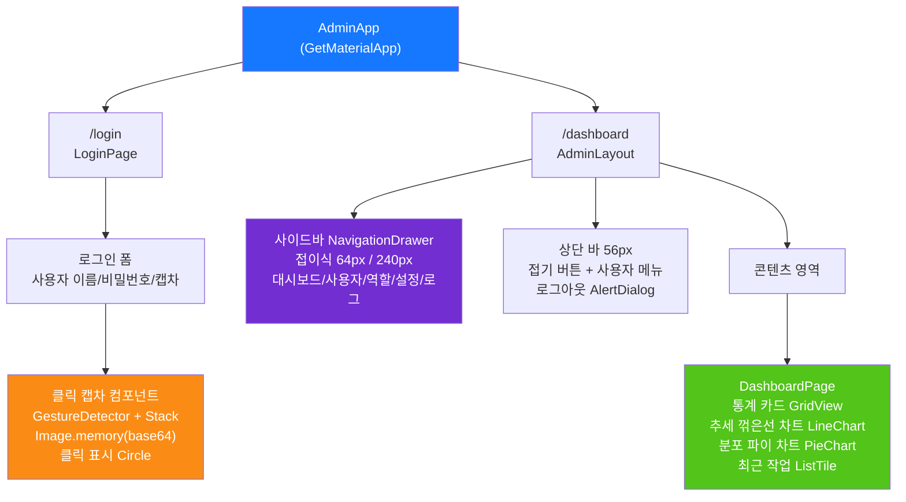

---

## 11. HarmonyOS 페이지 라우팅

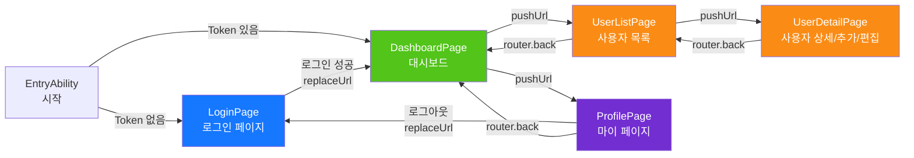

---

## 12. 보안 심층 방어 전체도

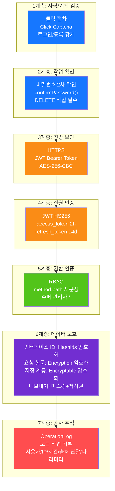

---

## 13. 배포 토폴로지

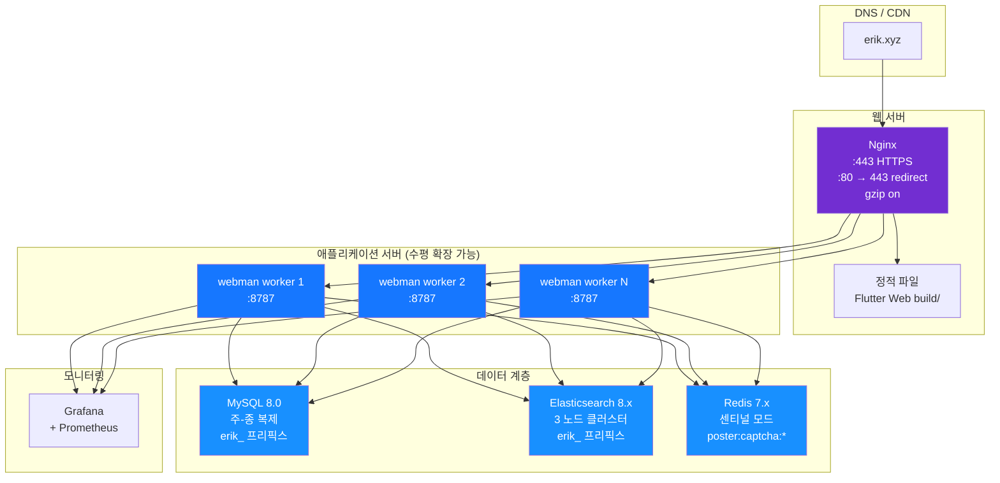

---

## 14. ERP 시스템 전체 아키텍처

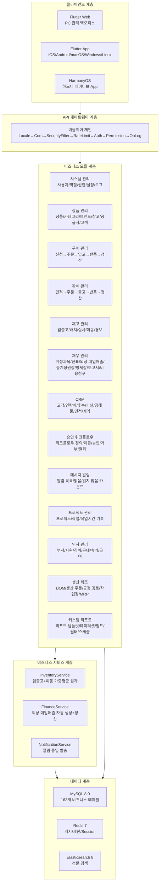

---

## 15. 모듈 간 데이터 플로우

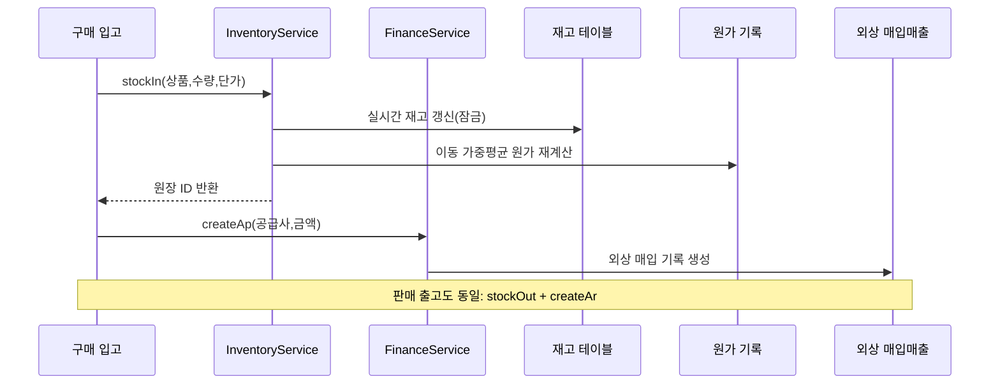

---

## 16. 재고 원가 계산 데이터 플로우

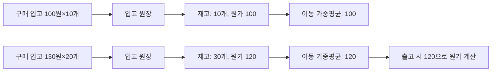

---

## 17. 승인 워크플로우 데이터 플로우

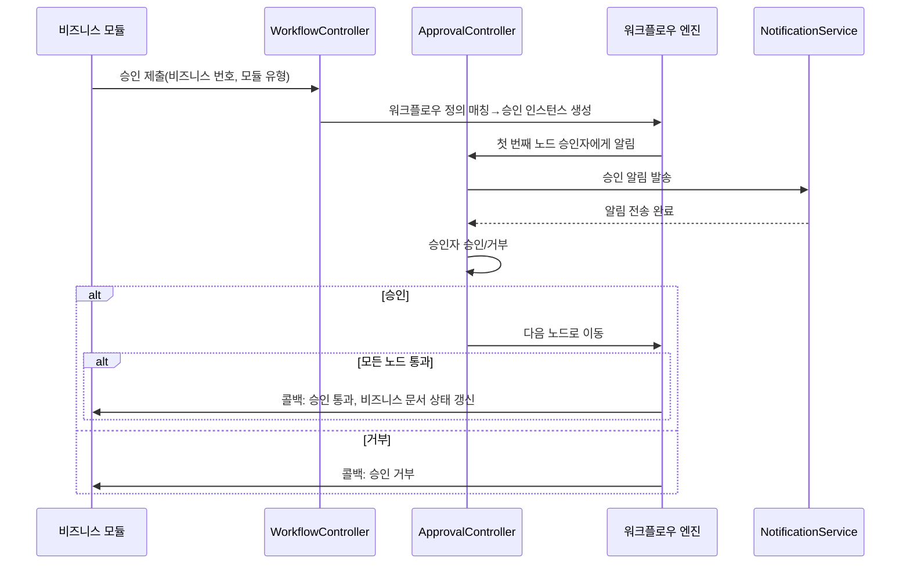

---

## 18. 메시지 알림 데이터 플로우

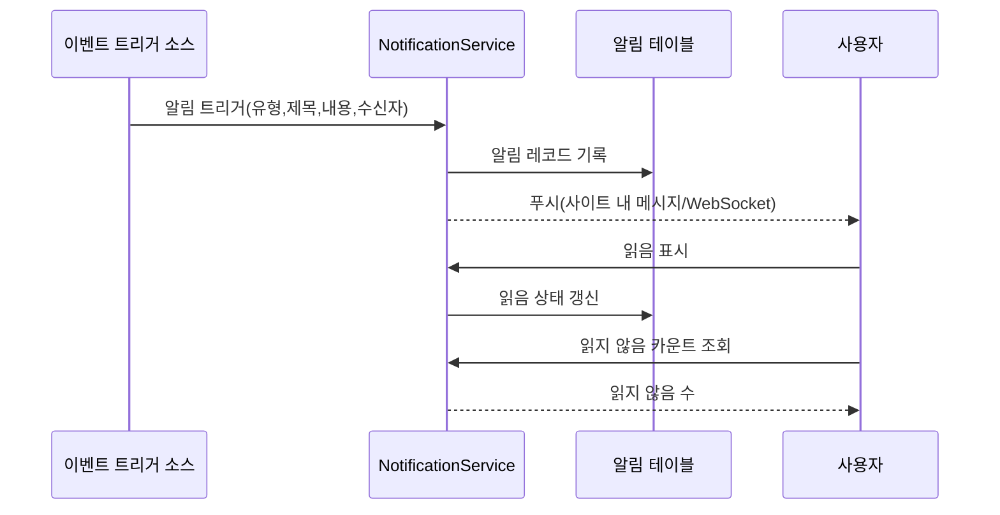

---

## 19. MRP 자재 소요량 계획 데이터 플로우

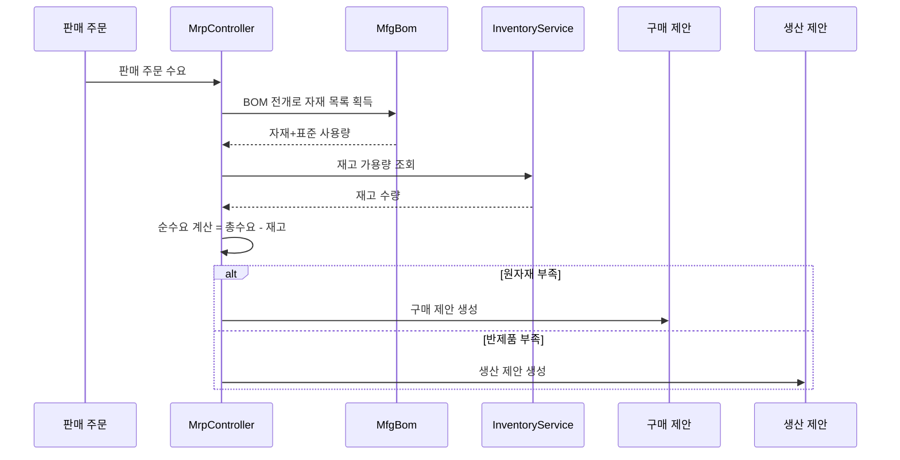

---

## 20. ERP 모듈 컨트롤러-서비스-모델 매핑 테이블

> 서비스 계층 설명: `핵심 Service` 열은 해당 모듈에 이미 구축된 비즈니스 서비스를 표시합니다. **⚠ 컨트롤러가 모델 직접 조회, 알려진 기술 부채** 로 표시된 모듈은
> 컨트롤러가 여전히 모델 조회/쓰기 메서드(`XxxModel::find/where/save` 등)를 직접 호출하며 서비스 계층이 아직 추출되지 않았고, 이는 알려진 기술 부채이며
> 이후 P2-F2 서비스 계층 경량 추출 패턴(`app/service/AbstractCrudService` 공용 CRUD 기본 클래스 + 모듈 Service)에 따라 점진적으로 수렴할 예정입니다.

| 모듈 | Controllers (디렉토리) | 핵심 Service | 주요 Model | 테이블 수 |
|------|-------------------|-------------|-----------|------|
| 시스템 관리 | admin/controller/ (14개) | - ⚠컨트롤러 모델 직접 조회, 알려진 기술 부채 | AdminUser, AdminRole, AdminPermission | 7 |
| 상품 관리 | controller/product/ (7개) | ProductService | Product, Category, Brand, Warehouse, Supplier, Customer | 11 |
| 구매 관리 | controller/purchase/ (5개) | InventoryService, FinanceService ⚠CRUD는 여전히 직접 조회, 알려진 기술 부채 | PurchaseOrder, PurchaseReceive | 9 |
| 판매 관리 | controller/sales/ (5개) | InventoryService, FinanceService ⚠CRUD는 여전히 직접 조회, 알려진 기술 부채 | SalesOrder, SalesDelivery | 9 |
| 재고 관리 | controller/inventory/ (5개) | InventoryService ⚠CRUD는 여전히 직접 조회, 알려진 기술 부채 | Inventory, InventoryFlow, CostRecord | 11 |
| 재무 관리 | controller/finance/ (20개) | FinanceService ⚠CRUD는 여전히 직접 조회, 알려진 기술 부채 | FinanceArAp, FinanceVoucher, FinanceReceipt, FinancePayment, FinanceGeneralLedger, FinanceBalanceSheet, FinanceAsset, FinanceBudget, FinanceCostCenter | 26 |
| CRM | controller/crm/ (10개) | CrmService | CrmOpportunity, CrmFollowRecord, CrmContract, CrmPoolRule, CrmQuotation, CrmCampaign, CrmTicket, CrmAnalyticsReport | 16 |
| 승인 워크플로우 | controller/workflow/ (2개) | - ⚠컨트롤러 모델 직접 조회, 알려진 기술 부채 | ApprovalWorkflow, ApprovalInstance, ApprovalNode, ApprovalRecord | 4 |
| 메시지 알림 | controller/notification/ (1개) | NotificationService ⚠CRUD는 여전히 직접 조회, 알려진 기술 부채 | Notification, NotificationSetting, NotificationTemplate | 3 |
| 프로젝트 관리 | controller/project/ (3개) | - ⚠컨트롤러 모델 직접 조회, 알려진 기술 부채 | Project, ProjectTask, ProjectTimesheet, ProjectMember, ProjectGantt | 5 |
| 인사 관리 | controller/hr/ (5개) | HrService | HrDepartment, HrEmployee, HrPosition, HrAttendance, HrLeave, HrSalary | 8 |
| 생산 제조 | controller/manufacturing/ (5개) | ManufacturingService | MfgBom, MfgProductionOrder, MfgRouting, MfgWorkstation, MfgMrpPlan | 8 |
| 커스텀 리포트 | controller/report/ (2개) | - ⚠컨트롤러 모델 직접 조회, 알려진 기술 부채 | ReportTemplate, ReportDataset, ReportField, ReportFilter, ReportSchedule | 5 |
| EAM 장비 관리 | controller/eam/ (4개) | - ⚠컨트롤러 모델 직접 조회, 알려진 기술 부채 | EamEquipment, EamMaintenancePlan, EamRepairOrder, EamSparePart | 4 |
| DMS 문서 관리 | controller/dms/ (2개) | - ⚠컨트롤러 모델 직접 조회, 알려진 기술 부채 | DmsCategory, DmsDocument, DmsDocumentVersion | 3 |
| BI 대시보드 | controller/bi/ (3개) | - ⚠컨트롤러 모델 직접 조회, 알려진 기술 부채 | BiDashboard, BiWidget | 2 |

### 20.1 P2-F2 서비스 계층 경량 추출 기록 (crm/hr/manufacturing/product 추출 완료)

| 모듈 | 추출 전 컨트롤러 직접 조회 호출 수 | 추출 후 | 신규 Service | 추출 내용 |
|------|----------------------|--------|--------------|----------|
| CRM | 57 | 0 | `app/service/crm/CrmService.php` | 공용 CRUD + 계약 상태 전환, 견적→계약, 공해 풀 획득/해제, 티켓 지정/해결/응답, 상세 연쇄 정리, 분석 리포트 데이터 구성 |
| 인사 관리 | 38 | 0 | `app/service/hr/HrService.php` | 공용 CRUD + 출근 지각/조퇴 판정, 휴가 승인(휴가 근태 자동 생성), 급여 유일성/실지급 계산/지급/일괄 생성 |
| 생산 제조 | 33 | 0 | `app/service/manufacturing/ManufacturingService.php` | 공용 CRUD + 작업 주문 시작/완료 전환, BOM 버전 복사/효력 상호 배타, MRP 상세 생성 |
| 상품 관리 | 29 | 0 | `app/service/product/ProductService.php` | 공용 CRUD + 상품 트랜잭션 생성(SKU/가격), 필드별 원값 보존 갱신, 상세 연관 로딩 |

추출 패턴: `app/service/AbstractCrudService.php`가 `list/all/find/create/update/delete/deleteWhere` 공용 CRUD와
`normalizePageParams/canTransition` 순수 로직 헬퍼를 제공합니다. 모듈 Service는 이를 상속하고 모듈 고유 비즈니스를 축적합니다.
컨트롤러는 `Container::get(XxxService::class)`(class_exists 폴백)로 서비스를 주입받아 라우트/파라미터/반환 구조를 완전히 유지합니다.
hashid 인코딩/디코딩, 비밀번호 2차 확인, 응답 래핑 등 HTTP 관심사는 컨트롤러에 남아 있습니다.
신규 Service는 `config/dependence.php`에 등록되어 있습니다(해당 파일은 dead config로 addDefinitions에 로드되지 않으며, 런타임 의존성 컨테이너가
class_exists 폴백으로 인스턴스화하므로 모든 Service는 무인자 생성자를 유지합니다).

추출되지 않은 모듈(프로젝트 관리 18회, 커스텀 리포트 18회, 구매 24회, 판매 24회, 시스템 관리 42회 등)은 테이블에
"컨트롤러 모델 직접 조회, 알려진 기술 부채"로 표시되어 있으며, 이후 반복에서 동일한 패턴으로 추출할 예정입니다.

---

## OMS/WMS/TMS 확장 모듈 (2026-08)

### OMS (Order Management System) — 8 tables
- **주문 확장** (`erik_oms_order`): 다채널 집계/이행 상태/결제 상태/우선순위
- **주문 주소** (`erik_oms_order_address`): 배송/청구지 주소(다국가 형식)
- **이행 기록** (`erik_oms_fulfillment`+`_item`): 할당/피킹 완료/포장 완료/출하 수량 추적
- **RMA** (`erik_oms_rma`+`_item`): 반품/교환 전체 수명 주기
- **재고 예약** (`erik_oms_inventory_reservation`): ATP = physical - reserved
- **채널** (`erik_channel`): direct/marketplace/edi/pos

### WMS (Warehouse Management System) — 12 tables
- **구역 및 로케이션** (`erik_wms_zone`, `erik_wms_location`): zone→aisle→rack→level→bin
- **입고** (`erik_wms_asn`+`_item`, `erik_wms_receiving`, `erik_wms_putaway_task`+`_item`)
- **출고** (`erik_wms_wave`+`wave_order`, `erik_wms_pick_task`+`_item`, `erik_wms_pack_task`)

### TMS (Transport Management System) — 7 tables
- **운송사** (`erik_tms_carrier`+`carrier_service`, `erik_tms_freight_rate`)
- **운송장** (`erik_tms_shipment`+`_package`, `erik_tms_tracking_event`)
- **운임 인보이스** (`erik_tms_freight_invoice`)

### Data Flow
```
OMS: Channel Order → Inventory Reservation (ATP) → Create Fulfillment → WMS
WMS: Wave → Pick → Pack → TMS Shipment
TMS: Rate Shop → Ship → Confirm (stockOut + AR) → Tracking → Delivery
WMS Inbound: ASN → Receive → Putaway (stockIn + AP)
RMA: Request → Approve → Return → Receive (stockIn) → Refund
```

---

## 21. 생태계 로드맵 (2026-08)

> 상세 설계 명세: `superpowers/specs/2026-08-04-erp-ecosystem-roadmap-design.md`

### 21.1 기준 평가 (로드맵 시작 시점)

> P0~P3가 모두 인도되었으며, 현재 종합 점수 89/100(CLAUDE.md 참조)입니다. 아래 표는 로드맵 시작 전 기준 스냅샷입니다.

| 차원 | 점수 | 핵심 격차 |
|------|------|----------|
| 백엔드 API | 85/100 | 다수 모듈이 CRUD 골격에 불과, 비즈니스 계산 엔진 부재 |
| 보안 방어 | 95/100 | 18계층 심층 방어, 운영 준비 완료 |
| 프론트엔드 UI | 20/100 | **최대 약점**: Flutter 12페이지가 ~20% 모듈만 커버, 웹 관리 패널 부재 |
| 운영 생태계 | 70/100 | 마이그레이션 롤백, 자동 백업, 관측성 부족 |
| 비즈니스 깊이 | 55/100 | 재무/인사/제조 핵심 알고리즘 미구현 |
| **종합** | **65/100** | |

### 21.2 4단계 직렬 로드맵

```
P0(3-4주) → P1(4-6주) → P2(1-2주) → P3(2-3주) = 총 약 13주
```

| 단계 | 이름 | 핵심 인도물 |
|------|------|----------|
| **P0** | 프론트엔드 생태계 | Flutter Web 전체 모듈 관리 패널(14개 모듈 40+ 페이지), 공용 컴포넌트 라이브러리, HarmonyOS 정렬 |
| **P1** | 비즈니스 깊이 | 재무 복식부기 엔진, 급여 계산 엔진, MRP 엔진, 품질 관리 모듈, 실시간 알림(WebSocket) |
| **P2** | 운영 안정성 | DB 마이그레이션 롤백, 자동 백업 강화, OpenTelemetry 추적, RabbitMQ 큐 드라이버 |
| **P3** | 경험 강화 | BI 드래그 앤 드롭 대시보드, 장비 관리(EAM), 멀티 테넌트 격리, 문서 관리(DMS) |

### 21.3 미들웨어 체인 진화

```
현재:   Locale → Cors → SecurityFilter → RateLimit → TracingId → {라우트 그룹}
P1 후:  Locale → Cors → SecurityFilter → RateLimit → WebSocketUpgrade → {라우트 그룹}
P2 후:  Locale → Cors → SecurityFilter → RateLimit → TracingId → WebSocketUpgrade → {라우트 그룹}
P3 후:  Locale → Cors → SecurityFilter → RateLimit → TracingId → TenantScope → WebSocketUpgrade → {라우트 그룹}
```

### 21.4 P0 목표 아키텍처 — Flutter Web 관리 패널

| 계층 | 신규 내용 |
|------|----------|
| 레이아웃 계층 | `AdminLayout` PC 3단 레이아웃(접이식 사이드바 + 상단 바 + 콘텐츠 영역) |
| 컴포넌트 계층 | `DataTableWrapper`, `FormDialog`, `ConfirmDialog`, `StatCard`, `BreadcrumbNav`, `FileUploader` |
| 페이지 계층 | 기존 12페이지에서 14개 모듈 40+ 페이지 전면 커버로 확장 |
| 서비스 계층 | 기존 `ApiService`, `AuthService`, `CaptchaService`, `ExportService` 재사용 |

### 21.5 P1 목표 아키텍처 — 비즈니스 계산 엔진

| 엔진 | 서비스 클래스 | 핵심 규칙 |
|------|--------|----------|
| 복식부기 | `DoubleEntryService`, `PeriodCloseService`, `AccountBalanceService` | 차변/대변 균형 강제 검증, 기말 손익 이월, 다중 통화 환율 환산 |
| 급여 계산 | `SalaryEngineService`, `SocialInsuranceService`, `HousingFundService`, `TaxCalculatorService` | 사회보험 기준 상하한, 주택공제금 비율, 개인소득세 누진세율, 은행 일괄 지급 |
| MRP | `MrpEngineService`, `BomExplosionService`, `NetRequirementService` | BOM 레벨별 전개+손실, 로우레벨 코드(LLC), 안전재고, 배치 규칙 |
| 품질 | `QmsInspectionService` | IQC 입고/IPQC 공정/OQC 출하 3문서 전환 |
| 알림 | `WebSocketService`, `ChannelRouter` | 사이트 내/이메일/기업 위챗/딩톡 다채널 |

### 21.6 데이터 모델 변경 요약

| 단계 | 신규 테이블 수 | 관련 모듈 |
|------|----------|----------|
| P0 | 0 | 순수 프론트엔드, 테이블 변경 없음 |
| P1 | 14 | 재무(2) + 인사(3) + 제조(2) + 품질(5) + 알림(2) |
| P3 | 7 | BI(2) + EAM(3) + DMS(2) |

---

## 22. 멀티 테넌트 (예약 능력, 미활성화)

> 저작권 고지는 파일 헤더와 동일: Copyright (c) 2026 erik <erik@erik.xyz> — https://erik.xyz

### 22.1 포지셔닝과 결정

멀티 테넌트는 본 프로젝트에서 **예약 능력**으로 포지셔닝되며, 이번 기간에는 **연결하지 않고 활성화하지 않습니다** (문서화된 다운그레이드). 계획과 일치합니다:
SaaS 과금, 테넌트 자체 개통 등 "멀티 테넌트 완전 상용화 방안"은 본 프로젝트 구축 범위에 포함되지 않습니다. 이번 기간에는 최소
코드 골격(미들웨어 + 모델 Trait)만 유지하고 활성화 절차를 제공하여 이후 필요 시 활성화할 수 있게 합니다.
참고: §21.2 로드맵 P3의 "멀티 테넌트 격리"는 이에 따라 "예약 능력(문서화된 다운그레이드)"으로 조정되며, 골격은 유지하고 연결하지 않습니다.

결정 근거 (2026-08 리뷰):
- 기존 배포가 거의 전부 단일 테넌트이며, 연결은 불필요한 격리 복잡성과 회귀 위험을 도입합니다;
- 현재 골격에 기술 결함이 있으며(22.4 참조), "연결=격리"가 성립하지 않아 먼저 설계 수정을 완료해야 합니다;
- 격리는 163개 테이블 중 비즈니스 테이블에 테이블별로 컬럼을 추가하고 모델별로 활성화해야 하므로 비용이 "최소 연결"을 훨씬 초과합니다.

### 22.2 현재 사실 (코드와 설정 대조)

| 항목 | 현재 상태 |
|----|------|
| `app/middleware/TenantScope.php` | 존재, 미등록; `X-Tenant-Id` 헤더에서 테넌트를 읽으며, 헤더 부재 시 그대로 통과 |
| `app/model/concerns/TenantScope.php` | 존재, 사용 모델 없음; `bootTenantScope()` 전역 스코프는 테넌트 설정 후에만 필터링 |
| `config/middleware.php` | 전역 체인: Locale → Cors → SecurityFilter → RateLimit → TracingId, TenantScope 없음 |
| `config/route.php` /admin 그룹 | AdminAuth → AdminPermission → OperationLog, TenantScope 없음 |
| JWT 페이로드 | `sub` / `username` / `token_type`만, **tenant_id 선언 없음** (`app/api/v1/controller/AuthController.php`) |
| 데이터베이스 | **전체 DB에 tenant_id 컬럼 없음** (install.sql에도 없음) |
| 모델 | **어떤 모델도 TenantScope trait를 사용하지 않음** |

### 22.3 활성화 절차 (예약 참고, 이번 기간에는 미실행)

1. 미들웨어 등록: `config/route.php`의 /admin 그룹 `middleware()`에
   `app\middleware\TenantScope::class` 추가(AdminAuth 뒤에 배치하여 인증 완료 보장).
2. 요청 측이 요청 헤더에 `X-Tenant-Id`(int 테넌트 ID)를 전달.
3. 격리가 필요한 비즈니스 테이블에 `tenant_id` 컬럼(BIGINT + 인덱스) 추가 및 기존 데이터 백필;
   사전/시스템 테이블(예: `erik_admin_user`, `erik_role`, `erik_permission`)은 격리하지 않음.
4. 격리가 필요한 모델 클래스에서 `use app\model\concerns\TenantScope;`를 사용하면 현재 테넌트 기준으로 자동 필터링.
5. (선택) JWT에서 테넌트를 가져오려면(요청 헤더 대신): 로그인 발급 페이로드에 `tenant_id` 선언을 추가하고,
   미들웨어에서 `$payload['tenant_id']`를 읽습니다.

### 22.4 알려진 기술 제약 (활성화 전 반드시 해결)

- **정적 전달 체인 단절(PHP 8.3 실측)**: 미들웨어가 trait 이름으로 `setCurrentTenantId()`를 호출하면
  trait 자체의 정적 복사본에 기록되므로, 해당 trait를 사용하는 모델 클래스는 읽을 수 없고 쿼리가 필터링되지 않습니다.
  활성화 시 요청 컨텍스트 기반 주입(예: `request()->tenantId`)으로 변경해야 합니다.
- **정적 전역 상태 간섭**: Workerman은 상주 프로세스이므로 정적 속성이 요청 간 공유됩니다. 코루틴 모드를 활성화하면
  (Swoole/Swow) 테넌트 간 데이터 간섭이 발생할 수 있으므로 요청 레벨 바인딩(`context()` / 요청 객체)으로 변경해야 합니다.
- **데이터 플레인 격차**: 전체 DB에 tenant_id 컬럼이 없으므로 테이블별 마이그레이션이 필요하며, 테넌트 간 공유 사전 테이블은 면제 메커니즘 설계가 필요합니다.

### 22.5 수용 기준

이번 기간 수용 = 문서와 코드 일치: `config/middleware.php`와 `config/route.php`에
TenantScope 등록이 없음; 미들웨어와 Trait 주석에 "예약 능력, 미활성화" 명시 및 활성화 절차 제공;
본 절 설명이 코드 현황과 항목별로 대응.
