# Diagramas de arquitetura e diagramas de lógica de negócio

> Copyright (c) 2026 erik <erik@erik.xyz> — https://erik.xyz

> Os diagramas Mermaid abaixo são renderizados automaticamente no GitHub / GitLab / VS Code. Em outros ambientes, use o [Mermaid Live Editor](https://mermaid.live/).

---

## 1. Arquitetura de topologia do sistema

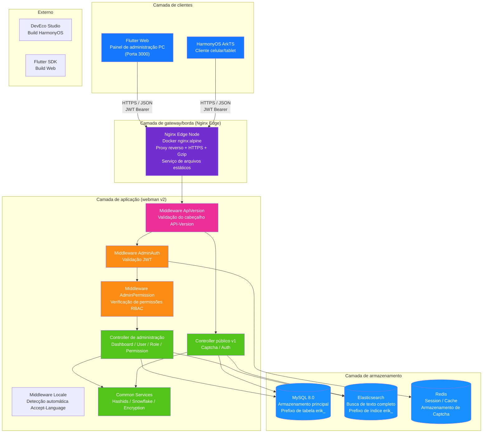

---

## 2. Arquitetura em camadas do backend

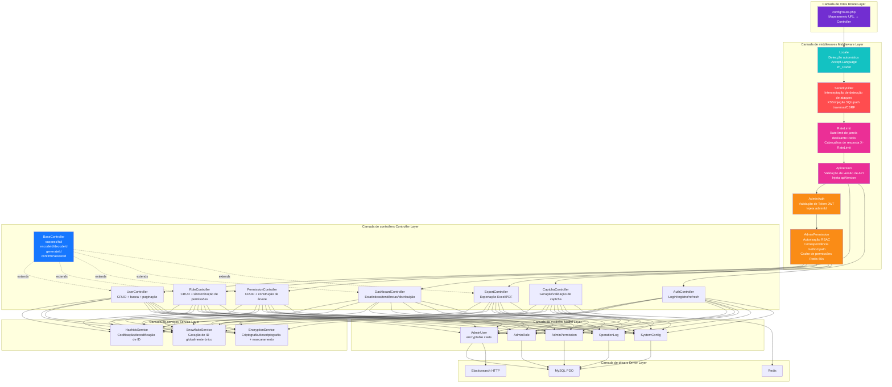

### Extensão da camada de negócio ERP

Com a evolução do sistema de um painel de administração puro para um sistema ERP completo, a camada de controllers e a camada de serviços ganharam os seguintes módulos de negócio:

| Camada | Diretório | Observação |
|------|------|------|
| Controllers de negócio | `app/controller/{product,purchase,sales,inventory,finance,crm,workflow,notification,project,hr,manufacturing,report}/` | 70, divididos por módulo, tratam requisições de negócio |
| Serviços de negócio | `app/service/{inventory,finance,notification}/` | Entrada/saída de estoque + cálculo de custo, contas a receber/pagar + estorno, envio de notificações |

---

## 3. Ciclo de vida da requisição

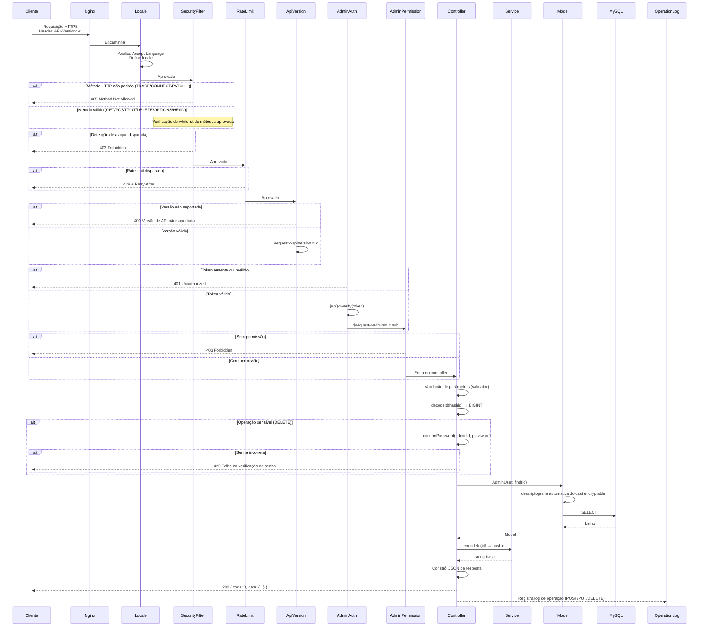

---

## 4. Fluxo de autenticação e captcha

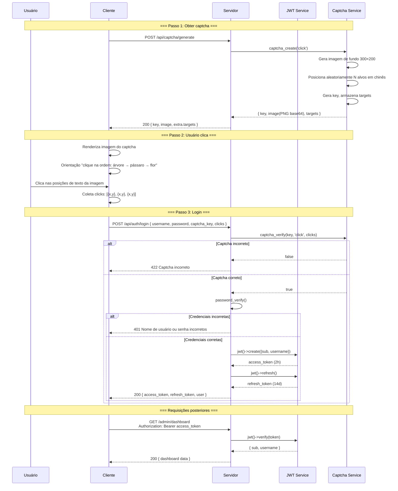

---

## 5. Modelo de permissões RBAC

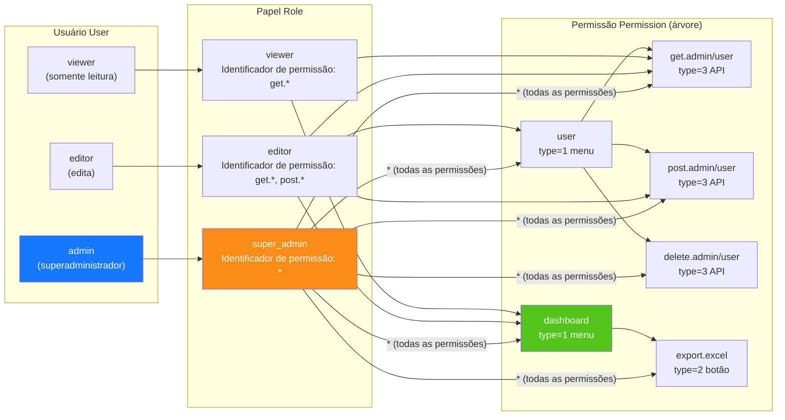

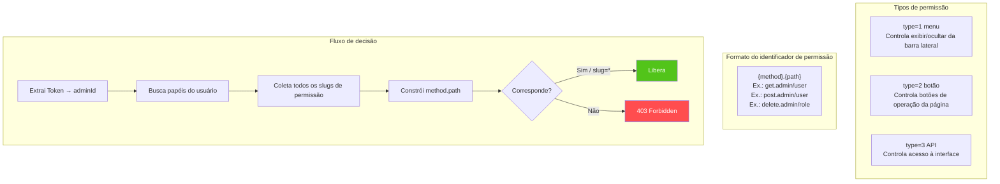

---

## 6. Ciclo de vida completo do ID

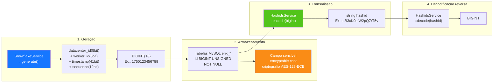

---

## 7. Camadas de criptografia de dados

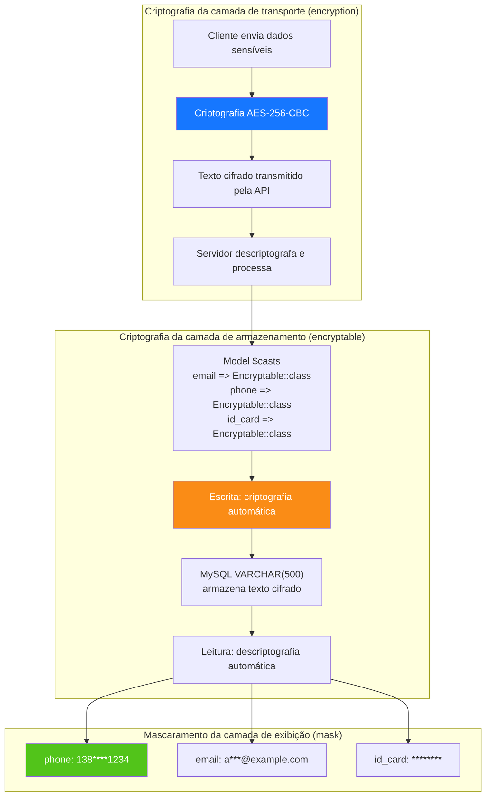

---

## 8. Relacionamento ER do banco de dados

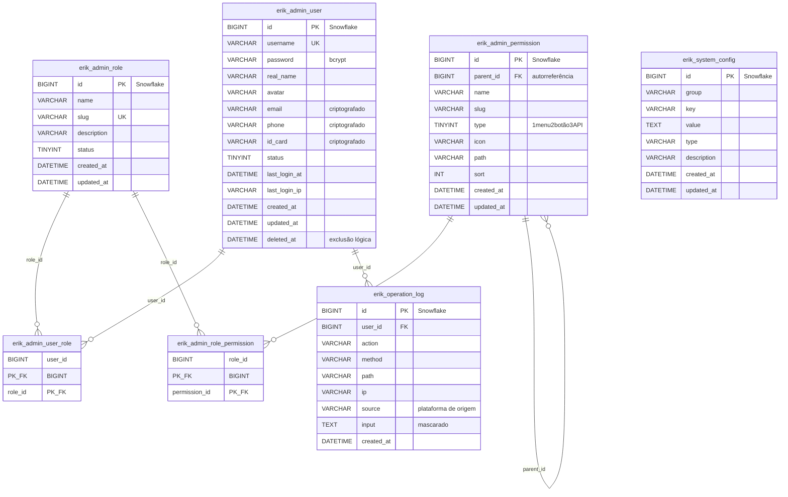

---

## 9. Fluxo de negócio de exportação

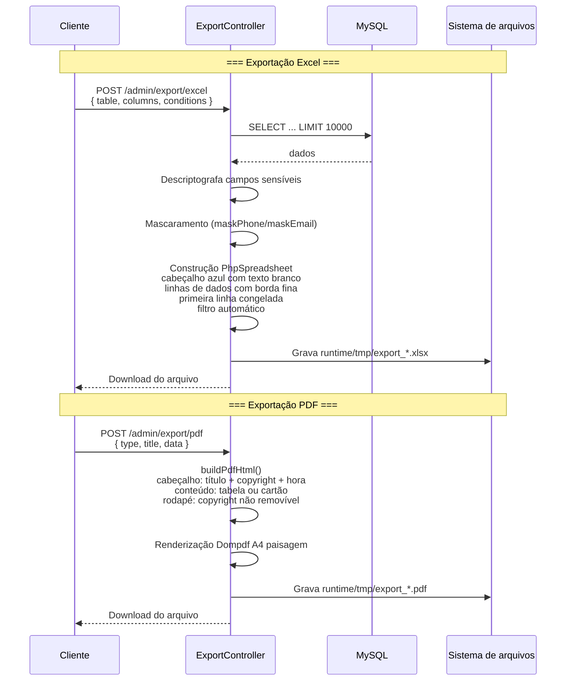

---

## 10. Árvore de componentes Flutter Web

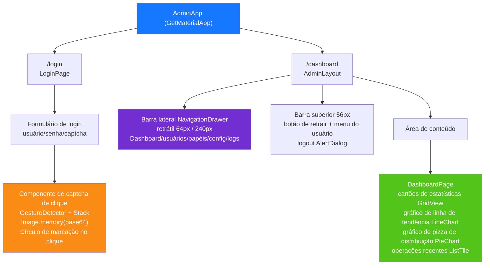

---

## 11. Roteamento de páginas HarmonyOS

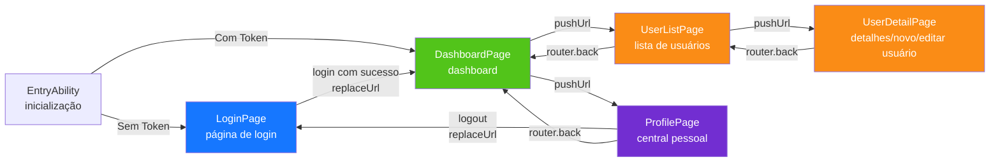

---

## 12. Visão geral da defesa em profundidade de segurança

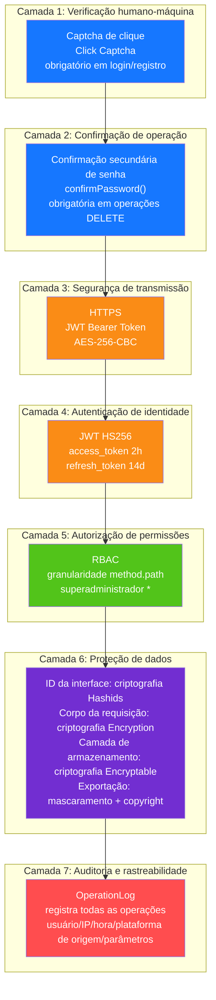

---

## 13. Topologia de implantação

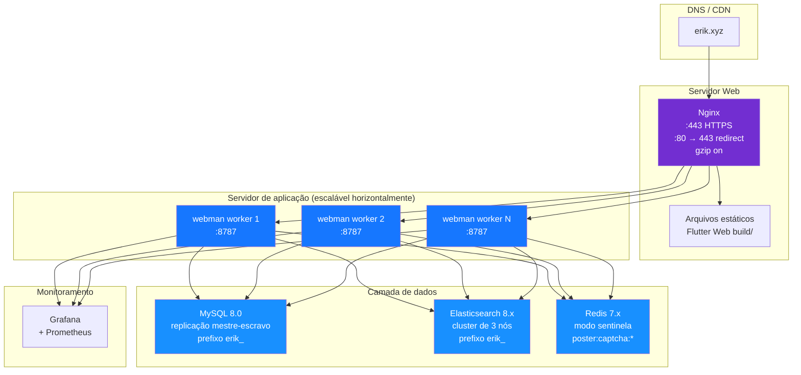

---

## 14. Arquitetura geral do sistema ERP

```mermaid
graph TB
    subgraph Client["Camada de clientes"]
        FW["Flutter Web<br/>Painel de administração PC"]
        FA["Flutter App<br/>iOS/Android/macOS/Windows/Linux"]
        HW["HarmonyOS<br/>App nativo HarmonyOS"]
    end

    subgraph Gateway["Camada de gateway de API"]
        MW["Cadeia de middlewares<br/>Locale→Cors→SecurityFilter→RateLimit→Auth→Permission→OpLog"]
    end

    subgraph Business["Camada de módulos de negócio"]
        direction LR
        Admin["Administração do sistema<br/>usuários/papéis/permissões/config/logs"]
        Product["Gestão de produtos<br/>produtos/categorias/marcas/armazéns/fornecedores/clientes"]
        Purchase["Gestão de compras<br/>solicitação→pedido→recebimento→devolução→liquidação"]
        Sales["Gestão de vendas<br/>cotação→pedido→expedição→devolução→liquidação"]
        Inventory["Gestão de estoque<br/>entrada/saída/lotes/contagem/transferência/alertas"]
        Finance["Gestão financeira<br/>contas/vouchers/contas a receber e pagar/razão geral/razão auxiliar/relatórios/reembolsos"]
        CRM["CRM<br/>clientes/contatos/acompanhamento/funil/pool público/cotações/contratos"]
        Workflow["Workflow de aprovação<br/>definição de workflow/envio/aprovação/recusa/retirada"]
        Notification["Notificações de mensagens<br/>lista de notificações/lidas/contagem de não lidas"]
        Project["Gestão de projetos<br/>projetos/tarefas/registros de horas"]
        HR["Recursos humanos<br/>departamentos/funcionários/cargos/ponto/afastamentos/salários"]
        Manufacturing["Produção e manufatura<br/>BOM/pedidos de produção/roteiros/estações de trabalho/MRP"]
        Report["Relatórios personalizados<br/>modelos de relatório/datasets/campos/filtros/agendamento"]
    end

    subgraph Service["Camada de serviços de negócio"]
        IS["InventoryService<br/>entrada/saída + custo médio móvel ponderado"]
        FS["FinanceService<br/>geração automática de contas a receber/pagar + estorno"]
        NS["NotificationService<br/>envio unificado de notificações"]
    end

    subgraph Data["Camada de dados"]
        MySQL["MySQL 8.0<br/>163 tabelas de negócio"]
        Redis["Redis 7<br/>cache/rate limit/Session"]
        ES["Elasticsearch 8<br/>busca de texto completo"]
    end

    Client --> Gateway
    Gateway --> Business
    Business --> Service
    Service --> Data
    Business --> Data
```

---

## 15. Fluxo de dados entre módulos

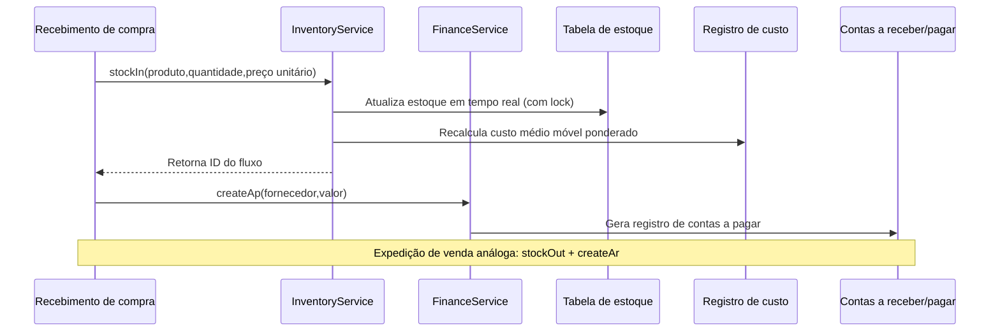

---

## 16. Fluxo de dados do cálculo de custo de estoque

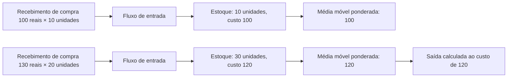

---

## 17. Fluxo de dados do workflow de aprovação

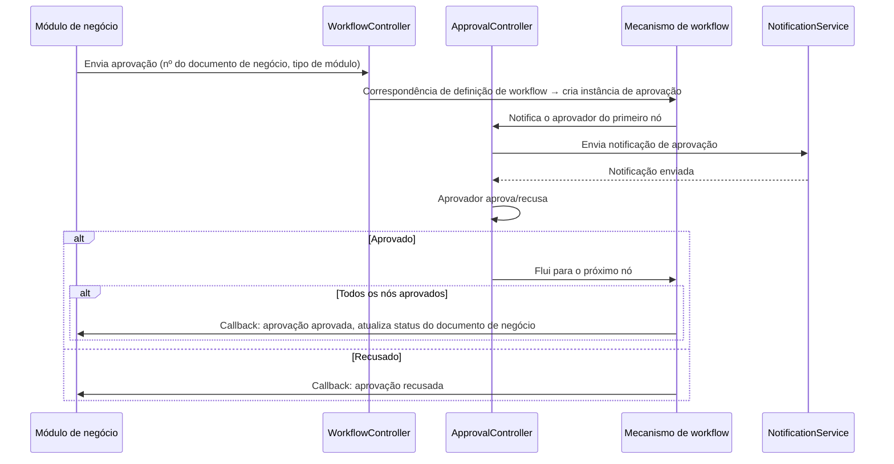

---

## 18. Fluxo de dados de notificações de mensagens

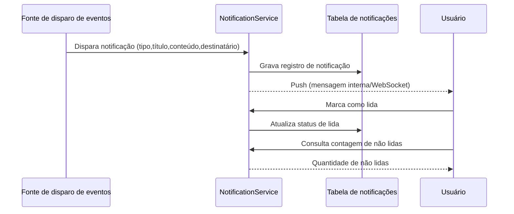

---

## 19. Fluxo de dados do MRP (planejamento de necessidades de materiais)

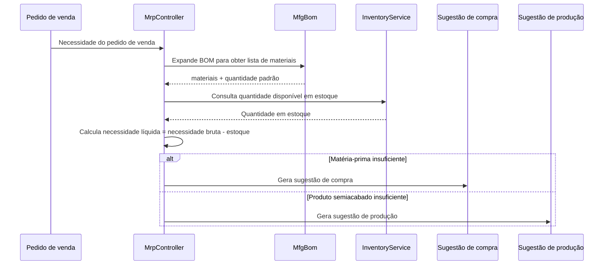

---

## 20. Tabela de mapeamento controller-serviço-modelo dos módulos ERP

> Observação sobre a camada de serviços: a coluna `Service principal` indica o serviço de negócio já extraído para o módulo; os módulos marcados com **⚠ o controller consulta o modelo diretamente, dívida técnica conhecida** ainda chamam métodos de consulta/gravação do modelo diretamente no controller (`XxxModel::find/where/save` etc.), sem camada de serviço extraída — dívida técnica conhecida,
> a convergir gradualmente pelo padrão de extração leve da camada de serviços P2-F2 (`app/service/AbstractCrudService` — classe base CRUD genérica + Service do módulo).

| Módulo | Controllers (diretório) | Service principal | Modelos principais | Nº de tabelas |
|------|-------------------|-------------|-----------|------|
| Administração do sistema | admin/controller/ (14) | - ⚠ controller consulta o modelo diretamente, dívida técnica conhecida | AdminUser, AdminRole, AdminPermission | 7 |
| Gestão de produtos | controller/product/ (7) | ProductService | Product, Category, Brand, Warehouse, Supplier, Customer | 11 |
| Gestão de compras | controller/purchase/ (5) | InventoryService, FinanceService ⚠CRUD ainda consulta diretamente, dívida técnica conhecida | PurchaseOrder, PurchaseReceive | 9 |
| Gestão de vendas | controller/sales/ (5) | InventoryService, FinanceService ⚠CRUD ainda consulta diretamente, dívida técnica conhecida | SalesOrder, SalesDelivery | 9 |
| Gestão de estoque | controller/inventory/ (5) | InventoryService ⚠CRUD ainda consulta diretamente, dívida técnica conhecida | Inventory, InventoryFlow, CostRecord | 11 |
| Gestão financeira | controller/finance/ (20) | FinanceService ⚠CRUD ainda consulta diretamente, dívida técnica conhecida | FinanceArAp, FinanceVoucher, FinanceReceipt, FinancePayment, FinanceGeneralLedger, FinanceBalanceSheet, FinanceAsset, FinanceBudget, FinanceCostCenter | 26 |
| CRM | controller/crm/ (10) | CrmService | CrmOpportunity, CrmFollowRecord, CrmContract, CrmPoolRule, CrmQuotation, CrmCampaign, CrmTicket, CrmAnalyticsReport | 16 |
| Workflow de aprovação | controller/workflow/ (2) | - ⚠ controller consulta o modelo diretamente, dívida técnica conhecida | ApprovalWorkflow, ApprovalInstance, ApprovalNode, ApprovalRecord | 4 |
| Notificações de mensagens | controller/notification/ (1) | NotificationService ⚠CRUD ainda consulta diretamente, dívida técnica conhecida | Notification, NotificationSetting, NotificationTemplate | 3 |
| Gestão de projetos | controller/project/ (3) | - ⚠ controller consulta o modelo diretamente, dívida técnica conhecida | Project, ProjectTask, ProjectTimesheet, ProjectMember, ProjectGantt | 5 |
| Recursos humanos | controller/hr/ (5) | HrService | HrDepartment, HrEmployee, HrPosition, HrAttendance, HrLeave, HrSalary | 8 |
| Produção e manufatura | controller/manufacturing/ (5) | ManufacturingService | MfgBom, MfgProductionOrder, MfgRouting, MfgWorkstation, MfgMrpPlan | 8 |
| Relatórios personalizados | controller/report/ (2) | - ⚠ controller consulta o modelo diretamente, dívida técnica conhecida | ReportTemplate, ReportDataset, ReportField, ReportFilter, ReportSchedule | 5 |
| Gestão de equipamentos EAM | controller/eam/ (4) | - ⚠ controller consulta o modelo diretamente, dívida técnica conhecida | EamEquipment, EamMaintenancePlan, EamRepairOrder, EamSparePart | 4 |
| Gestão de documentos DMS | controller/dms/ (2) | - ⚠ controller consulta o modelo diretamente, dívida técnica conhecida | DmsCategory, DmsDocument, DmsDocumentVersion | 3 |
| BI dashboards | controller/bi/ (3) | - ⚠ controller consulta o modelo diretamente, dívida técnica conhecida | BiDashboard, BiWidget | 2 |

### 20.1 Registro de extração leve da camada de serviços P2-F2 (crm/hr/manufacturing/product já extraídos)

| Módulo | Chamadas diretas no controller antes da extração | Depois | Novo Service | Conteúdo extraído |
|------|----------------------|--------|--------------|----------|
| CRM | 57 | 0 | `app/service/crm/CrmService.php` | CRUD genérico + transição de status de contrato, cotação para contrato, reivindicação/liberação do pool público, atribuição/resolução/resposta de tickets, limpeza em cascata de itens, construção de dados de relatório analítico |
| Recursos humanos | 38 | 0 | `app/service/hr/HrService.php` | CRUD genérico + detecção de atraso/saída antecipada no ponto, aprovação de afastamentos (geração automática de ponto de afastamento), unicidade de salário/cálculo do líquido/pagamento/geração em lote |
| Produção e manufatura | 33 | 0 | `app/service/manufacturing/ManufacturingService.php` | CRUD genérico + fluxo de início/conclusão de ordens de trabalho, cópia de versão de BOM/exclusividade mútua de ativação, geração de itens de MRP |
| Gestão de produtos | 29 | 0 | `app/service/product/ProductService.php` | CRUD genérico + criação transacional de produtos (SKU/preço), atualização preservando o valor original por campo, carregamento de relacionamentos em detalhes |

Padrão de extração: `app/service/AbstractCrudService.php` fornece CRUD genérico `list/all/find/create/update/delete/deleteWhere`
e helpers de lógica pura `normalizePageParams/canTransition`; os Services de módulo herdam dele e consolidam o negócio específico do módulo.
Os controllers injetam o serviço via `Container::get(XxxService::class)` (fallback class_exists), mantendo rotas/parâmetros/estruturas de retorno totalmente inalteradas;
codificação/decodificação hashid, confirmação secundária de senha, empacotamento de resposta e outras preocupações HTTP permanecem nos controllers.
Os novos Services estão registrados em `config/dependence.php` (arquivo dead config, não carregado pelo addDefinitions; em runtime o container
usa o fallback class_exists para instanciar; por isso todos os Services mantêm construtor sem parâmetros).

Módulos não extraídos (gestão de projetos 18 vezes, relatórios personalizados 18 vezes, compras 24 vezes, vendas 24 vezes, administração do sistema 42 vezes etc.) estão marcados na tabela
como "controller consulta o modelo diretamente, dívida técnica conhecida"; as próximas iterações extrairão pelo mesmo padrão.

---

## Módulos de extensão OMS/WMS/TMS (2026-08)

### OMS (Order Management System) — 8 tabelas
- **Extensão de pedidos** (`erik_oms_order`): agregação multicanal/status de fulfillment/status de pagamento/prioridade
- **Endereços de pedido** (`erik_oms_order_address`): endereços de recebimento/cobrança (formato multinacional)
- **Registros de fulfillment** (`erik_oms_fulfillment`+`_item`): rastreamento de quantidades alocadas/separadas/embaladas/enviadas
- **RMA** (`erik_oms_rma`+`_item`): ciclo de vida completo de troca/devolução
- **Reserva de estoque** (`erik_oms_inventory_reservation`): ATP = physical - reserved
- **Canais** (`erik_channel`): direct/marketplace/edi/pos

### WMS (Warehouse Management System) — 12 tabelas
- **Zonas e localizações** (`erik_wms_zone`, `erik_wms_location`): zone→aisle→rack→level→bin
- **Entrada** (`erik_wms_asn`+`_item`, `erik_wms_receiving`, `erik_wms_putaway_task`+`_item`)
- **Saída** (`erik_wms_wave`+`wave_order`, `erik_wms_pick_task`+`_item`, `erik_wms_pack_task`)

### TMS (Transport Management System) — 7 tabelas
- **Transportadoras** (`erik_tms_carrier`+`carrier_service`, `erik_tms_freight_rate`)
- **Remessas** (`erik_tms_shipment`+`_package`, `erik_tms_tracking_event`)
- **Faturas** (`erik_tms_freight_invoice`)

### Fluxo de dados
```
OMS: Pedido do canal → Reserva de estoque (ATP) → Cria fulfillment → WMS
WMS: Wave → Pick → Pack → Remessa TMS
TMS: Rate Shop → Ship → Confirmar (stockOut + AR) → Tracking → Entrega
WMS Inbound: ASN → Receive → Putaway (stockIn + AP)
RMA: Solicitação → Aprovação → Devolução → Recebimento (stockIn) → Reembolso
```

---

## 21. Roteiro do ecossistema (2026-08)

> Especificação de design detalhada: `docs/superpowers/specs/2026-08-04-erp-ecosystem-roadmap-design.md`

### 21.1 Avaliação de linha de base (no início do roteiro)

> P0~P3 já entregues integralmente, pontuação geral atual 89/100 (ver docs/CLAUDE.md); a tabela abaixo é o instantâneo de linha de base antes do início do roteiro.

| Dimensão | Pontuação | Lacuna principal |
|------|------|----------|
| API backend | 85/100 | Vários módulos são esqueletos CRUD, faltam mecanismos de cálculo de negócio |
| Proteção de segurança | 95/100 | 18 camadas de defesa em profundidade, pronto para produção |
| UI frontend | 20/100 | **Maior deficiência**: 12 páginas Flutter cobrem ~20% dos módulos, falta painel de administração Web |
| Ecossistema de operações | 70/100 | Faltam rollback de migração, backup automático, observabilidade |
| Profundidade de negócio | 55/100 | Algoritmos centrais de finanças/RH/manufatura não implementados |
| **Geral** | **65/100** | |

### 21.2 Roteiro serial em quatro fases

```
P0(3-4 semanas) → P1(4-6 semanas) → P2(1-2 semanas) → P3(2-3 semanas) = total ~13 semanas
```

| Fase | Nome | Entrega principal |
|------|------|----------|
| **P0** | Ecossistema frontend | Painel de administração Flutter Web com todos os módulos (14 módulos 40+ páginas), biblioteca de componentes genéricos, alinhamento HarmonyOS |
| **P1** | Profundidade de negócio | Mecanismo de contabilidade de partidas dobradas, mecanismo de cálculo de salário, mecanismo MRP, módulo de gestão de qualidade, notificações em tempo real (WebSocket) |
| **P2** | Confiabilidade operacional | Rollback de migração de banco, backup automático aprimorado, rastreamento OpenTelemetry, filas RabbitMQ |
| **P3** | Melhoria de experiência | BI dashboards arrastáveis, gestão de equipamentos (EAM), isolamento multi-tenant, gestão de documentos (DMS) |

### 21.3 Evolução da cadeia de middlewares

```
Atual:    Locale → Cors → SecurityFilter → RateLimit → TracingId → {grupo de rotas}
Após P1:  Locale → Cors → SecurityFilter → RateLimit → WebSocketUpgrade → {grupo de rotas}
Após P2:  Locale → Cors → SecurityFilter → RateLimit → TracingId → WebSocketUpgrade → {grupo de rotas}
Após P3:  Locale → Cors → SecurityFilter → RateLimit → TracingId → TenantScope → WebSocketUpgrade → {grupo de rotas}
```

### 21.4 Arquitetura alvo do P0 — Painel de administração Flutter Web

| Camada | Novidades |
|------|----------|
| Camada de layout | `AdminLayout` layout PC de três colunas (barra lateral retrátil + barra superior + área de conteúdo) |
| Camada de componentes | `DataTableWrapper`, `FormDialog`, `ConfirmDialog`, `StatCard`, `BreadcrumbNav`, `FileUploader` |
| Camada de páginas | Expande das 12 páginas atuais para cobertura total de 14 módulos 40+ páginas |
| Camada de serviços | Reutiliza os existentes `ApiService`, `AuthService`, `CaptchaService`, `ExportService` |

### 21.5 Arquitetura alvo do P1 — Mecanismos de cálculo de negócio

| Mecanismo | Classes de serviço | Regras principais |
|------|--------|----------|
| Partidas dobradas | `DoubleEntryService`, `PeriodCloseService`, `AccountBalanceService` | Validação obrigatória de equilíbrio débito-crédito, encerramento de resultado do período, conversão de câmbio multimoeda |
| Cálculo de salário | `SalaryEngineService`, `SocialInsuranceService`, `HousingFundService`, `TaxCalculatorService` | Limites de base da seguridade social, proporção do fundo de previdência, alíquotas progressivas de imposto individual, pagamento bancário |
| MRP | `MrpEngineService`, `BomExplosionService`, `NetRequirementService` | Expansão BOM camada a camada + perdas, código de nível baixo (LLC), estoque de segurança, regras de lote |
| Qualidade | `QmsInspectionService` | Fluxo de três documentos IQC entrada/IPQC processo/OQC expedição |
| Notificações | `WebSocketService`, `ChannelRouter` | Multicanal interno/e-mail/WeCom/DingTalk |

### 21.6 Resumo de alterações do modelo de dados

| Fase | Novas tabelas | Módulos envolvidos |
|------|----------|----------|
| P0 | 0 | Apenas frontend, sem alteração de tabelas |
| P1 | 14 | Finanças(2) + RH(3) + Manufatura(2) + Qualidade(5) + Notificações(2) |
| P3 | 7 | BI(2) + EAM(3) + DMS(2) |

---

## 22. Multi-tenant (capacidade reservada, não ativada)

> Aviso de copyright igual ao cabeçalho do arquivo: Copyright (c) 2026 erik <erik@erik.xyz> — https://erik.xyz

### 22.1 Posicionamento e decisão

O multi-tenant neste projeto está posicionado como **capacidade reservada**; nesta fase **não será conectado nem ativado** (degradação documentada). Consistente com o planejamento:
cobrança SaaS, autoatendimento de tenants etc. — o "esquema comercial completo de multi-tenant" não está no escopo deste projeto; nesta fase apenas o esqueleto mínimo
de código (middleware + Model Trait) é mantido, com etapas de ativação documentadas, para ativação sob demanda futura.
Nota: o "isolamento multi-tenant" do P3 no roteiro §21.2 foi ajustado para "capacidade reservada (degradação documentada)", mantendo o esqueleto sem conectar.

Base da decisão (revisão de 2026-08):
- Quase todas as implantações atuais são de tenant único; conectar introduziria complexidade de isolamento desnecessária e risco de regressão;
- O esqueleto atual tem deficiências técnicas (ver 22.4); "conectar = isolar" não se sustenta; é preciso primeiro concluir a correção de design;
- O isolamento exigiria adicionar colunas tabela a tabela e ativar modelo a modelo nas 163 tabelas de negócio, custo muito maior que a "conexão mínima".

### 22.2 Fatos atuais (verificação de código e configuração)

| Item | Situação atual |
|----|------|
| `app/middleware/TenantScope.php` | Existe, não registrado; lê o tenant do cabeçalho `X-Tenant-Id`, libera diretamente se o cabeçalho estiver ausente |
| `app/model/concerns/TenantScope.php` | Existe, nenhum modelo o usa; o escopo global `bootTenantScope()` só filtra após o tenant ser definido |
| `config/middleware.php` | Cadeia global: Locale → Cors → SecurityFilter → RateLimit → TracingId, sem TenantScope |
| grupo `config/route.php` /admin | AdminAuth → AdminPermission → OperationLog, sem TenantScope |
| Payload JWT | Apenas `sub` / `username` / `token_type`, **sem declaração tenant_id** (`app/api/v1/controller/AuthController.php`) |
| Banco de dados | **Nenhuma coluna tenant_id em todo o banco** (install.sql também não tem) |
| Modelos | **Nenhum modelo usa o trait TenantScope** |

### 22.3 Etapas de ativação (referência reservada, não executada nesta fase)

1. Registrar o middleware: adicionar `app\middleware\TenantScope::class` em `middleware()` do grupo /admin em `config/route.php` (posicionar após AdminAuth, garantindo autenticação).
2. O solicitante envia `X-Tenant-Id` no cabeçalho da requisição (ID de tenant int).
3. Adicionar a coluna `tenant_id` (BIGINT + índice) às tabelas de negócio que precisam de isolamento e retroalimentar os dados existentes;
   tabelas de dicionário/sistema (como `erik_admin_user`, `erik_role`, `erik_permission`) não são isoladas.
4. Nos modelos que precisam de isolamento, `use app\model\concerns\TenantScope;` filtra automaticamente pelo tenant atual.
5. (Opcional) Para obter o tenant do JWT em vez do cabeçalho: estender o payload de emissão do login adicionando a declaração `tenant_id`
   e ler de `$payload['tenant_id']` no middleware.

### 22.4 Limitações técnicas conhecidas (devem ser resolvidas antes da ativação)

- **Cadeia de passagem estática quebrada (testado em PHP 8.3)**: o middleware chama `setCurrentTenantId()` via nome do trait,
  gravando em uma cópia estática do próprio trait; as classes de modelo que usam o trait não conseguem ler, e as consultas não são filtradas.
  Na ativação, é necessário mudar para injeção baseada no contexto da requisição (ex.: `request()->tenantId`).
- **Interferência do estado global estático**: o Workerman é um processo residente; propriedades estáticas são compartilhadas entre requisições; se o modo corrotina
  (Swoole/Swow) for ativado, ocorrerá interferência de dados entre tenants; é preciso mudar para vínculo por requisição (`context()` / objeto de requisição).
- **Lacuna no plano de dados**: não há coluna tenant_id em todo o banco; é preciso migrar tabela por tabela; tabelas de dicionário compartilhadas entre tenants precisam de mecanismo de isenção.

### 22.5 Critérios de aceite

Aceite desta fase = documentação e código consistentes: `config/middleware.php` e `config/route.php` não contêm
registro do TenantScope; os comentários do middleware e do Trait marcam explicitamente "capacidade reservada, não ativada" e fornecem as etapas de ativação;
esta seção corresponde ponto a ponto à situação atual do código.
