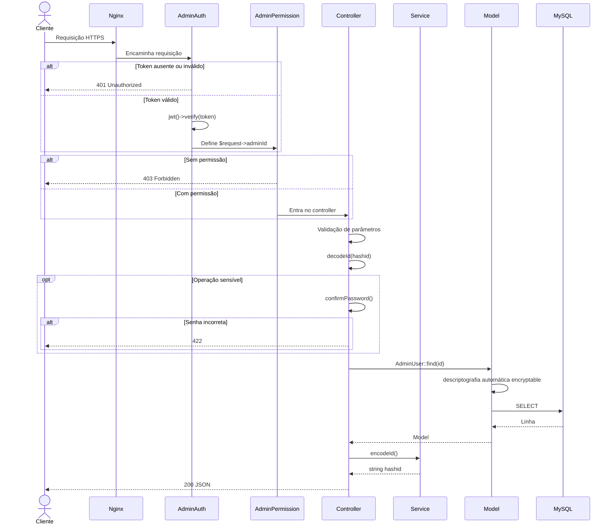

# Ciclo de vida da requisição

```mermaid
sequenceDiagram
    actor C as Cliente
    participant N as Nginx
    participant MW1 as AdminAuth
    participant MW2 as AdminPermission
    participant CTL as Controller
    participant SVC as Service
    participant MDL as Model
    participant DB as MySQL

    C->>N: Requisição HTTPS
    N->>MW1: Encaminha requisição

    alt Token ausente ou inválido
        MW1-->>C: 401 Unauthorized
    else Token válido
        MW1->>MW1: jwt()->verify(token)
        MW1->>MW2: Define $request->adminId
    end

    alt Sem permissão
        MW2-->>C: 403 Forbidden
    else Com permissão
        MW2->>CTL: Entra no controller
    end

    CTL->>CTL: Validação de parâmetros
    CTL->>CTL: decodeId(hashid)

    opt Operação sensível
        CTL->>CTL: confirmPassword()
        alt Senha incorreta
            CTL-->>C: 422
        end
    end

    CTL->>MDL: AdminUser::find(id)
    MDL->>MDL: descriptografia automática encryptable
    MDL->>DB: SELECT
    DB-->>MDL: Linha
    MDL-->>CTL: Model

    CTL->>SVC: encodeId()
    SVC-->>CTL: string hashid

    CTL-->>C: 200 JSON
```
