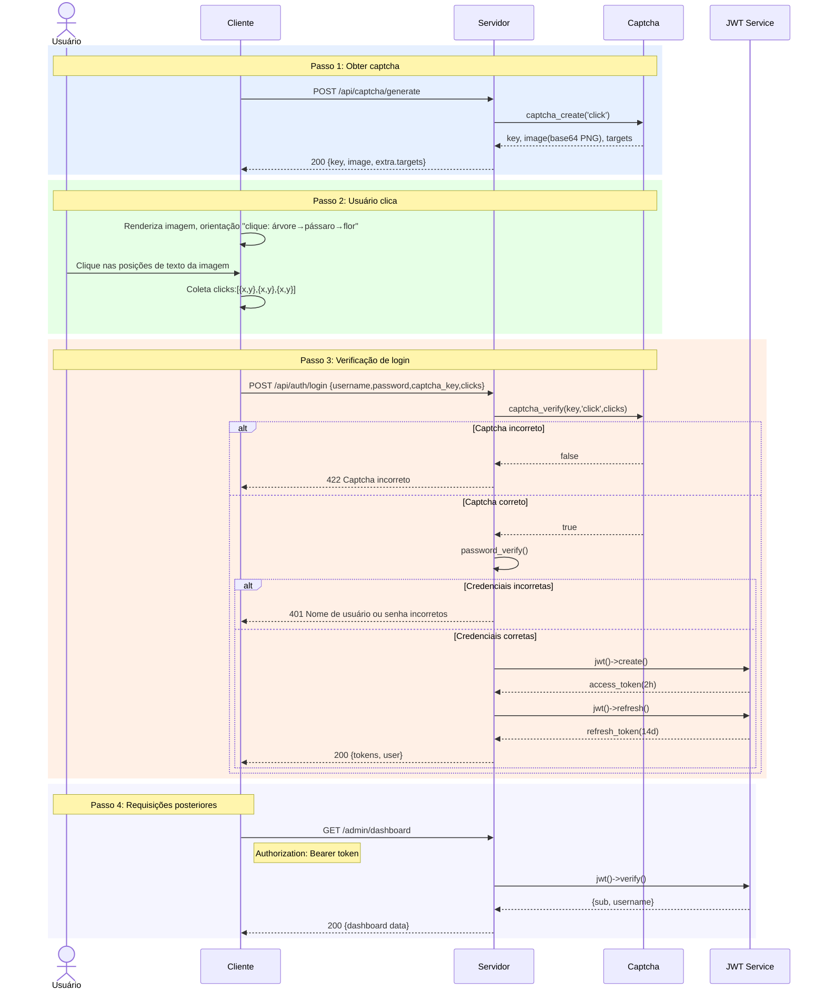

# Fluxo de autenticação e captcha

```mermaid
sequenceDiagram
    actor U as Usuário
    participant CL as Cliente
    participant SV as Servidor
    participant CAP as Captcha
    participant JWT as JWT Service

    rect rgb(230, 240, 255)
    Note over U,CAP: Passo 1: Obter captcha
    CL->>SV: POST /api/captcha/generate
    SV->>CAP: captcha_create('click')
    CAP-->>SV: key, image(base64 PNG), targets
    SV-->>CL: 200 {key, image, extra.targets}
    end

    rect rgb(230, 255, 230)
    Note over U,CAP: Passo 2: Usuário clica
    CL->>CL: Renderiza imagem, orientação "clique: árvore→pássaro→flor"
    U->>CL: Clique nas posições de texto da imagem
    CL->>CL: Coleta clicks:[{x,y},{x,y},{x,y}]
    end

    rect rgb(255, 240, 230)
    Note over U,CAP: Passo 3: Verificação de login
    CL->>SV: POST /api/auth/login {username,password,captcha_key,clicks}
    SV->>CAP: captcha_verify(key,'click',clicks)

    alt Captcha incorreto
        CAP-->>SV: false
        SV-->>CL: 422 Captcha incorreto
    else Captcha correto
        CAP-->>SV: true
        SV->>SV: password_verify()
        alt Credenciais incorretas
            SV-->>CL: 401 Nome de usuário ou senha incorretos
        else Credenciais corretas
            SV->>JWT: jwt()->create()
            JWT-->>SV: access_token(2h)
            SV->>JWT: jwt()->refresh()
            JWT-->>SV: refresh_token(14d)
            SV-->>CL: 200 {tokens, user}
        end
    end
    end

    rect rgb(245, 245, 255)
    Note over U,CL: Passo 4: Requisições posteriores
    CL->>SV: GET /admin/dashboard
    Note right of CL: Authorization: Bearer token
    SV->>JWT: jwt()->verify()
    JWT-->>SV: {sub, username}
    SV-->>CL: 200 {dashboard data}
    end
```
