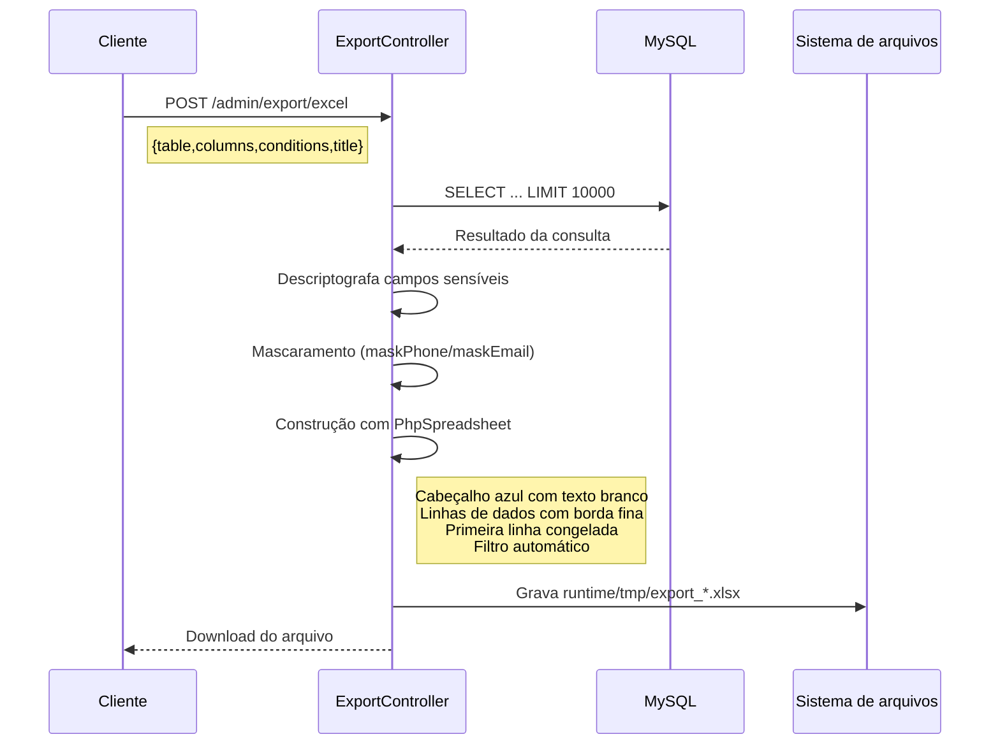
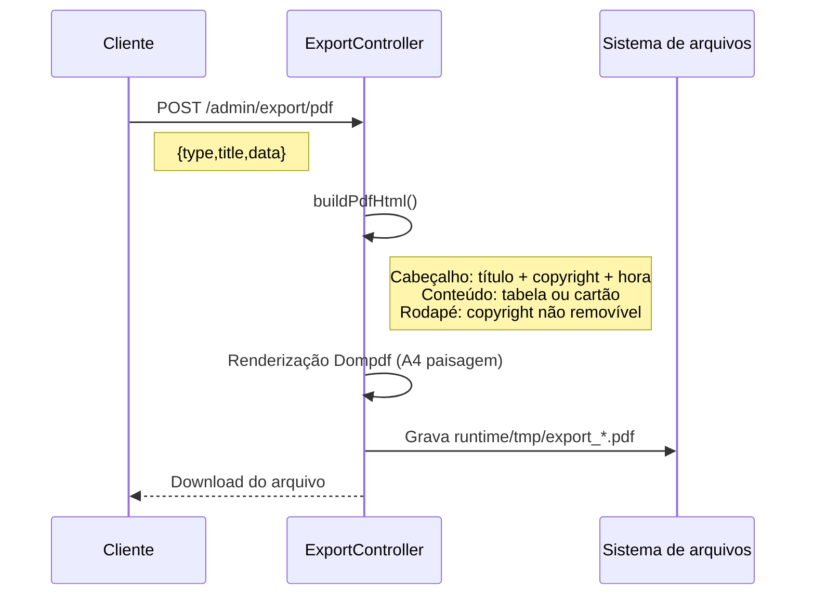

# Fluxo de negócio de exportação

## Exportação Excel

```mermaid
sequenceDiagram
    participant C as Cliente
    participant CTL as ExportController
    participant DB as MySQL
    participant FS as Sistema de arquivos

    C->>CTL: POST /admin/export/excel
    Note right of C: {table,columns,conditions,title}
    CTL->>DB: SELECT ... LIMIT 10000
    DB-->>CTL: Resultado da consulta
    CTL->>CTL: Descriptografa campos sensíveis
    CTL->>CTL: Mascaramento (maskPhone/maskEmail)
    CTL->>CTL: Construção com PhpSpreadsheet
    Note right of CTL: Cabeçalho azul com texto branco<br/>Linhas de dados com borda fina<br/>Primeira linha congelada<br/>Filtro automático
    CTL->>FS: Grava runtime/tmp/export_*.xlsx
    CTL-->>C: Download do arquivo
```

## Exportação PDF

```mermaid
sequenceDiagram
    participant C as Cliente
    participant CTL as ExportController
    participant FS as Sistema de arquivos

    C->>CTL: POST /admin/export/pdf
    Note right of C: {type,title,data}
    CTL->>CTL: buildPdfHtml()
    Note right of CTL: Cabeçalho: título + copyright + hora<br/>Conteúdo: tabela ou cartão<br/>Rodapé: copyright não removível
    CTL->>CTL: Renderização Dompdf (A4 paisagem)
    CTL->>FS: Grava runtime/tmp/export_*.pdf
    CTL-->>C: Download do arquivo
```
