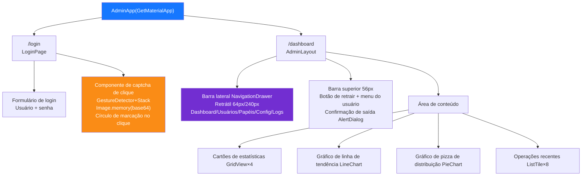
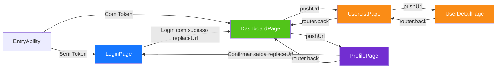

# Arquitetura de componentes do frontend

## Árvore de componentes Flutter Web

```mermaid
flowchart TD
    app["AdminApp(GetMaterialApp)"]

    app --> login["/login<br/>LoginPage"]
    app --> dashboard["/dashboard<br/>AdminLayout"]

    login --> form["Formulário de login<br/>Usuário + senha"]
    login --> captcha["Componente de captcha de clique<br/>GestureDetector+Stack<br/>Image.memory(base64)<br/>Círculo de marcação no clique"]

    dashboard --> sidebar["Barra lateral NavigationDrawer<br/>Retrátil 64px/240px<br/>Dashboard/Usuários/Papéis/Config/Logs"]
    dashboard --> header["Barra superior 56px<br/>Botão de retrair + menu do usuário<br/>Confirmação de saída AlertDialog"]
    dashboard --> content["Área de conteúdo"]

    content --> stats["Cartões de estatísticas GridView×4"]
    content --> chart["Gráfico de linha de tendência LineChart"]
    content --> pie["Gráfico de pizza de distribuição PieChart"]
    content --> logs["Operações recentes ListTile×8"]

    style app fill:#1677FF,color:#fff
    style captcha fill:#FA8C16,color:#fff
    style sidebar fill:#722ED1,color:#fff
```

## Roteamento de páginas HarmonyOS

```mermaid
flowchart LR
    entry["EntryAbility"]
    entry -->|"Sem Token"| loginH["LoginPage"]
    entry -->|"Com Token"| dashH["DashboardPage"]

    loginH -->|"Login com sucesso replaceUrl"| dashH

    dashH -->|"pushUrl"| userList["UserListPage"]
    dashH -->|"pushUrl"| profile["ProfilePage"]

    userList -->|"pushUrl"| userDetail["UserDetailPage"]
    userList -->|"router.back"| dashH
    userDetail -->|"router.back"| userList

    profile -->|"Confirmar saída replaceUrl"| loginH
    profile -->|"router.back"| dashH

    style loginH fill:#1677FF,color:#fff
    style dashH fill:#52C41A,color:#fff
    style userList fill:#FA8C16,color:#fff
    style userDetail fill:#FA8C16,color:#fff
    style profile fill:#722ED1,color:#fff
```
