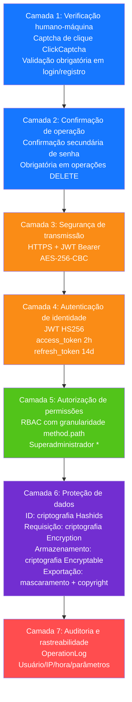

# Defesa em profundidade de segurança

```mermaid
flowchart TB
    l1["Camada 1: Verificação humano-máquina<br/>Captcha de clique ClickCaptcha<br/>Validação obrigatória em login/registro"]
    l2["Camada 2: Confirmação de operação<br/>Confirmação secundária de senha<br/>Obrigatória em operações DELETE"]
    l3["Camada 3: Segurança de transmissão<br/>HTTPS + JWT Bearer<br/>AES-256-CBC"]
    l4["Camada 4: Autenticação de identidade<br/>JWT HS256<br/>access_token 2h<br/>refresh_token 14d"]
    l5["Camada 5: Autorização de permissões<br/>RBAC com granularidade method.path<br/>Superadministrador *"]
    l6["Camada 6: Proteção de dados<br/>ID: criptografia Hashids<br/>Requisição: criptografia Encryption<br/>Armazenamento: criptografia Encryptable<br/>Exportação: mascaramento + copyright"]
    l7["Camada 7: Auditoria e rastreabilidade<br/>OperationLog<br/>Usuário/IP/hora/parâmetros"]

    l1 --> l2 --> l3 --> l4 --> l5 --> l6 --> l7

    style l1 fill:#1677FF,color:#fff
    style l2 fill:#1677FF,color:#fff
    style l3 fill:#FA8C16,color:#fff
    style l4 fill:#FA8C16,color:#fff
    style l5 fill:#52C41A,color:#fff
    style l6 fill:#722ED1,color:#fff
    style l7 fill:#FF4D4F,color:#fff
```
