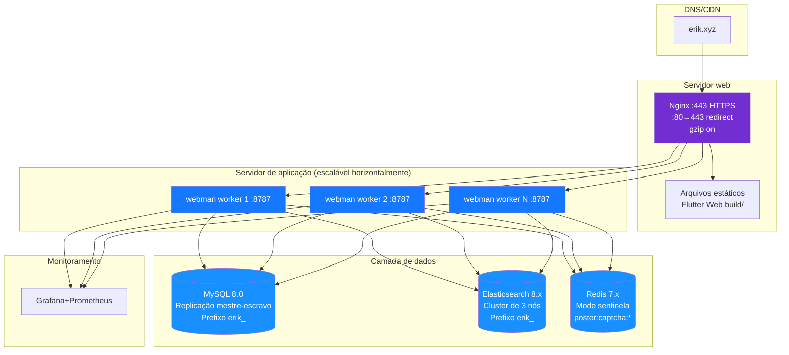

# Topologia de implantação

```mermaid
flowchart TB
    subgraph dns["DNS/CDN"]
        domain["erik.xyz"]
    end

    subgraph web["Servidor web"]
        nginx["Nginx :443 HTTPS<br/>:80→443 redirect<br/>gzip on"]
        static["Arquivos estáticos<br/>Flutter Web build/"]
    end

    subgraph app["Servidor de aplicação (escalável horizontalmente)"]
        wm1["webman worker 1 :8787"]
        wm2["webman worker 2 :8787"]
        wm3["webman worker N :8787"]
    end

    subgraph data["Camada de dados"]
        mysql[("MySQL 8.0<br/>Replicação mestre-escravo<br/>Prefixo erik_")]
        es[("Elasticsearch 8.x<br/>Cluster de 3 nós<br/>Prefixo erik_")]
        redis[("Redis 7.x<br/>Modo sentinela<br/>poster:captcha:*")]
    end

    subgraph monitor["Monitoramento"]
        grafana["Grafana+Prometheus"]
    end

    domain --> nginx
    nginx --> static
    nginx --> wm1
    nginx --> wm2
    nginx --> wm3
    wm1 & wm2 & wm3 --> mysql
    wm1 & wm2 & wm3 --> es
    wm1 & wm2 & wm3 --> redis
    wm1 & wm2 & wm3 --> grafana

    style nginx fill:#722ED1,color:#fff
    style wm1 fill:#1677FF,color:#fff
    style wm2 fill:#1677FF,color:#fff
    style wm3 fill:#1677FF,color:#fff
    style mysql fill:#1890FF,color:#fff
    style es fill:#1890FF,color:#fff
    style redis fill:#1890FF,color:#fff
```
