# Диаграммы архитектуры и бизнес-логики

> Copyright (c) 2026 erik <erik@erik.xyz> — https://erik.xyz

> Приведённые ниже диаграммы Mermaid автоматически рендерятся на GitHub / GitLab / в VS Code. В других средах используйте [Mermaid Live Editor](https://mermaid.live/).

---

## 1. Топология системной архитектуры

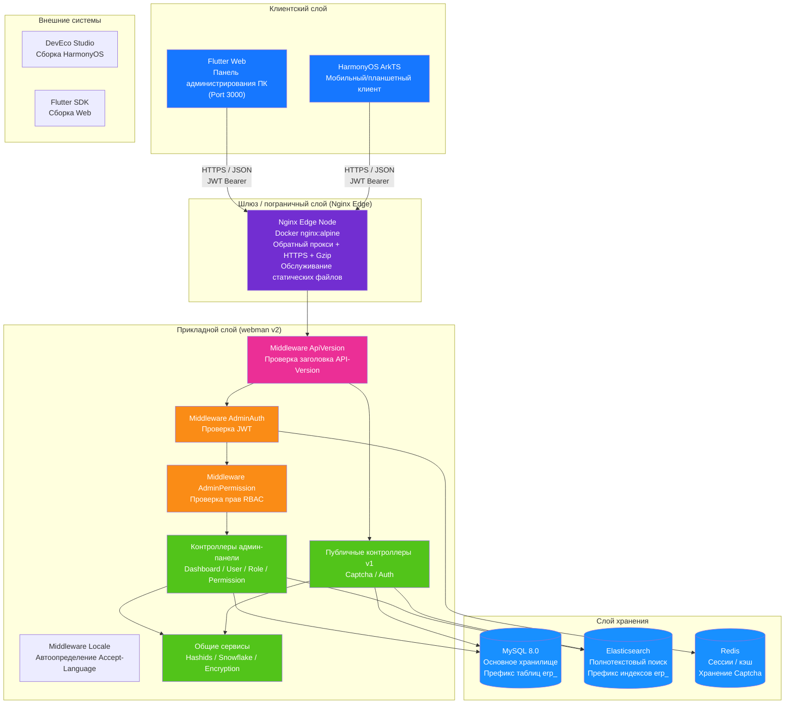

---

## 2. Многоуровневая архитектура бэкенда

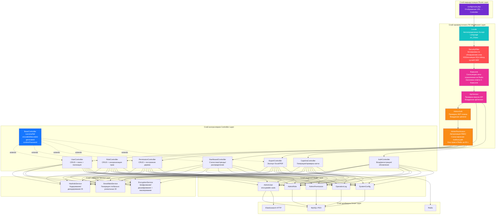

### Расширение бизнес-слоя ERP

По мере эволюции системы от чистой админ-панели до полноценной ERP-системы в слое контроллеров и сервисов добавлены следующие бизнес-модули:

| Слой | Каталог | Описание |
|------|---------|----------|
| Бизнес-контроллеры | `app/controller/{product,purchase,sales,inventory,finance,crm,workflow,notification,project,hr,manufacturing,report}/` | 70 шт., разделены по модулям, обрабатывают бизнес-запросы |
| Бизнес-сервисы | `app/service/{inventory,finance,notification}/` | Приход/расход склада + расчёт себестоимости, дебиторская/кредиторская задолженность + взаимозачёт, отправка уведомлений |

---

## 3. Жизненный цикл запроса

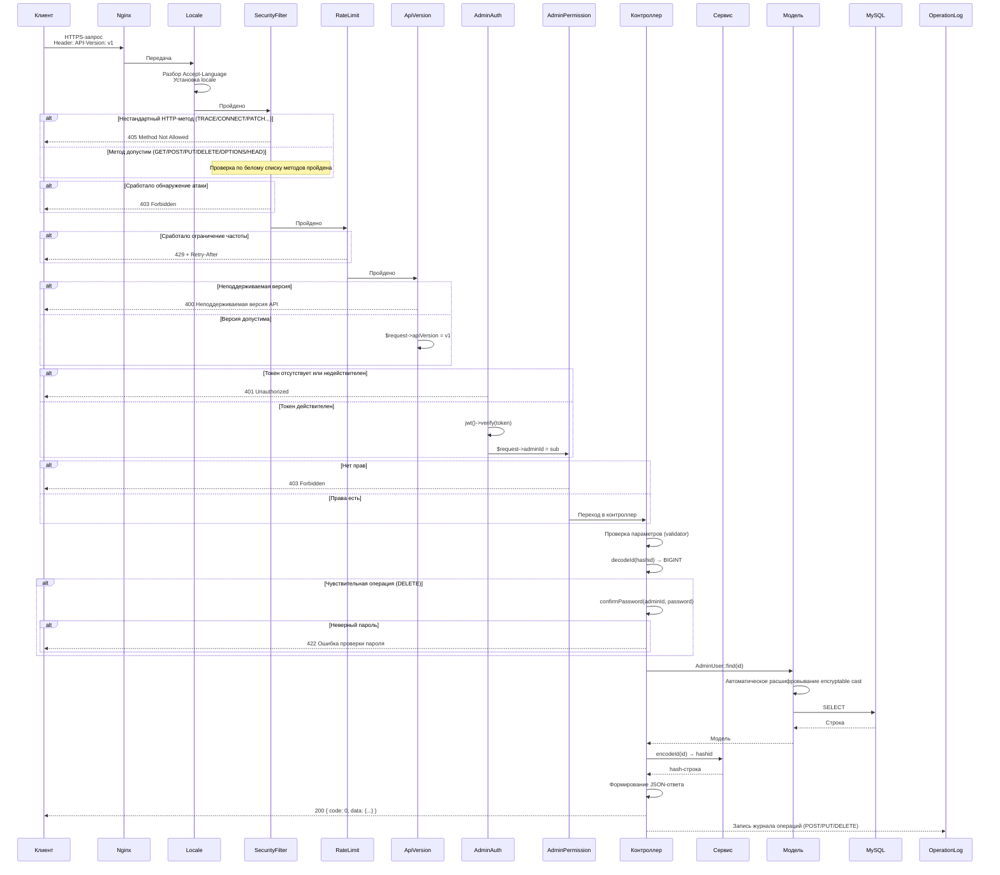

---

## 4. Поток аутентификации и капчи

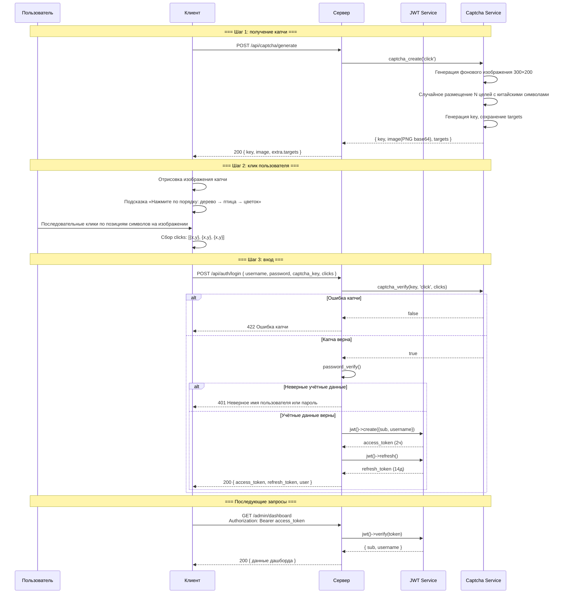

---

## 5. Модель прав RBAC

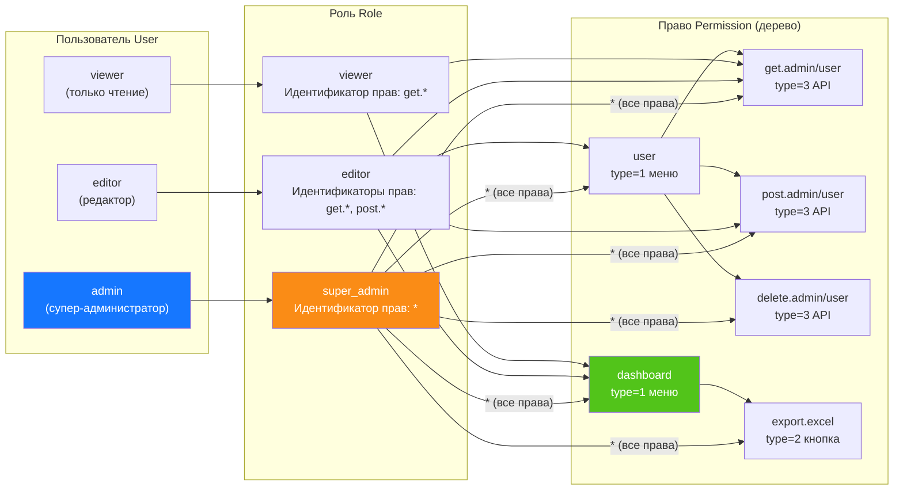

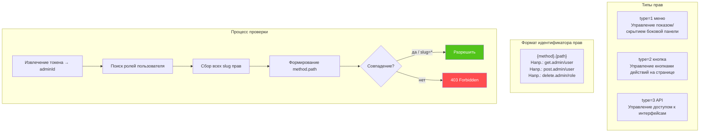

---

## 6. Полный жизненный цикл ID

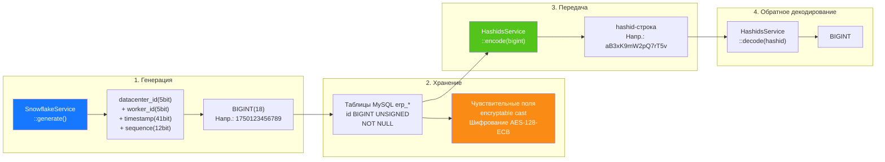

---

## 7. Многоуровневое шифрование данных

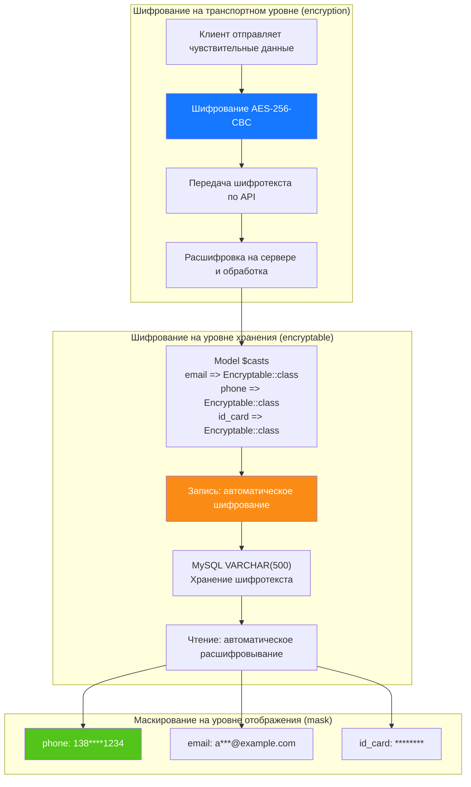

---

## 8. ER-отношения базы данных

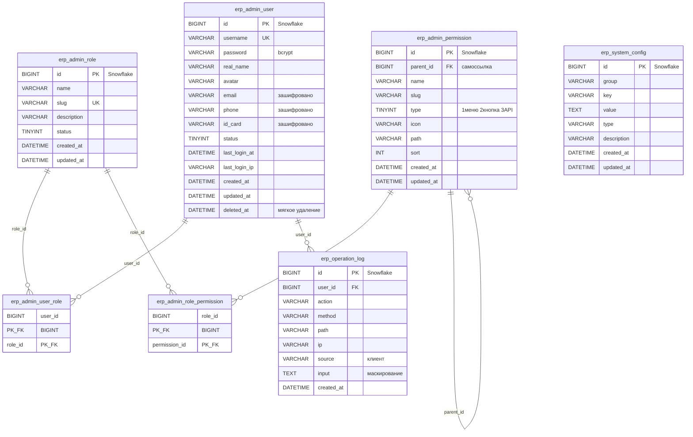

---

## 9. Бизнес-процесс экспорта

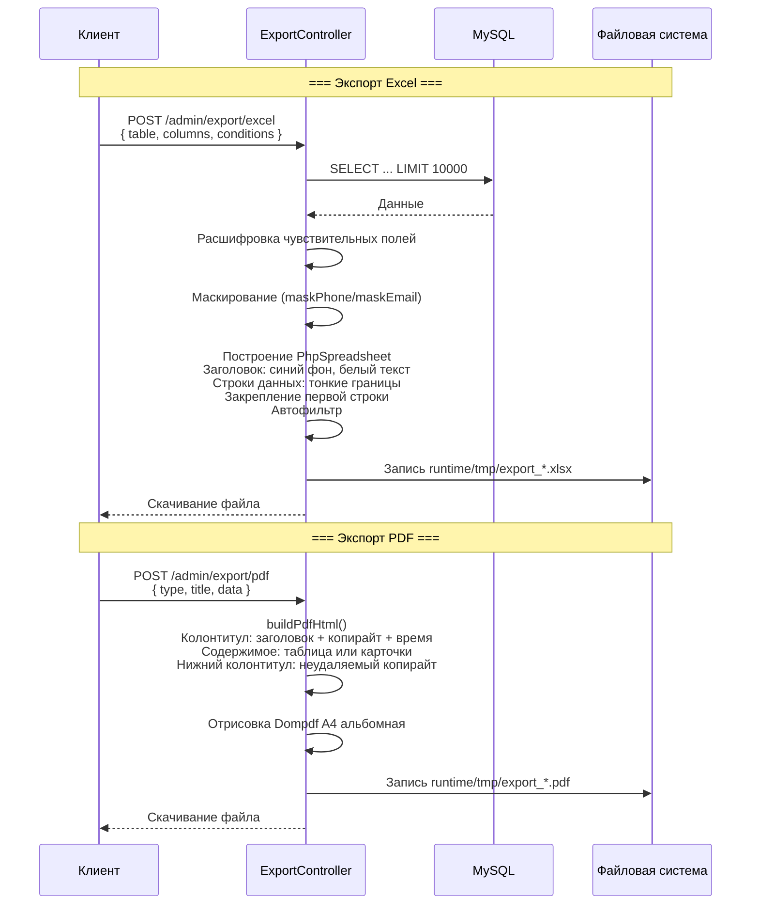

---

## 10. Дерево компонентов Flutter Web

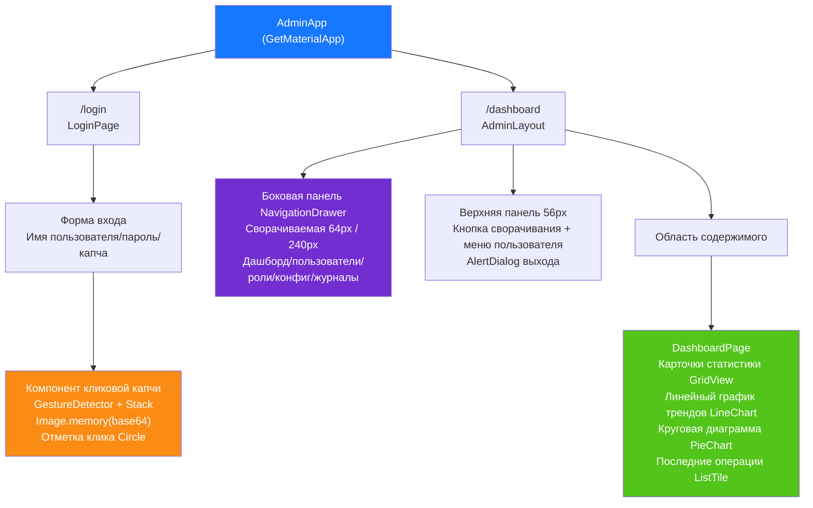

---

## 11. Маршрутизация страниц HarmonyOS

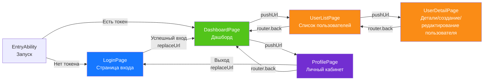

---

## 12. Обзор многоуровневой защиты

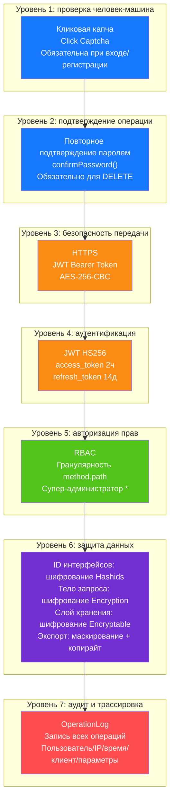

---

## 13. Топология развёртывания

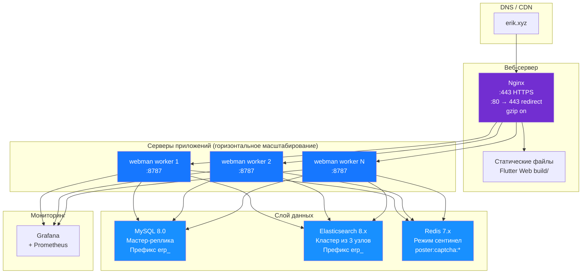

---

## 14. Общая архитектура ERP-системы

```mermaid
graph TB
    subgraph Client["Клиентский слой"]
        FW["Flutter Web<br/>Панель администрирования ПК"]
        FA["Flutter App<br/>iOS/Android/macOS/Windows/Linux"]
        HW["HarmonyOS<br/>Нативное приложение HarmonyOS"]
    end

    subgraph Gateway["Слой API-шлюза"]
        MW["Цепочка промежуточного ПО<br/>Locale→Cors→SecurityFilter→RateLimit→Auth→Permission→OpLog"]
    end

    subgraph Business["Слой бизнес-модулей"]
        direction LR
        Admin["Системное администрирование<br/>Пользователи/роли/права/конфиг/журналы"]
        Product["Управление товарами<br/>Товары/категории/бренды/склады/поставщики/клиенты"]
        Purchase["Управление закупками<br/>Заявка→заказ→приёмка→возврат→расчёт"]
        Sales["Управление продажами<br/>Предложение→заказ→отгрузка→возврат→расчёт"]
        Inventory["Управление складом<br/>Приход/расход/партии/инвентаризация/перемещение/предупреждения"]
        Finance["Управление финансами<br/>Счета/проводки/дебиторка-кредиторка/главная книга/детали/отчёты/возмещения"]
        CRM["CRM<br/>Клиенты/контакты/сделки/воронка/общий пул/предложения/договоры"]
        Workflow["Согласование рабочих процессов<br/>Определение процесса/подача/одобрение/отклонение/отзыв"]
        Notification["Уведомления<br/>Список уведомлений/прочитано/счётчик непрочитанных"]
        Project["Управление проектами<br/>Проекты/задачи/учёт времени"]
        HR["HR<br/>Отделы/сотрудники/должности/посещаемость/отпуска/зарплаты"]
        Manufacturing["Производство<br/>BOM/производственные заказы/маршруты/рабочие центры/MRP"]
        Report["Пользовательские отчёты<br/>Шаблоны отчётов/наборы данных/поля/фильтры/планировщик"]
    end

    subgraph Service["Слой бизнес-сервисов"]
        IS["InventoryService<br/>Приход/расход + скользящая средневзвешенная себестоимость"]
        FS["FinanceService<br/>Автогенерация дебиторки/кредиторки + взаимозачёт"]
        NS["NotificationService<br/>Единая отправка уведомлений"]
    end

    subgraph Data["Слой данных"]
        MySQL["MySQL 8.0<br/>163 бизнес-таблицы"]
        Redis["Redis 7<br/>Кэш/лимиты/сессии"]
        ES["Elasticsearch 8<br/>Полнотекстовый поиск"]
    end

    Client --> Gateway
    Gateway --> Business
    Business --> Service
    Service --> Data
    Business --> Data
```

---

## 15. Поток данных между модулями

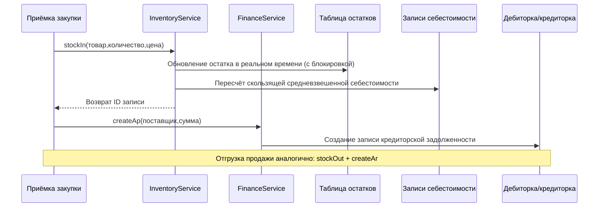

---

## 16. Поток расчёта складской себестоимости

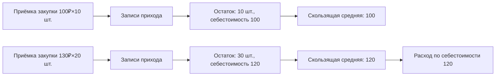

---

## 17. Поток данных согласования рабочего процесса

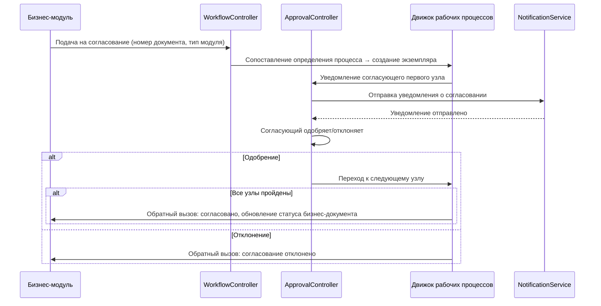

---

## 18. Поток данных уведомлений

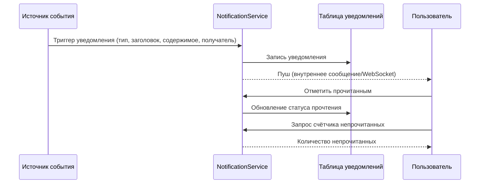

---

## 19. Поток данных MRP (планирование потребностей в материалах)

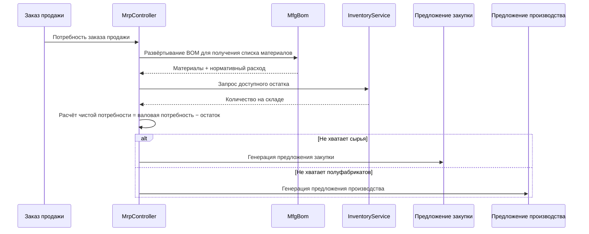

---

## 20. Таблица соответствия «контроллер-сервис-модель» модулей ERP

> Примечание о слое сервисов: в колонке «Ключевой Service» отмечены бизнес-сервисы, уже вынесенные для модуля; модули,
> отмеченные **⚠ контроллер напрямую обращается к модели — известный технический долг**,
> по-прежнему вызывают методы запроса/записи моделей напрямую из контроллеров (`XxxModel::find/where/save` и т. д.),
> слой сервисов для них ещё не выделен; это известный технический долг, который будет постепенно устраняться
> по схеме лёгкого выделения сервисного слоя P2-F2 (`app/service/AbstractCrudService` — универсальный CRUD-базовый класс + модульный Service).

| Модуль | Контроллеры (каталог) | Ключевой Service | Основные модели | Число таблиц |
|--------|-----------------------|------------------|-----------------|--------------|
| Системное администрирование | admin/controller/ (14) | - ⚠ контроллер напрямую обращается к модели, известный технический долг | AdminUser, AdminRole, AdminPermission | 7 |
| Управление товарами | controller/product/ (7) | ProductService | Product, Category, Brand, Warehouse, Supplier, Customer | 11 |
| Управление закупками | controller/purchase/ (5) | InventoryService, FinanceService ⚠ CRUD пока напрямую, известный технический долг | PurchaseOrder, PurchaseReceive | 9 |
| Управление продажами | controller/sales/ (5) | InventoryService, FinanceService ⚠ CRUD пока напрямую, известный технический долг | SalesOrder, SalesDelivery | 9 |
| Управление складом | controller/inventory/ (5) | InventoryService ⚠ CRUD пока напрямую, известный технический долг | Inventory, InventoryFlow, CostRecord | 11 |
| Управление финансами | controller/finance/ (20) | FinanceService ⚠ CRUD пока напрямую, известный технический долг | FinanceArAp, FinanceVoucher, FinanceReceipt, FinancePayment, FinanceGeneralLedger, FinanceBalanceSheet, FinanceAsset, FinanceBudget, FinanceCostCenter | 26 |
| CRM | controller/crm/ (10) | CrmService | CrmOpportunity, CrmFollowRecord, CrmContract, CrmPoolRule, CrmQuotation, CrmCampaign, CrmTicket, CrmAnalyticsReport | 16 |
| Согласование рабочих процессов | controller/workflow/ (2) | - ⚠ контроллер напрямую обращается к модели, известный технический долг | ApprovalWorkflow, ApprovalInstance, ApprovalNode, ApprovalRecord | 4 |
| Уведомления | controller/notification/ (1) | NotificationService ⚠ CRUD пока напрямую, известный технический долг | Notification, NotificationSetting, NotificationTemplate | 3 |
| Управление проектами | controller/project/ (3) | - ⚠ контроллер напрямую обращается к модели, известный технический долг | Project, ProjectTask, ProjectTimesheet, ProjectMember, ProjectGantt | 5 |
| HR | controller/hr/ (5) | HrService | HrDepartment, HrEmployee, HrPosition, HrAttendance, HrLeave, HrSalary | 8 |
| Производство | controller/manufacturing/ (5) | ManufacturingService | MfgBom, MfgProductionOrder, MfgRouting, MfgWorkstation, MfgMrpPlan | 8 |
| Пользовательские отчёты | controller/report/ (2) | - ⚠ контроллер напрямую обращается к модели, известный технический долг | ReportTemplate, ReportDataset, ReportField, ReportFilter, ReportSchedule | 5 |
| EAM (управление оборудованием) | controller/eam/ (4) | - ⚠ контроллер напрямую обращается к модели, известный технический долг | EamEquipment, EamMaintenancePlan, EamRepairOrder, EamSparePart | 4 |
| DMS (управление документами) | controller/dms/ (2) | - ⚠ контроллер напрямую обращается к модели, известный технический долг | DmsCategory, DmsDocument, DmsDocumentVersion | 3 |
| BI-дашборды | controller/bi/ (3) | - ⚠ контроллер напрямую обращается к модели, известный технический долг | BiDashboard, BiWidget | 2 |

### 20.1 Журнал лёгкого выделения сервисного слоя P2-F2 (crm/hr/manufacturing/product уже выделены)

| Модуль | Вызовов контроллером до выделения | После выделения | Новый Service | Что выделено |
|--------|----------------------------------|-----------------|---------------|--------------|
| CRM | 57 | 0 | `app/service/crm/CrmService.php` | Универсальный CRUD + смена статуса договора, предложение→договор, выдача/возврат в общий пул, назначение/решение/ответ по тикетам, каскадная очистка деталей, построение данных аналитических отчётов |
| HR | 38 | 0 | `app/service/hr/HrService.php` | Универсальный CRUD + определение опозданий/ранних уходов, согласование отпусков (автогенерация отпускной посещаемости), уникальность зарплат/расчёт к выдаче/выплата/массовое создание |
| Производство | 33 | 0 | `app/service/manufacturing/ManufacturingService.php` | Универсальный CRUD + переходы «начало/завершение» производственных заказов, копирование версий BOM/взаимоисключение при вводе в действие, генерация деталей MRP |
| Управление товарами | 29 | 0 | `app/service/product/ProductService.php` | Универсальный CRUD + транзакционное создание товара (SKU/цены), обновление с сохранением исходных значений по полям, загрузка связанных данных деталей |

Схема выделения: `app/service/AbstractCrudService.php` предоставляет универсальные CRUD-методы `list/all/find/create/update/delete/deleteWhere`
и вспомогательные функции чистой логики `normalizePageParams/canTransition`; модульные Service наследуют его и аккумулируют специфическую бизнес-логику модуля.
Контроллеры внедряют сервис через `Container::get(XxxService::class)` (с откатом через class_exists), маршруты/параметры/структура ответов полностью неизменны;
кодирование hashid, повторное подтверждение пароля, обёртка ответов и прочие HTTP-задачи остаются в контроллерах.
Новые Service зарегистрированы в `config/dependence.php` (этот файл — dead config, не загружается через addDefinitions; во время выполнения
контейнер полагается на откат через class_exists, поэтому все Service сохраняют конструктор без аргументов).

Модули без выделения (управление проектами — 18 вызовов, пользовательские отчёты — 18, закупки — 24, продажи — 24, системное администрирование — 42 и т. д.)
отмечены в таблице как «контроллер напрямую обращается к модели, известный технический долг»; в следующих итерациях будут выделены по той же схеме.

---

## Расширения OMS/WMS/TMS (2026-08)

### OMS (Order Management System) — 8 таблиц
- **Расширение заказов** (`erp_oms_order`): агрегация по каналам/статус исполнения/статус оплаты/приоритет
- **Адреса заказов** (`erp_oms_order_address`): адреса доставки/оплаты (форматы разных стран)
- **Записи исполнения** (`erp_oms_fulfillment`+`_item`): отслеживание количеств «распределено/собрано/упаковано/отгружено»
- **RMA** (`erp_oms_rma`+`_item`): полный жизненный цикл возвратов/обменов
- **Резервирование остатков** (`erp_oms_inventory_reservation`): ATP = physical − reserved
- **Каналы** (`erp_channel`): direct/marketplace/edi/pos

### WMS (Warehouse Management System) — 12 таблиц
- **Зоны и ячейки** (`erp_wms_zone`, `erp_wms_location`): zone→aisle→rack→level→bin
- **Приёмка** (`erp_wms_asn`+`_item`, `erp_wms_receiving`, `erp_wms_putaway_task`+`_item`)
- **Отгрузка** (`erp_wms_wave`+`wave_order`, `erp_wms_pick_task`+`_item`, `erp_wms_pack_task`)

### TMS (Transport Management System) — 7 таблиц
- **Перевозчики** (`erp_tms_carrier`+`carrier_service`, `erp_tms_freight_rate`)
- **Накладные** (`erp_tms_shipment`+`_package`, `erp_tms_tracking_event`)
- **Счета** (`erp_tms_freight_invoice`)

### Поток данных
```
OMS: Заказ канала → Резервирование остатков (ATP) → Создание исполнения → WMS
WMS: Волна → Сборка → Упаковка → Накладная TMS
TMS: Сравнение тарифов → Отгрузка → Подтверждение (stockOut + AR) → Трекинг → Доставка
WMS Inbound: ASN → Приёмка → Размещение (stockIn + AP)
RMA: Заявка → Одобрение → Возврат → Приёмка (stockIn) → Возмещение
```

---

## 21. Дорожная карта экосистемы (2026-08)

> Детальная спецификация: `superpowers/specs/2026-08-04-erp-ecosystem-roadmap-design.md`

### 21.1 Базовая оценка (на момент запуска дорожной карты)

> P0~P3 полностью сданы, текущая общая оценка 89/100 (см. CLAUDE.md); таблица ниже — базовый снимок до запуска дорожной карты.

| Измерение | Оценка | Ключевые пробелы |
|-----------|--------|------------------|
| Backend API | 85/100 | Многие модули — CRUD-скелеты, не хватает бизнес-движков расчётов |
| Безопасность | 95/100 | 18 уровней защиты, готово к продакшену |
| Frontend UI | 20/100 | **Самое слабое место**: Flutter 12 страниц покрывают ~20% модулей, нет веб-панели администрирования |
| Операционная экосистема | 70/100 | Нет отката миграций, автоматических резервных копий, наблюдаемости |
| Глубина бизнеса | 55/100 | Ключевые алгоритмы финансов/HR/производства не реализованы |
| **Общая** | **65/100** | |

### 21.2 Четырёхэтапная последовательная дорожная карта

```
P0(3-4 недели) → P1(4-6 недель) → P2(1-2 недели) → P3(2-3 недели) = всего около 13 недель
```

| Этап | Название | Ключевые результаты |
|------|----------|---------------------|
| **P0** | Фронтенд-экосистема | Веб-панель администрирования Flutter Web на все модули (14 модулей, 40+ страниц), библиотека общих компонентов, выравнивание с HarmonyOS |
| **P1** | Глубина бизнеса | Движок двойной бухгалтерии, движок расчёта зарплат, движок MRP, модуль управления качеством, уведомления в реальном времени (WebSocket) |
| **P2** | Операционная надёжность | Откат миграций БД, расширенное автобекап, трассировка OpenTelemetry, драйвер очередей RabbitMQ |
| **P3** | Улучшение опыта | BI-дашборды с перетаскиванием, управление оборудованием (EAM), изоляция арендаторов, управление документами (DMS) |

### 21.3 Эволюция цепочки промежуточного ПО

```
Сейчас:   Locale → Cors → SecurityFilter → RateLimit → TracingId → {группа маршрутов}
После P1: Locale → Cors → SecurityFilter → RateLimit → WebSocketUpgrade → {группа маршрутов}
После P2: Locale → Cors → SecurityFilter → RateLimit → TracingId → WebSocketUpgrade → {группа маршрутов}
После P3: Locale → Cors → SecurityFilter → RateLimit → TracingId → TenantScope → WebSocketUpgrade → {группа маршрутов}
```

### 21.4 Целевая архитектура P0 — веб-панель Flutter Web

| Слой | Новое содержимое |
|------|------------------|
| Слой макета | `AdminLayout` — трёхколоночный макет ПК (сворачиваемая боковая панель + верхняя панель + область содержимого) |
| Слой компонентов | `DataTableWrapper`, `FormDialog`, `ConfirmDialog`, `StatCard`, `BreadcrumbNav`, `FileUploader` |
| Слой страниц | Расширение с текущих 12 страниц до полного покрытия 14 модулей, 40+ страниц |
| Слой сервисов | Переиспользование существующих `ApiService`, `AuthService`, `CaptchaService`, `ExportService` |

### 21.5 Целевая архитектура P1 — бизнес-движки расчётов

| Движок | Сервисные классы | Ключевые правила |
|--------|------------------|------------------|
| Двойная бухгалтерия | `DoubleEntryService`, `PeriodCloseService`, `AccountBalanceService` | Принудительная проверка баланса дебета/кредита, перенос результатов периода, пересчёт валют по курсам |
| Расчёт зарплат | `SalaryEngineService`, `SocialInsuranceService`, `HousingFundService`, `TaxCalculatorService` | Верхние/нижние границы базы соцвзносов, доля жилищного фонда, прогрессивная шкала НДФЛ, банковские выплаты |
| MRP | `MrpEngineService`, `BomExplosionService`, `NetRequirementService` | Многоуровневое развёртывание BOM + потери, низкий код уровня (LLC), страховой запас, правила партий |
| Качество | `QmsInspectionService` | Поток трёх форм: IQC входной / IPQC процессный / OQC выходной контроль |
| Уведомления | `WebSocketService`, `ChannelRouter` | Многоканально: внутренние/email/WeCom/钉钉 (DingTalk) |

### 21.6 Сводка изменений модели данных

| Этап | Новых таблиц | Затронутые модули |
|------|--------------|-------------------|
| P0 | 0 | Только фронтенд, изменений таблиц нет |
| P1 | 14 | Финансы (2) + HR (3) + Производство (2) + Качество (5) + Уведомления (2) |
| P3 | 7 | BI (2) + EAM (3) + DMS (2) |

---

## 22. Мультиарендность (зарезервированная возможность, не включена)

> Заявление об авторских правах такое же, как в шапке файла: Copyright (c) 2026 erik <erik@erik.xyz> — https://erik.xyz

### 22.1 Позиционирование и решение

Мультиарендность в этом проекте позиционируется как **зарезервированная возможность**; в текущем цикле она **не подключается и не включается** (документированная деградация). В соответствии с планированием:
SaaS-биллинг, самостоятельное подключение арендаторов и прочие «полные коммерческие решения мультиарендности» не входят в объём данного этапа; на данном этапе сохраняется только минимальный
каркас кода (промежуточное ПО + Trait модели) с описанием шагов включения для последующего включения по мере необходимости.
Примечание: «изоляция арендаторов» из этапа P3 дорожной карты §21.2 в соответствии с этим скорректирована на «зарезервированная возможность (документированная деградация)», каркас сохранён, подключение не выполняется.

Основания решения (рецензия 2026-08):
- Почти все существующие развёртывания — однократные арендаторы; подключение внесёт ненужную сложность изоляции и риски регрессий;
- Текущий каркас имеет технические недостатки (см. 22.4), «подключение = изоляция» не выполняется, требуется сначала завершить исправление проекта;
- Изоляция требует добавления колонки в каждую из 163 бизнес-таблиц и включения для каждой модели — затраты намного превышают «минимальное подключение».

### 22.2 Текущие факты (сверка кода и конфигурации)

| Пункт | Текущее состояние |
|-------|-------------------|
| `app/middleware/TenantScope.php` | Существует, не зарегистрирован; читает арендатора из заголовка `X-Tenant-Id`, при отсутствии заголовка пропускает |
| `app/model/concerns/TenantScope.php` | Существует, ни одна модель не использует; `bootTenantScope()` — глобальная область видимости, фильтрует только после установки арендатора |
| `config/middleware.php` | Глобальная цепочка: Locale → Cors → SecurityFilter → RateLimit → TracingId, без TenantScope |
| `config/route.php` /admin-группа | AdminAuth → AdminPermission → OperationLog, без TenantScope |
| Нагрузка JWT | Только `sub` / `username` / `token_type`, **без объявления tenant_id** (`app/api/v1/controller/AuthController.php`) |
| База данных | **Во всей БД нет колонки tenant_id** (в install.sql тоже нет) |
| Модели | **Ни одна модель не использует Trait TenantScope** |

### 22.3 Шаги включения (справочник, в текущем цикле не выполняются)

1. Зарегистрировать промежуточное ПО: в группе /admin файла `config/route.php` добавить в `middleware()`
   `app\middleware\TenantScope::class` (после AdminAuth, чтобы гарантировать аутентификацию).
2. Запрашивающая сторона передаёт `X-Tenant-Id` в заголовке запроса (int — ID арендатора).
3. Добавить колонку `tenant_id` (BIGINT + индекс) в бизнес-таблицы, требующие изоляции, и заполнить существующие данные;
   словарные/системные таблицы (например, `erp_admin_user`, `erp_role`, `erp_permission`) не изолируются.
4. В моделях, требующих изоляции, подключить `use app\model\concerns\TenantScope;` — автоматическая фильтрация по текущему арендатору.
5. (Опционально) если арендатор должен браться из JWT, а не из заголовка: расширить полезную нагрузку логина, добавив объявление `tenant_id`,
   и в промежуточном ПО читать из `$payload['tenant_id']`.

### 22.4 Известные технические ограничения (обязательно решить до включения)

- **Разрыв статической цепочки передачи (проверено на PHP 8.3)**: вызов `setCurrentTenantId()` из промежуточного ПО через имя trait
   записывает в собственную статическую копию trait, которую модель, использующая этот trait, не видит — запросы не фильтруются.
   При включении нужно перейти на внедрение на основе контекста запроса (например, `request()->tenantId`).
- **Перекрёстные помехи статического глобального состояния**: Workerman — резидентный процесс, статические свойства разделяются между запросами; при включении кооперативного режима
   (Swoole/Swow) возможны перекрёстные помехи данных между арендаторами; нужно перейти на привязку на уровне запроса (`context()` / объект запроса).
- **Пробел на стороне данных**: во всей БД нет колонки tenant_id, требуется миграция по каждой таблице; для словарных таблиц, общих для арендаторов, нужен механизм исключений.

### 22.5 Критерии приёмки

Приёмка текущего цикла = согласованность документации и кода: `config/middleware.php` и `config/route.php` не содержат
регистрации TenantScope; в комментариях промежуточного ПО и Trait явно указано «зарезервированная возможность, не включена» и приведены шаги включения;
описание этого раздела построчно соответствует текущему состоянию кода.
