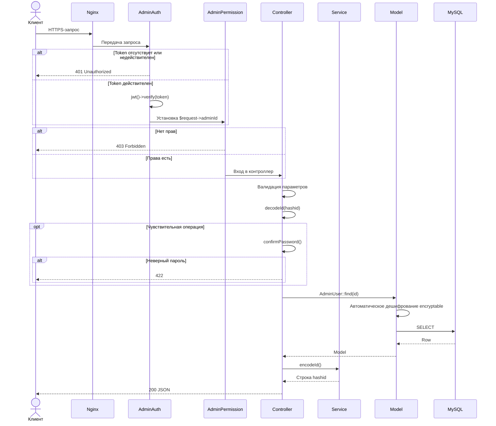

# Жизненный цикл запроса

```mermaid
sequenceDiagram
    actor C as Клиент
    participant N as Nginx
    participant MW1 as AdminAuth
    participant MW2 as AdminPermission
    participant CTL as Controller
    participant SVC as Service
    participant MDL as Model
    participant DB as MySQL

    C->>N: HTTPS-запрос
    N->>MW1: Передача запроса

    alt Token отсутствует или недействителен
        MW1-->>C: 401 Unauthorized
    else Token действителен
        MW1->>MW1: jwt()->verify(token)
        MW1->>MW2: Установка $request->adminId
    end

    alt Нет прав
        MW2-->>C: 403 Forbidden
    else Права есть
        MW2->>CTL: Вход в контроллер
    end

    CTL->>CTL: Валидация параметров
    CTL->>CTL: decodeId(hashid)

    opt Чувствительная операция
        CTL->>CTL: confirmPassword()
        alt Неверный пароль
            CTL-->>C: 422
        end
    end

    CTL->>MDL: AdminUser::find(id)
    MDL->>MDL: Автоматическое дешифрование encryptable
    MDL->>DB: SELECT
    DB-->>MDL: Row
    MDL-->>CTL: Model

    CTL->>SVC: encodeId()
    SVC-->>CTL: Строка hashid

    CTL-->>C: 200 JSON
```
