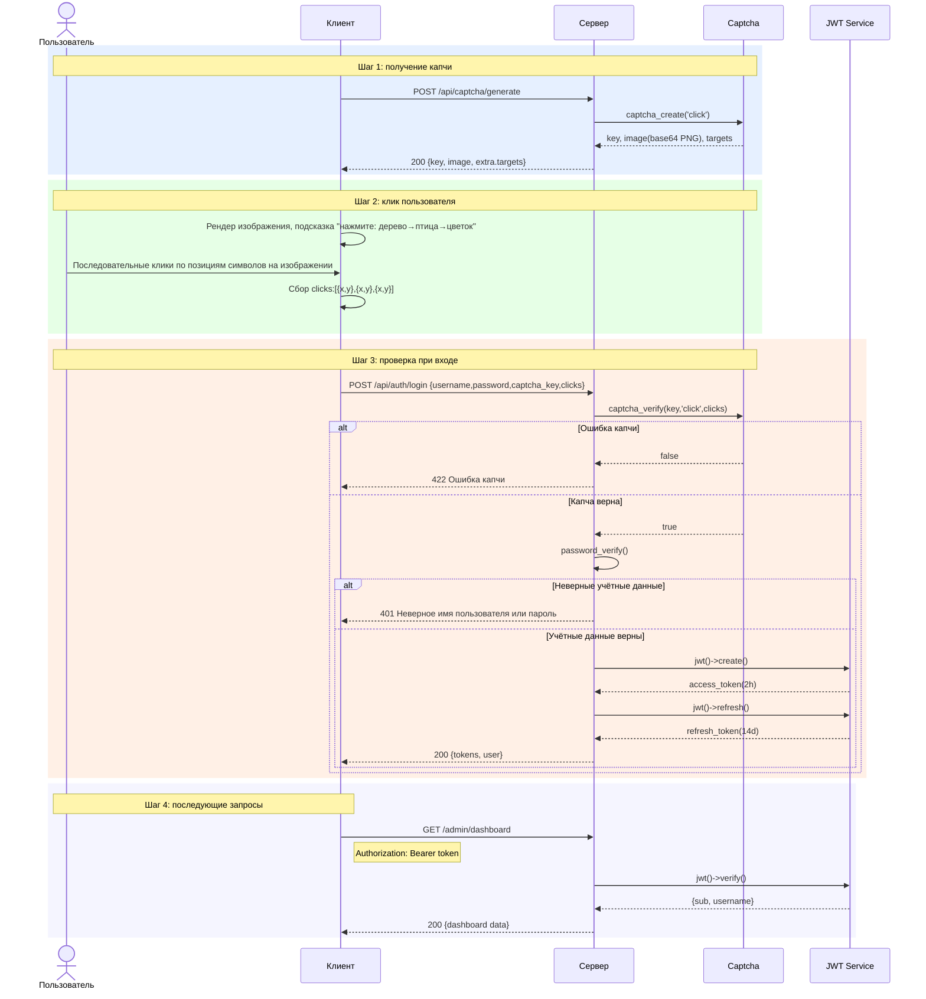

# Процесс аутентификации и капчи

```mermaid
sequenceDiagram
    actor U as Пользователь
    participant CL as Клиент
    participant SV as Сервер
    participant CAP as Captcha
    participant JWT as JWT Service

    rect rgb(230, 240, 255)
    Note over U,CAP: Шаг 1: получение капчи
    CL->>SV: POST /api/captcha/generate
    SV->>CAP: captcha_create('click')
    CAP-->>SV: key, image(base64 PNG), targets
    SV-->>CL: 200 {key, image, extra.targets}
    end

    rect rgb(230, 255, 230)
    Note over U,CAP: Шаг 2: клик пользователя
    CL->>CL: Рендер изображения, подсказка "нажмите: дерево→птица→цветок"
    U->>CL: Последовательные клики по позициям символов на изображении
    CL->>CL: Сбор clicks:[{x,y},{x,y},{x,y}]
    end

    rect rgb(255, 240, 230)
    Note over U,CAP: Шаг 3: проверка при входе
    CL->>SV: POST /api/auth/login {username,password,captcha_key,clicks}
    SV->>CAP: captcha_verify(key,'click',clicks)

    alt Ошибка капчи
        CAP-->>SV: false
        SV-->>CL: 422 Ошибка капчи
    else Капча верна
        CAP-->>SV: true
        SV->>SV: password_verify()
        alt Неверные учётные данные
            SV-->>CL: 401 Неверное имя пользователя или пароль
        else Учётные данные верны
            SV->>JWT: jwt()->create()
            JWT-->>SV: access_token(2h)
            SV->>JWT: jwt()->refresh()
            JWT-->>SV: refresh_token(14d)
            SV-->>CL: 200 {tokens, user}
        end
    end
    end

    rect rgb(245, 245, 255)
    Note over U,CL: Шаг 4: последующие запросы
    CL->>SV: GET /admin/dashboard
    Note right of CL: Authorization: Bearer token
    SV->>JWT: jwt()->verify()
    JWT-->>SV: {sub, username}
    SV-->>CL: 200 {dashboard data}
    end
```
