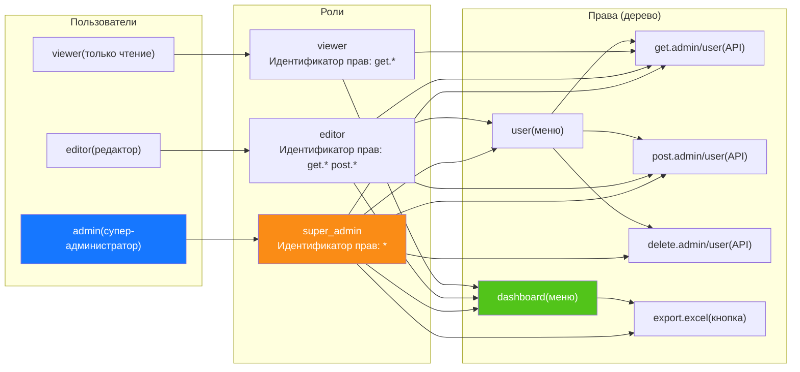
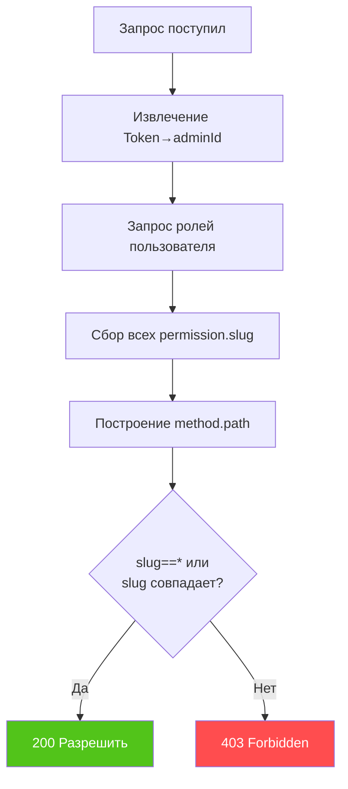
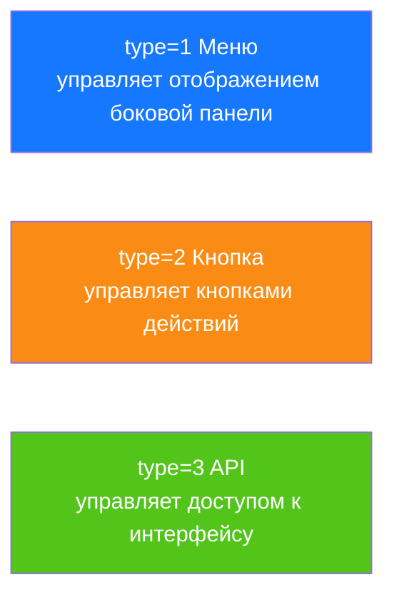

# Модель прав RBAC

## Связи пользователь-роль-право

```mermaid
flowchart LR
    subgraph users["Пользователи"]
        u1["admin(супер-администратор)"]
        u2["editor(редактор)"]
        u3["viewer(только чтение)"]
    end

    subgraph roles["Роли"]
        r1["super_admin<br/>Идентификатор прав: *"]
        r2["editor<br/>Идентификатор прав: get.* post.*"]
        r3["viewer<br/>Идентификатор прав: get.*"]
    end

    subgraph permissions["Права (дерево)"]
        p1["dashboard(меню)"]
        p2["user(меню)"]
        p3["get.admin/user(API)"]
        p4["post.admin/user(API)"]
        p5["delete.admin/user(API)"]
        p6["export.excel(кнопка)"]
    end

    u1 --> r1
    u2 --> r2
    u3 --> r3
    r1 --> p1 & p2 & p3 & p4 & p5 & p6
    r2 --> p1 & p2 & p3 & p4
    r3 --> p1 & p3
    p2 --> p3 & p4 & p5
    p1 --> p6

    style u1 fill:#1677FF,color:#fff
    style r1 fill:#FA8C16,color:#fff
    style p1 fill:#52C41A,color:#fff
```

## Процесс определения прав

```mermaid
flowchart TD
    start["Запрос поступил"] --> extract["Извлечение Token→adminId"]
    extract --> findRoles["Запрос ролей пользователя"]
    findRoles --> collectSlug["Сбор всех permission.slug"]
    collectSlug --> buildKey["Построение method.path"]
    buildKey --> check{"slug==* или<br/>slug совпадает?"}
    check -->|"Да"| allow["200 Разрешить"]
    check -->|"Нет"| deny["403 Forbidden"]

    style allow fill:#52C41A,color:#fff
    style deny fill:#FF4D4F,color:#fff
```

## Типы прав

```mermaid
flowchart LR
    t1["type=1 Меню<br/>управляет отображением боковой панели"]
    t2["type=2 Кнопка<br/>управляет кнопками действий"]
    t3["type=3 API<br/>управляет доступом к интерфейсу"]

    style t1 fill:#1677FF,color:#fff
    style t2 fill:#FA8C16,color:#fff
    style t3 fill:#52C41A,color:#fff
```
