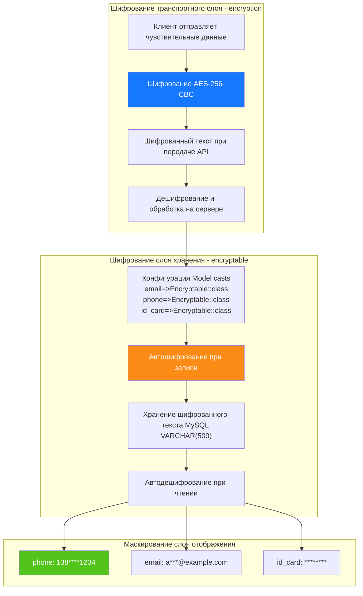

# Слои шифрования данных

```mermaid
flowchart TB
    subgraph transport["Шифрование транспортного слоя - encryption"]
        e1["Клиент отправляет чувствительные данные"]
        e2["Шифрование AES-256-CBC"]
        e3["Шифрованный текст при передаче API"]
        e4["Дешифрование и обработка на сервере"]
        e1 --> e2 --> e3 --> e4
    end

    subgraph storage["Шифрование слоя хранения - encryptable"]
        d1["Конфигурация Model casts<br/>email=>Encryptable::class<br/>phone=>Encryptable::class<br/>id_card=>Encryptable::class"]
        d2["Автошифрование при записи"]
        d3["Хранение шифрованного текста MySQL VARCHAR(500)"]
        d4["Автодешифрование при чтении"]
        d1 --> d2 --> d3 --> d4
    end

    subgraph mask["Маскирование слоя отображения"]
        m1["phone: 138****1234"]
        m2["email: a***@example.com"]
        m3["id_card: ********"]
        d4 --> m1 & m2 & m3
    end

    e4 --> d1

    style e2 fill:#1677FF,color:#fff
    style d2 fill:#FA8C16,color:#fff
    style m1 fill:#52C41A,color:#fff
```
