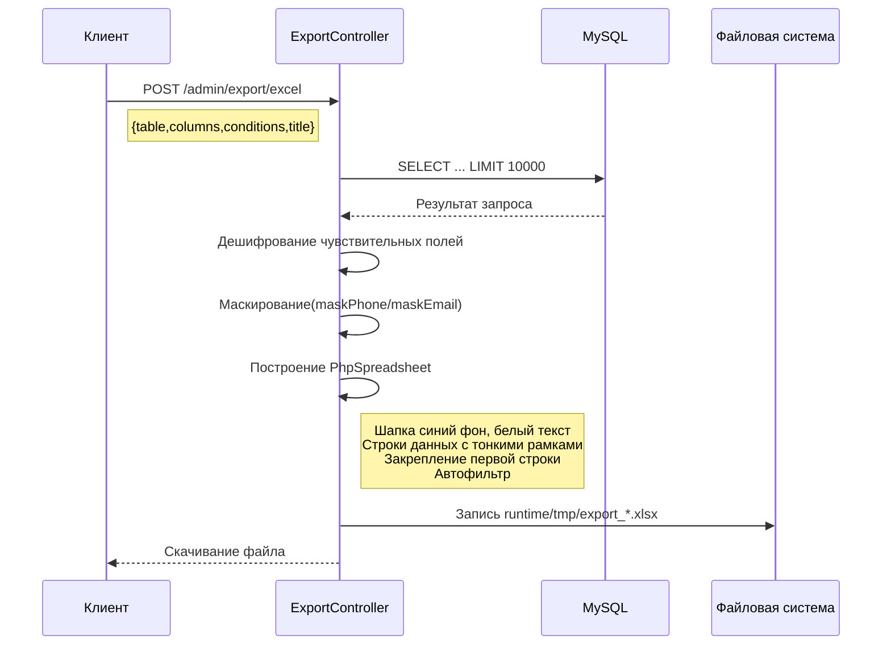
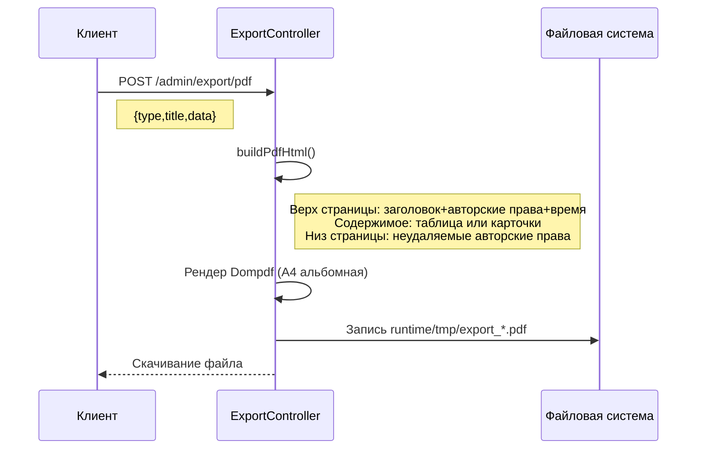

# Бизнес-процесс экспорта

## Экспорт Excel

```mermaid
sequenceDiagram
    participant C as Клиент
    participant CTL as ExportController
    participant DB as MySQL
    participant FS as Файловая система

    C->>CTL: POST /admin/export/excel
    Note right of C: {table,columns,conditions,title}
    CTL->>DB: SELECT ... LIMIT 10000
    DB-->>CTL: Результат запроса
    CTL->>CTL: Дешифрование чувствительных полей
    CTL->>CTL: Маскирование(maskPhone/maskEmail)
    CTL->>CTL: Построение PhpSpreadsheet
    Note right of CTL: Шапка синий фон, белый текст<br/>Строки данных с тонкими рамками<br/>Закрепление первой строки<br/>Автофильтр
    CTL->>FS: Запись runtime/tmp/export_*.xlsx
    CTL-->>C: Скачивание файла
```

## Экспорт PDF

```mermaid
sequenceDiagram
    participant C as Клиент
    participant CTL as ExportController
    participant FS as Файловая система

    C->>CTL: POST /admin/export/pdf
    Note right of C: {type,title,data}
    CTL->>CTL: buildPdfHtml()
    Note right of CTL: Верх страницы: заголовок+авторские права+время<br/>Содержимое: таблица или карточки<br/>Низ страницы: неудаляемые авторские права
    CTL->>CTL: Рендер Dompdf (A4 альбомная)
    CTL->>FS: Запись runtime/tmp/export_*.pdf
    CTL-->>C: Скачивание файла
```
