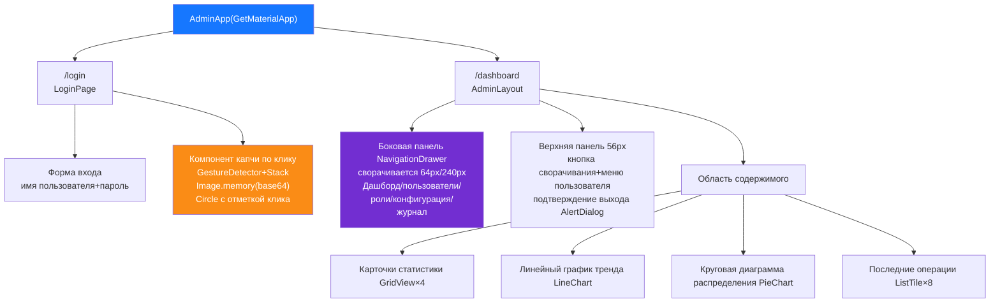
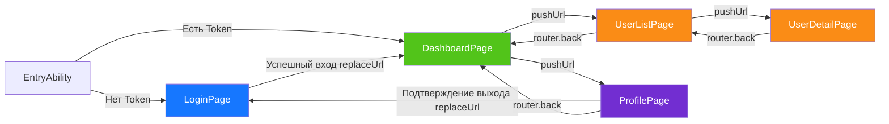

# Архитектура компонентов фронтенда

## Дерево компонентов Flutter Web

```mermaid
flowchart TD
    app["AdminApp(GetMaterialApp)"]

    app --> login["/login<br/>LoginPage"]
    app --> dashboard["/dashboard<br/>AdminLayout"]

    login --> form["Форма входа<br/>имя пользователя+пароль"]
    login --> captcha["Компонент капчи по клику<br/>GestureDetector+Stack<br/>Image.memory(base64)<br/>Circle с отметкой клика"]

    dashboard --> sidebar["Боковая панель NavigationDrawer<br/>сворачивается 64px/240px<br/>Дашборд/пользователи/роли/конфигурация/журнал"]
    dashboard --> header["Верхняя панель 56px<br/>кнопка сворачивания+меню пользователя<br/>подтверждение выхода AlertDialog"]
    dashboard --> content["Область содержимого"]

    content --> stats["Карточки статистики GridView×4"]
    content --> chart["Линейный график тренда LineChart"]
    content --> pie["Круговая диаграмма распределения PieChart"]
    content --> logs["Последние операции ListTile×8"]

    style app fill:#1677FF,color:#fff
    style captcha fill:#FA8C16,color:#fff
    style sidebar fill:#722ED1,color:#fff
```

## Маршрутизация страниц HarmonyOS

```mermaid
flowchart LR
    entry["EntryAbility"]
    entry -->|"Нет Token"| loginH["LoginPage"]
    entry -->|"Есть Token"| dashH["DashboardPage"]

    loginH -->|"Успешный вход replaceUrl"| dashH

    dashH -->|"pushUrl"| userList["UserListPage"]
    dashH -->|"pushUrl"| profile["ProfilePage"]

    userList -->|"pushUrl"| userDetail["UserDetailPage"]
    userList -->|"router.back"| dashH
    userDetail -->|"router.back"| userList

    profile -->|"Подтверждение выхода replaceUrl"| loginH
    profile -->|"router.back"| dashH

    style loginH fill:#1677FF,color:#fff
    style dashH fill:#52C41A,color:#fff
    style userList fill:#FA8C16,color:#fff
    style userDetail fill:#FA8C16,color:#fff
    style profile fill:#722ED1,color:#fff
```
