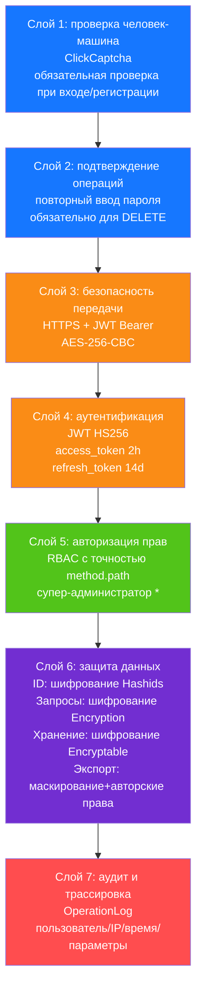

# Эшелонированная защита безопасности

```mermaid
flowchart TB
    l1["Слой 1: проверка человек-машина<br/>ClickCaptcha<br/>обязательная проверка при входе/регистрации"]
    l2["Слой 2: подтверждение операций<br/>повторный ввод пароля<br/>обязательно для DELETE"]
    l3["Слой 3: безопасность передачи<br/>HTTPS + JWT Bearer<br/>AES-256-CBC"]
    l4["Слой 4: аутентификация<br/>JWT HS256<br/>access_token 2h<br/>refresh_token 14d"]
    l5["Слой 5: авторизация прав<br/>RBAC с точностью method.path<br/>супер-администратор *"]
    l6["Слой 6: защита данных<br/>ID: шифрование Hashids<br/>Запросы: шифрование Encryption<br/>Хранение: шифрование Encryptable<br/>Экспорт: маскирование+авторские права"]
    l7["Слой 7: аудит и трассировка<br/>OperationLog<br/>пользователь/IP/время/параметры"]

    l1 --> l2 --> l3 --> l4 --> l5 --> l6 --> l7

    style l1 fill:#1677FF,color:#fff
    style l2 fill:#1677FF,color:#fff
    style l3 fill:#FA8C16,color:#fff
    style l4 fill:#FA8C16,color:#fff
    style l5 fill:#52C41A,color:#fff
    style l6 fill:#722ED1,color:#fff
    style l7 fill:#FF4D4F,color:#fff
```
